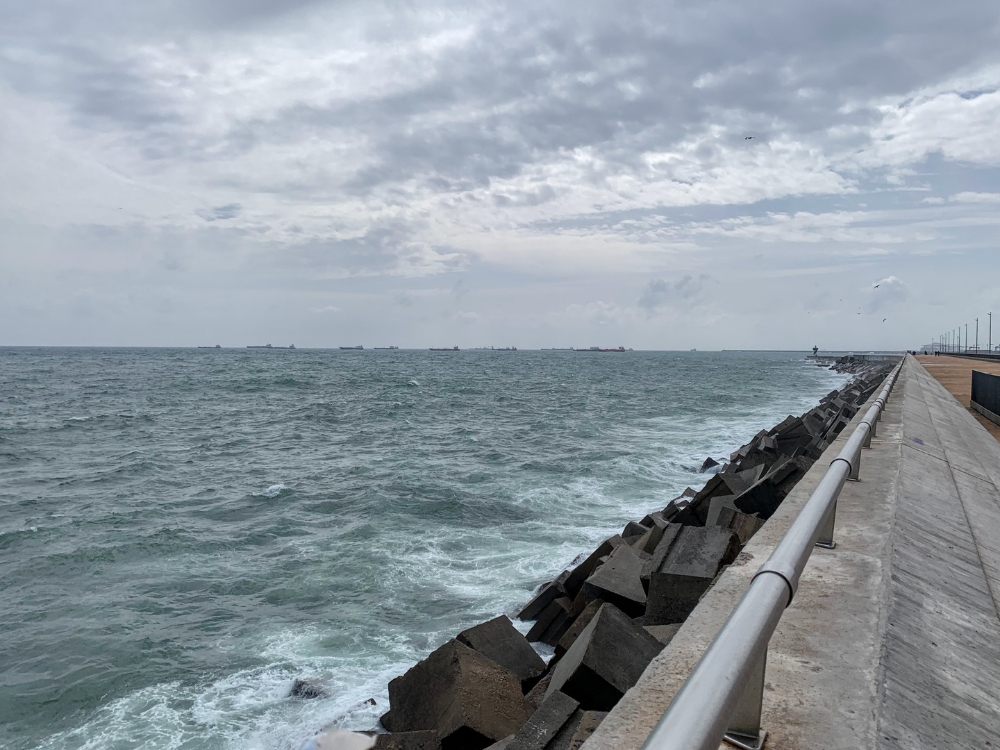
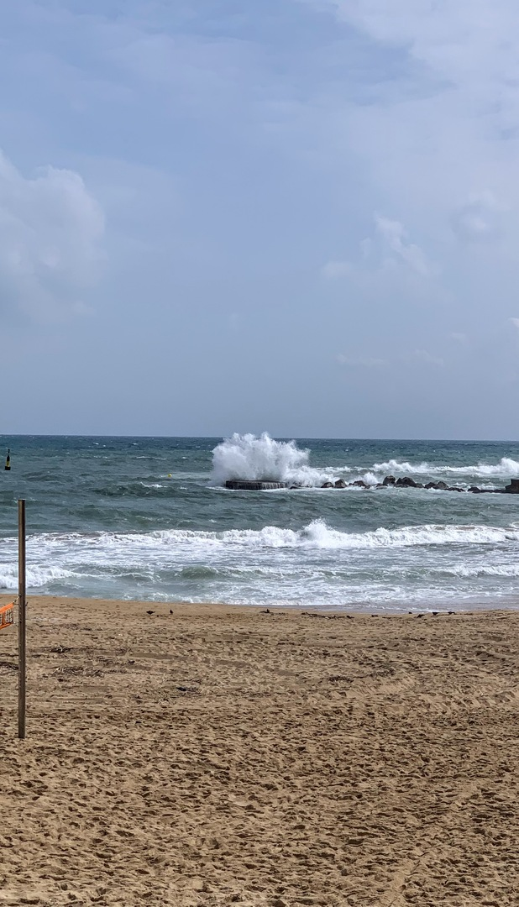
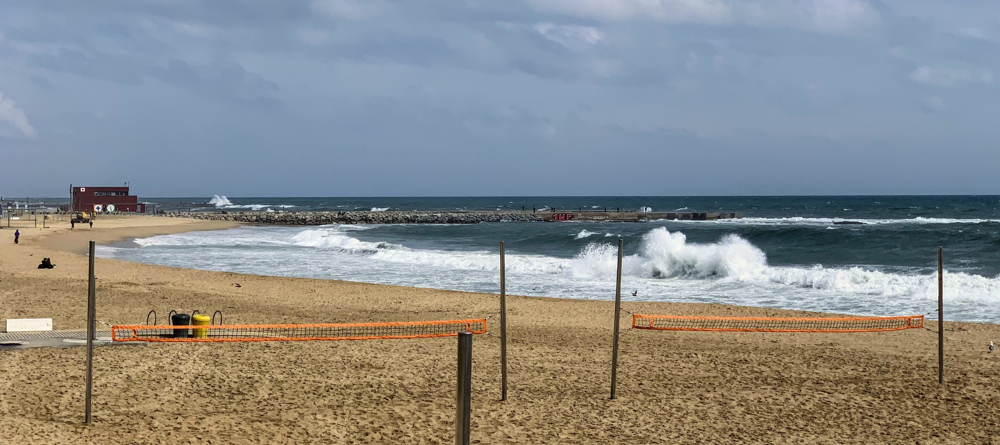
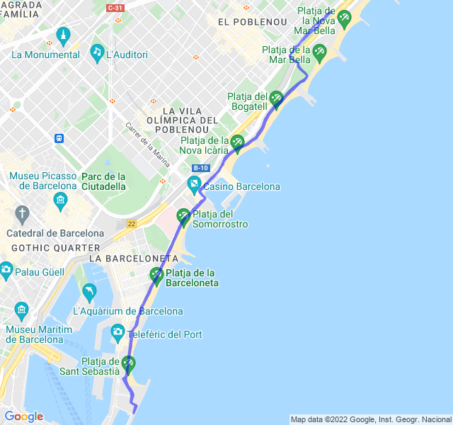

Nubi sparse, 14°C, Percepito 14°C, Umidità 75%, Vento 9m/s da E

<!--more-->

Gioranta di vento anche oggi.

Come al solito ho spinto troppo per essere un lento: dovevo stare sui 5:15m/km ma son andato 20sec meno, la pagherò al prossimo allenamento purtroppo.

[Link all'attività](https://strava.com/activities/6858630919).
