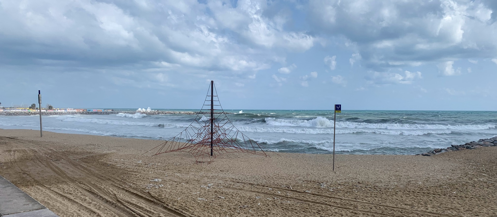
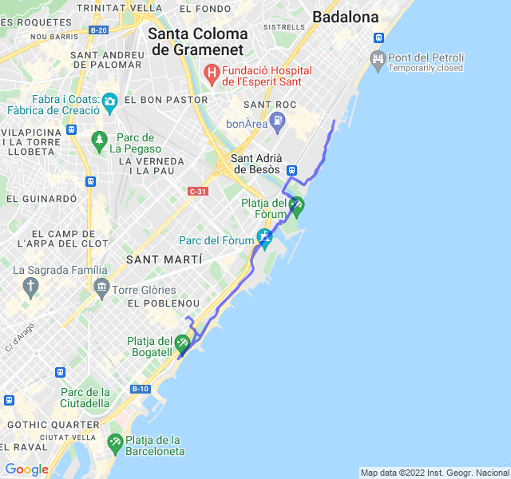

Nubi sparse, 14°C, Percepito 13°C, Umidità 61%, Vento 9m/s da ENE

<!--more-->

Sapevo che avrei pagato il lento "non lento" ed in effetti è successo. Probabilmente anche il fatto di essere il terzo allenamento di fila non ha aiutato e domani si replica con il progressivo.

In generale non è andata malissimo, a parte un paio di brevi pause durante i riposi, ho tenuto il passo.

[Link all'attività](https://strava.com/activities/6864131913).
