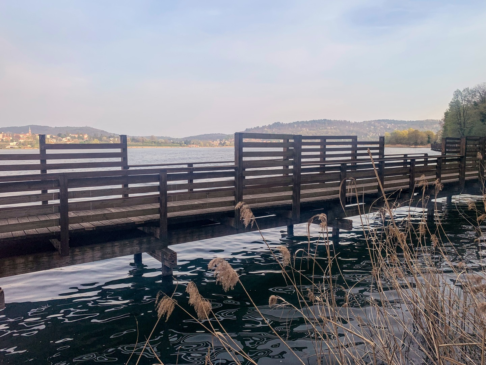
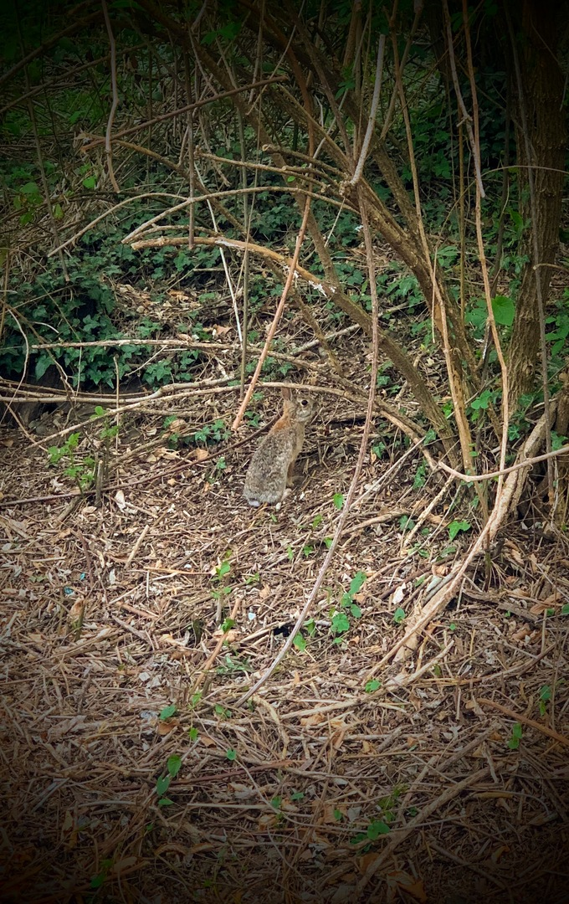
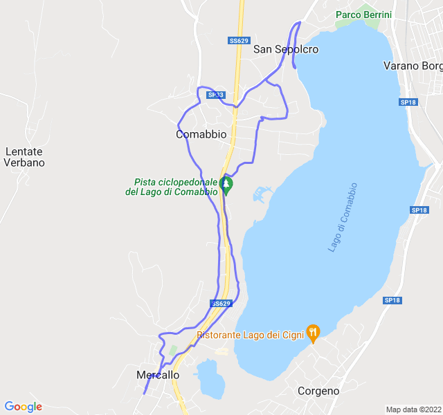

Cielo sereno, 19°C, Percepito 18°C, Umidità 41%, Vento 3m/s da ESE

<!--more-->

Fondo lento molto più faticoso del previsto. Probabilmente non ancora del tutto recuperato l'ultimo allenamento.

In più ho dovuto fare un paio di salite impreviste a causa della passerella sul lago non agibile.

In compenso ho incontrato qualche nuovo ami o sulla strada.


