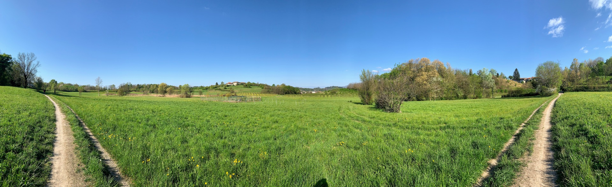
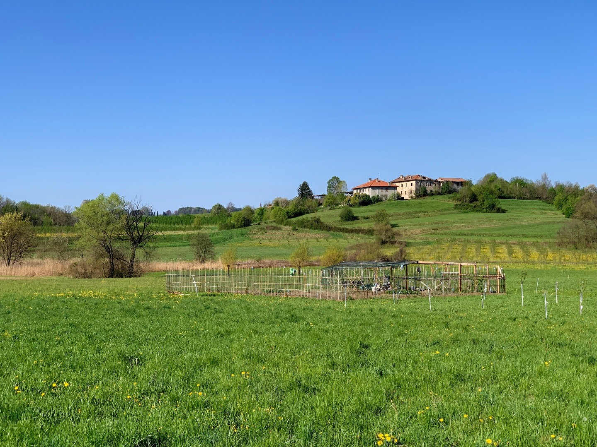
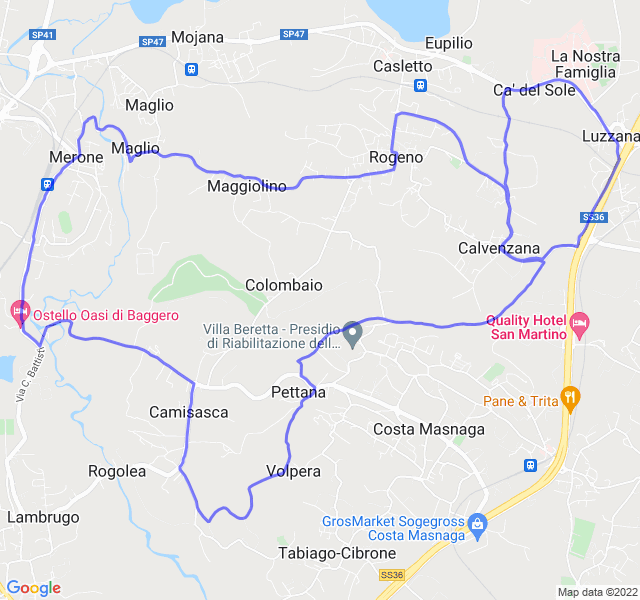

Nubi sparse, 11°C, Percepito 10°C, Umidità 55%, Vento 1m/s da SSO

<!--more-->

Avevo voglia di un lungo più che di un progressivo e così, dopo i 12km ho allungato un pochino.

Bellissima giornata per una corsa tra i campi.


