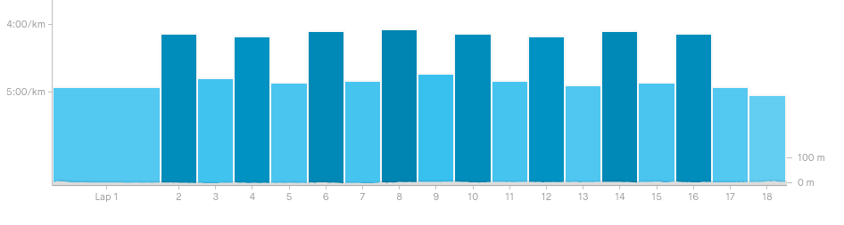
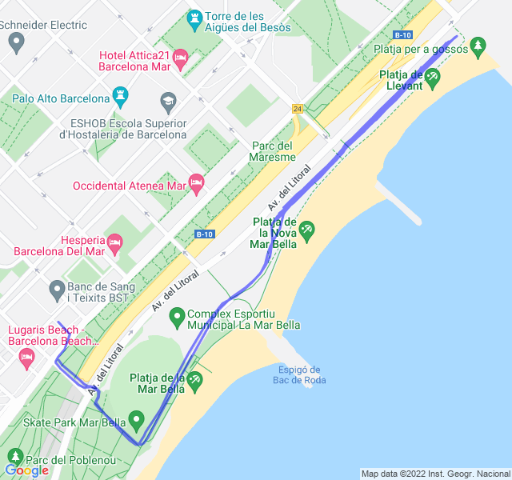

Poche nuvole, 19°C, Percepito 18°C, Umidità 65%, Vento 4m/s da SE

<!--more-->

Allenamento impegnativo ma portato a termine bene. Pensavo di soffrire molto di più il recupero attivo am è andata molto bene!


