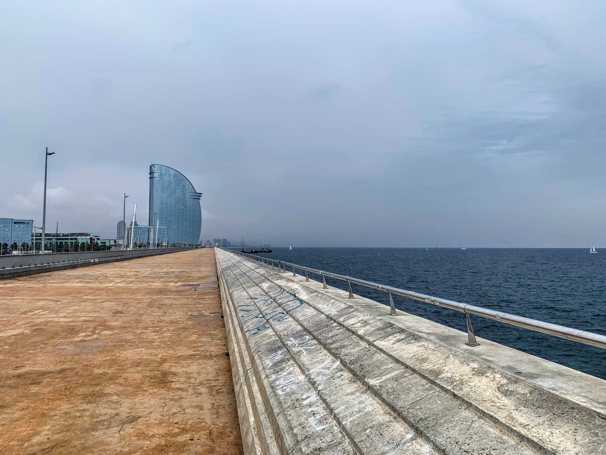
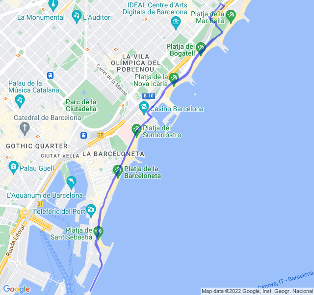

Poche nuvole, 16°C, Percepito 16°C, Umidità 84%, Vento 6m/s da E

<!--more-->

Pioggerella un po' fastidiosa ma tempo ideale per andare verso il centro senza dover schivare turisti in continuazione.

Fondo lento, come al solito non troppo lento!


