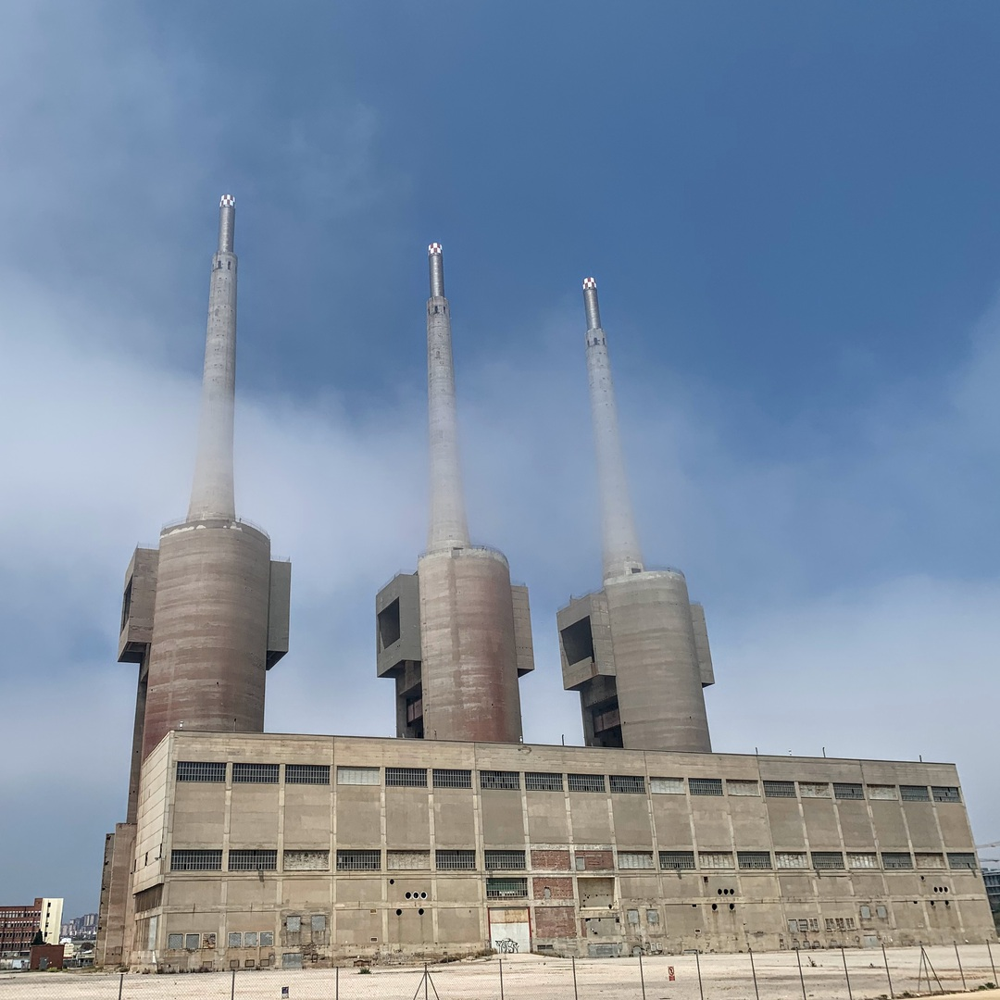
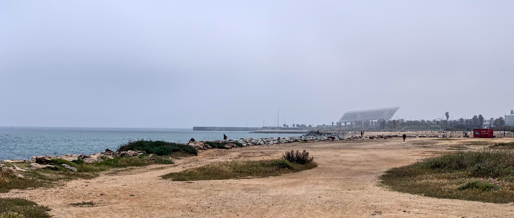
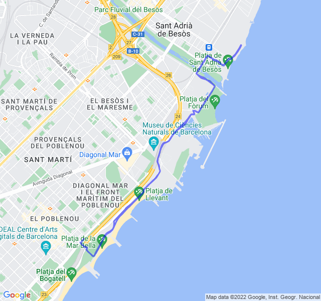

Cielo sereno, 25°C, Percepito 26°C, Umidità 63%, Vento 5m/s da ESE

<!--more-->

Oggi strana nebbiolina durante la corsa. Anche gli occhiali si appannavano in continuazione.

Lento rigenerante tranquillo stando attento a non superare i 140 battiti. Non è stato particolarmente difficile e ho tenuto un passo migliore dell'ultima volta che ci ho provato.

Purtroppo il percorso che faccio è sempre lo stesso perchè, con l'arrivo dei turisti, il lato sud della costa è troppo affollato.


