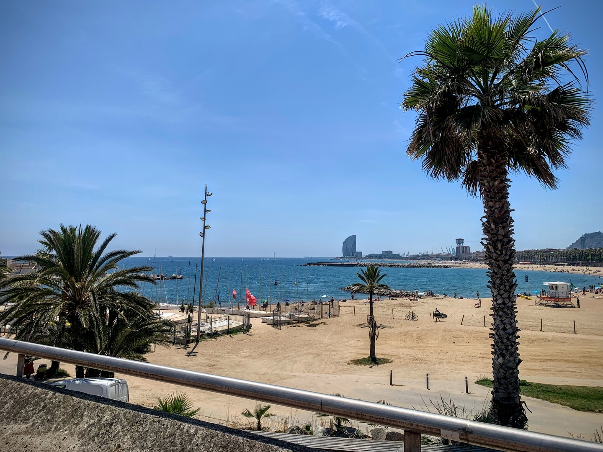
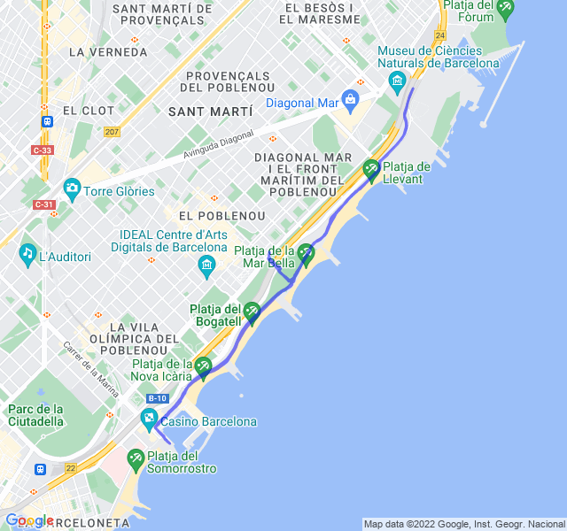

Poche nuvole, 26°C, Percepito 26°C, Umidità 66%, Vento 6m/s da S

<!--more-->

Altro giorno difficile per il caldo, devo smettere di scriverlo, tanto sarà così per un bel po'.
Sofferto un po' nella parte di medio, meno nel HIIT.

Nel complesso un allenamento dignitoso.


