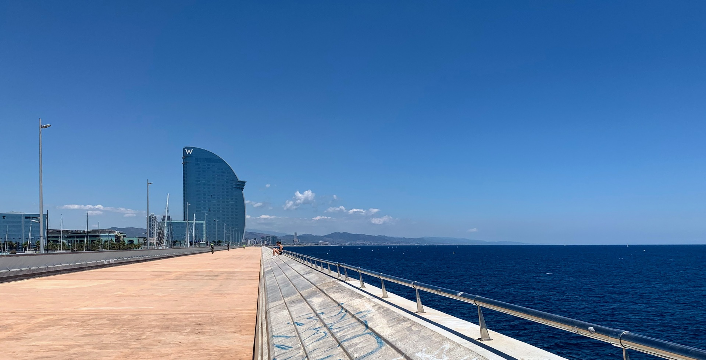
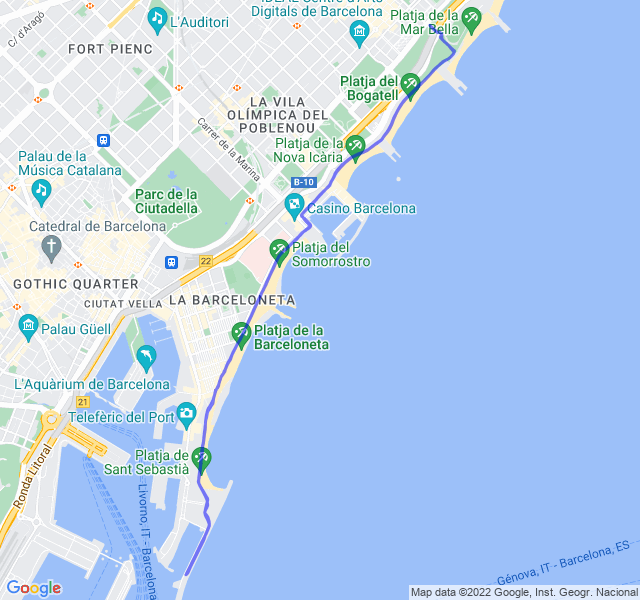

Poche nuvole, 27°C, Percepito 28°C, Umidità 60%, Vento 6m/s da S

<!--more-->

Fondo lento con l'obbiettivo di stare in Z2. Obbiettivo fallito nella seconda parte dove ho navigato in Z3 bassa per quasi tutto il tempo.

Con questo caldo e lo stop di settimana scorsa forse non potevo fare meglio.


