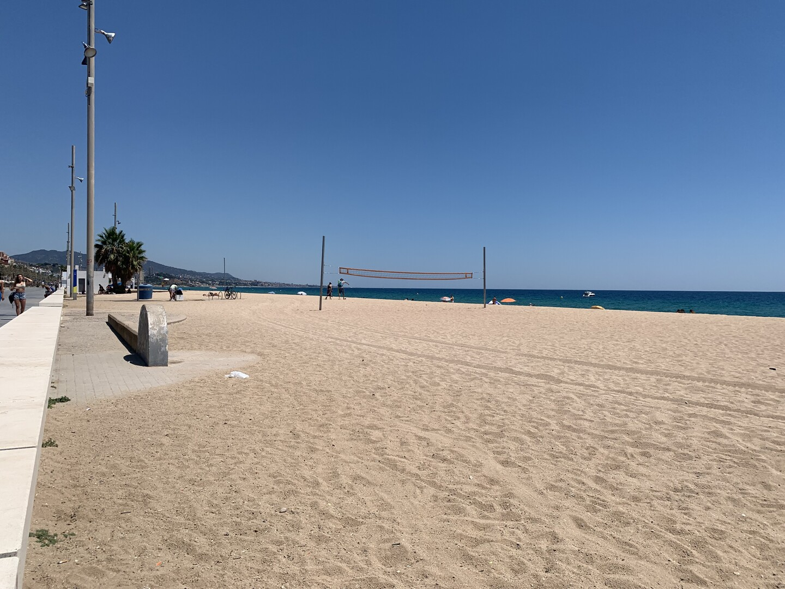
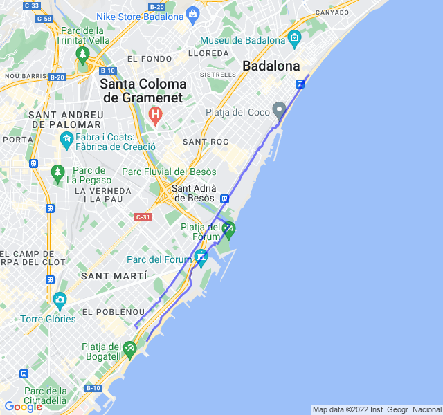

Cielo sereno, 29°C, Percepito 30°C, Umidità 52%, Vento 7m/s da SE

<!--more-->



Fondo lento esplorando la costa in previsione dei prossimi lunghi. Non male il percorso anche se tutto sotto il sole con poche zone d'ombra.


