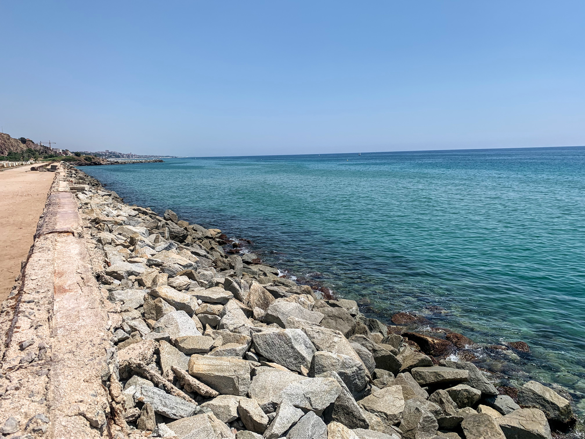
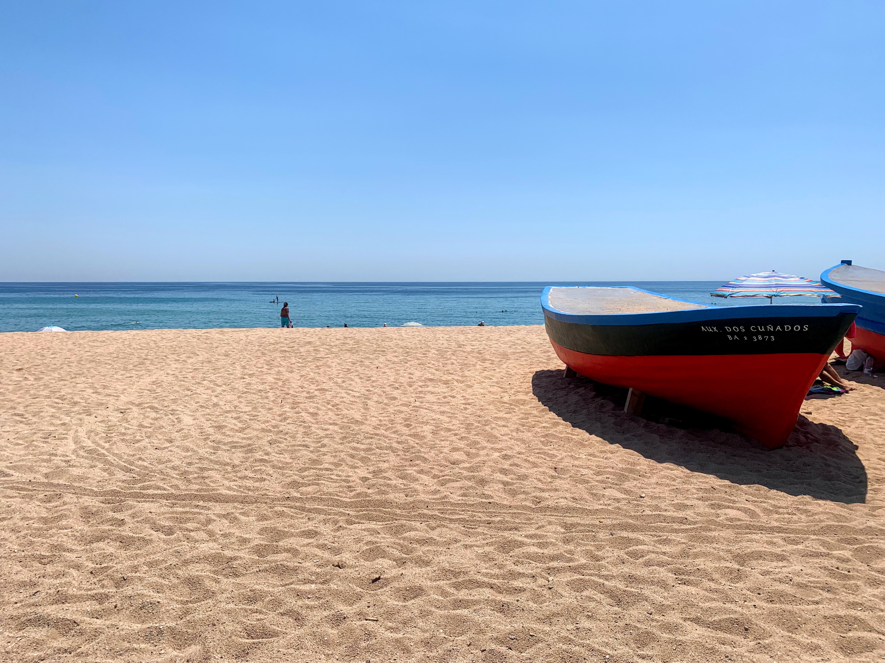
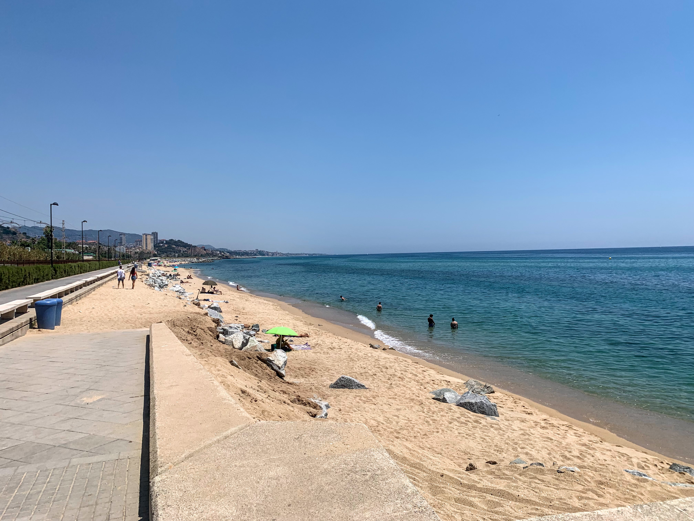

Cielo sereno, 32°C, Percepito 34°C, Umidità 49%, Vento 6m/s da SE

<!--more-->



Lungo lento terribile. Già alla partenza le sensazioni non erano delle migliori e quisto avrebbe dovuto farmi capire che non era giornata ma invece ho voluto continuare e la seconda metà è stata uno strazio.

Pulsazioni altissime, estrema fatica e caldo. Speriamo sia solo la giornata sbagliata e non la forma scadente!

In compenso il paesaggio merita sempre.


