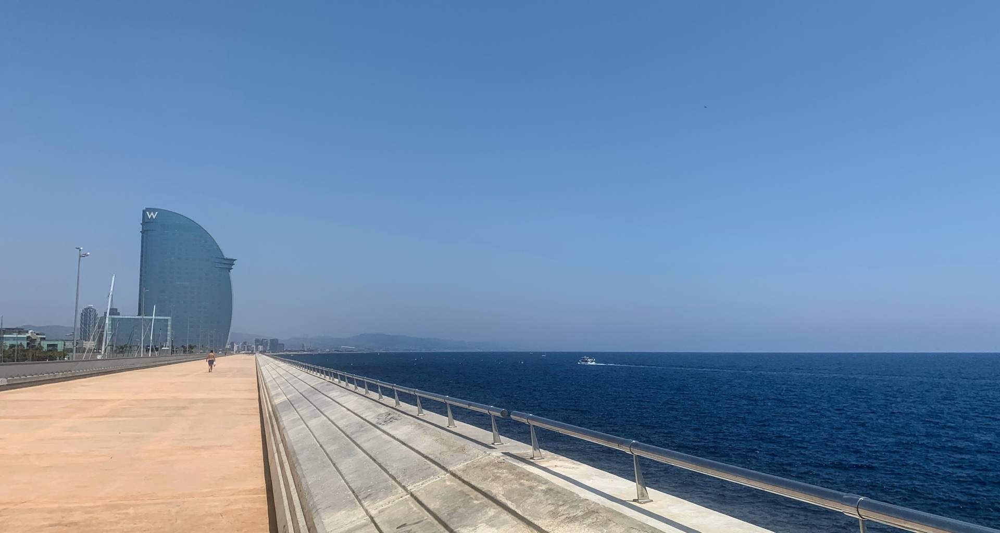
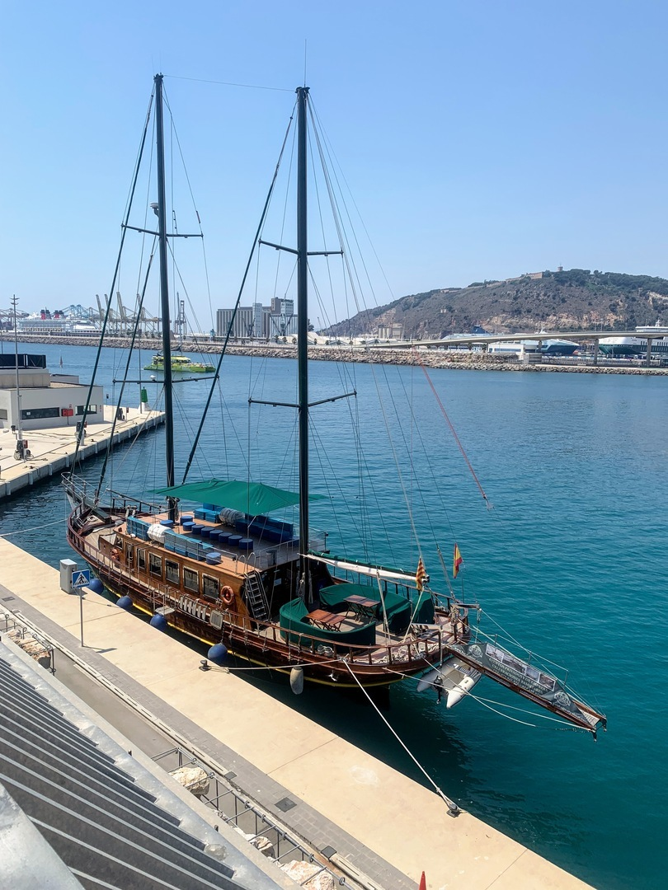
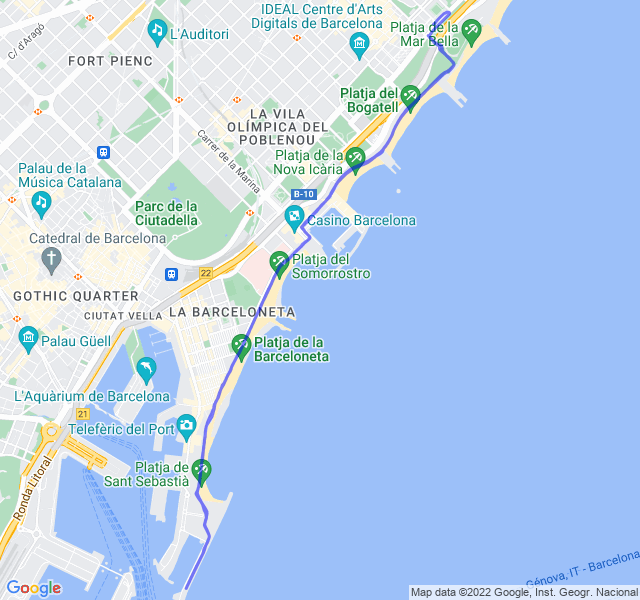

Cielo sereno, 30°C, Percepito 34°C, Umidità 68%, Vento 6m/s da ESE

<!--more-->

Fondo lento tranquillo. L'idea era di stare in Z2 ma con sto caldo la seconda parte dell'allenamento è sempre faticosa e il battito tende ad aumentare di conseguenza.

E poi si incontrano sempre cose interessanti quando si corre verso il porto...


