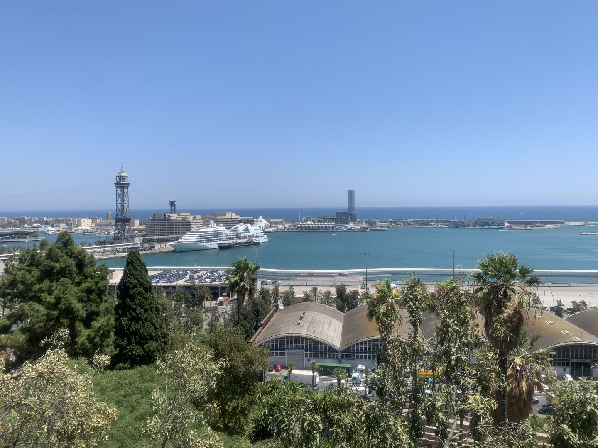
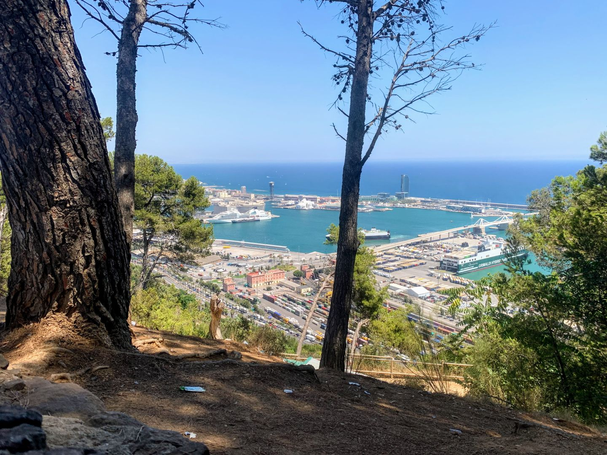
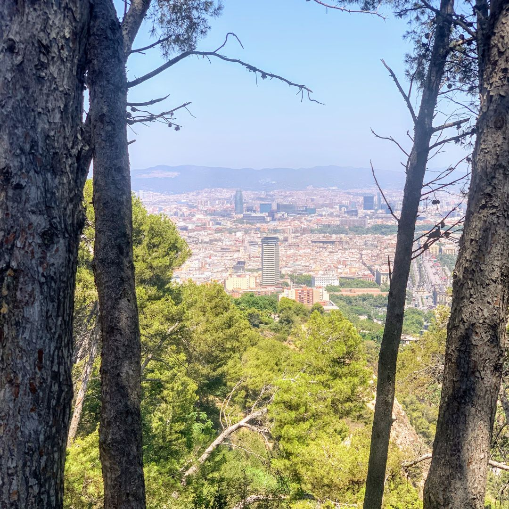
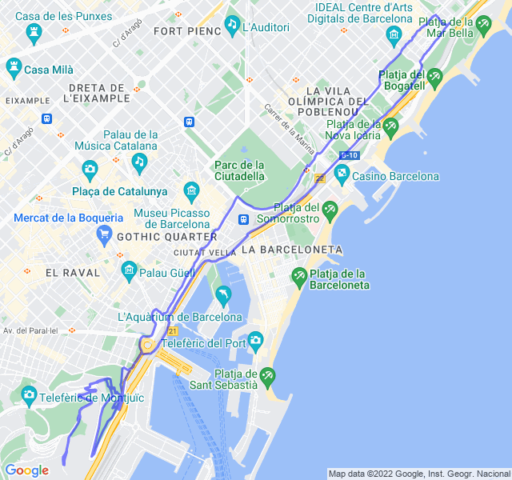

Sereno, 32 ℃,Percepita 36 ℃, Umidità 51%, Vento 19,4 km/h SW

<!--more-->

Lunghetto al Montjuïc. Tantissimo tempo che non faccio salite e si vede. 
Fatica alla minima pendenza e al ritorno dolore alle caviglie.

Ma il panorama vale lo sforzo!


