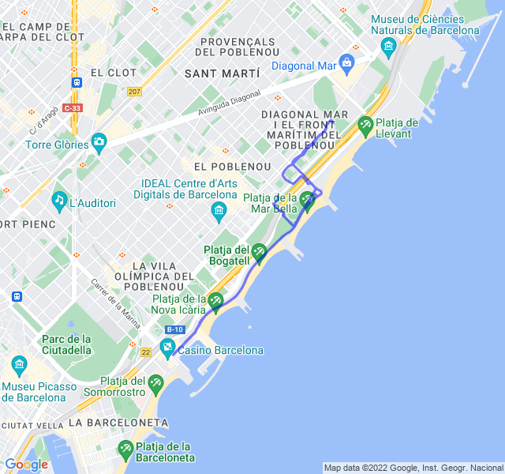

Cielo sereno, 33°C, Percepito 36°C, Umidità 51%, Vento 5m/s da SSO - Klimat.app

<!--more-->

Proviamo a rimettere un po' di velocità nelle gambe. Purtroppo il giorno non è dei migliori, il caldo è torrido e le previste 8 ripetute sono diventate 4 con grande fatica.


