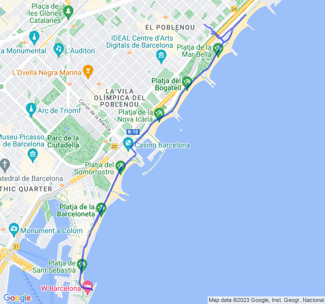

Primo variato della nuova tabella: duro!
<!--more--> 

Non male questo variato. Probabilmente il recupero l'ho fatto un po' troppo veloce... e anche la parte veloce. Nonostante questo il cuore non è salito come avrebbe dovuto, Z4 toccata a mala pena nelle ultime variazioni.

Forse ho un po' sovrastimato la mia FC Max?


