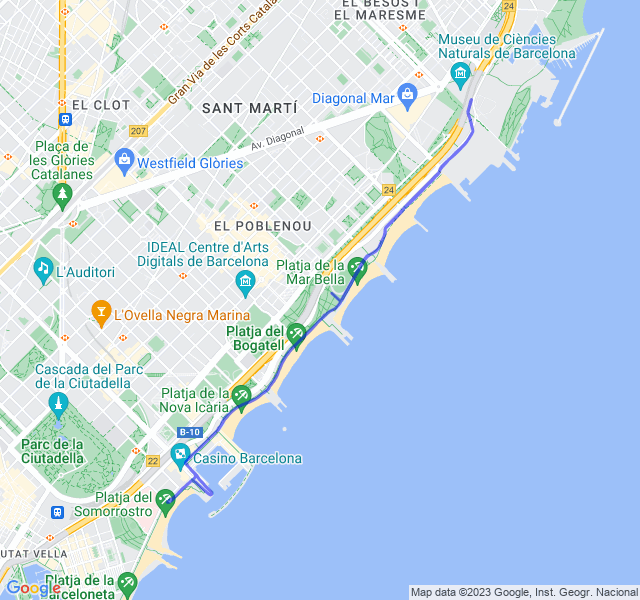

Rirpoviamo a stare in Z1.
<!--more--> 
[//]: # ()

Come da consigli del coach sono partito molto più piano: "non importa se fai una Z1 a 6min/km"

In effetti così è andata meglio: la frequenza è aumentata lo stesso un po' e il passo si è rallentato ma tutto sommato non male.

Mi fa sempre un po' strano correre a questi ritmi, sembra quasi di camminare.


