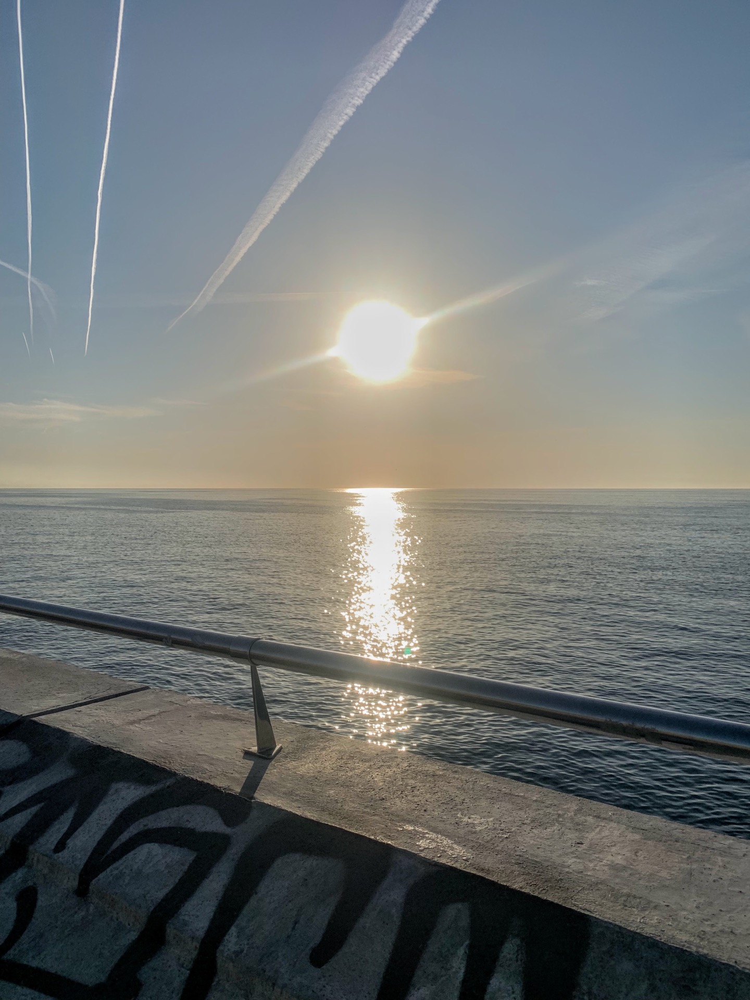
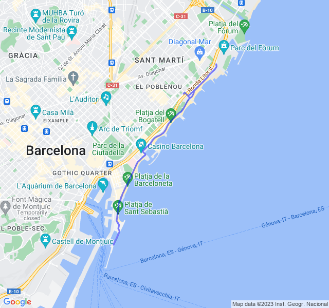

Allunghiamo la Z2.
<!--more--> 

Qualche chilometro in più in Z2 rispetto alle ultime uscite.

Non è andata male, il passo è sempre molto blando ma i battiti sembrano un po' più sotto controllo.

Alla fine comunque stanco con i quadricipiti indolenziti; son sempre convinto che sia per l'appoggio non proprio corretto a questi ritmi.


