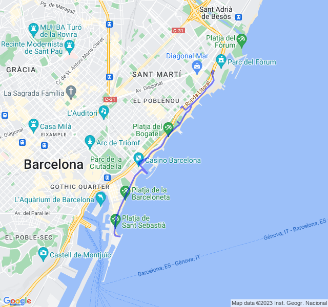

Ripetute in soglia.
<!--more--> 
[//]: # ()
Prime ripetute in soglia delal tabella.
Mi sembrano andate bene, un po' di fatica ma non troppo, soprattutto grazie ai recuperi lenti.

Quando ci saranno da fare recuperi più spinti sarà tutto un altro discorso!


