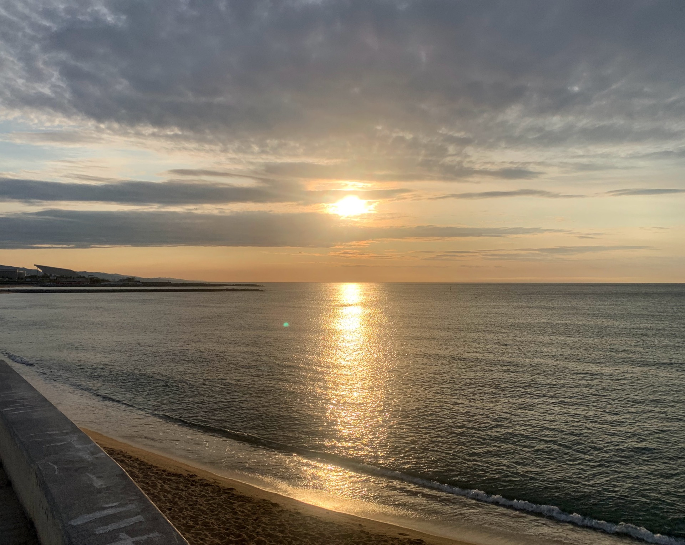
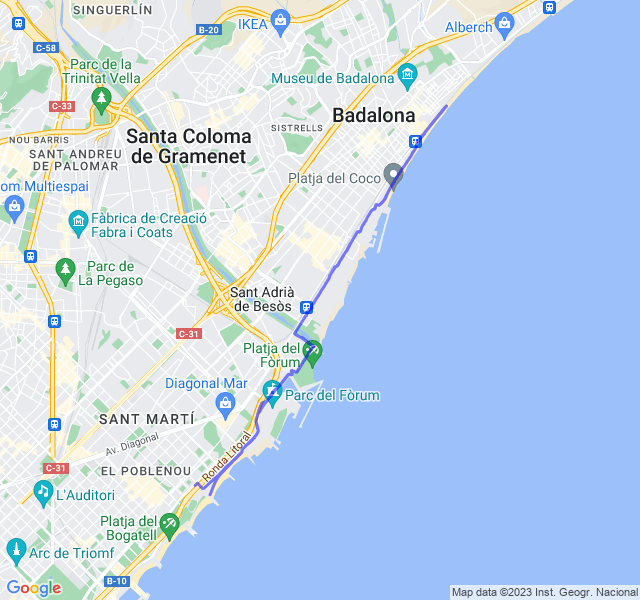

Bellissima Z2 lunghetta.

<!--more-->

Partito piano per non andare fuori giri coi battiti ho tenuto Z1/Z2 bassa per la prima metà con un passo comunque buono.

Al ritorno ho spinto un po' di più per andare in piena Z2 e ne è venuto fuori un ottimo ritmo e poca deriva fino alla fine.

Molto bene nel complesso!


