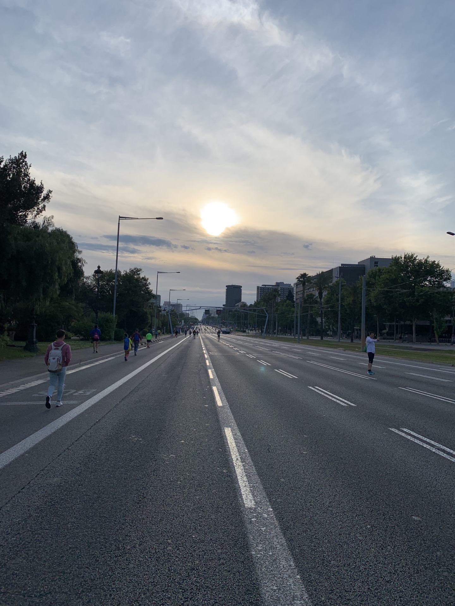
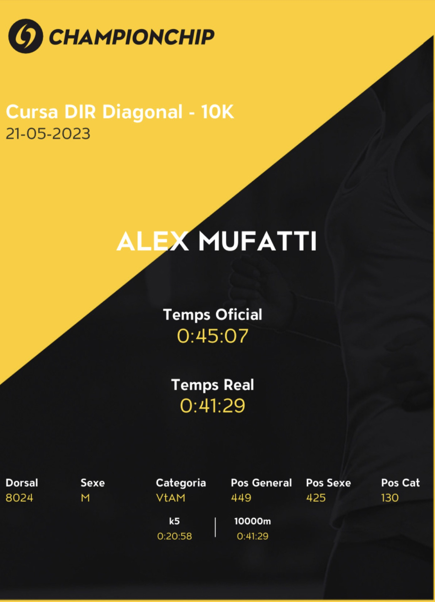
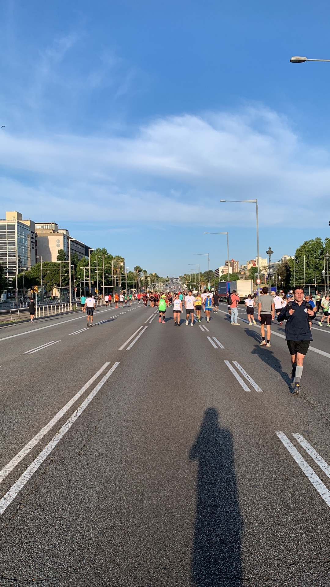
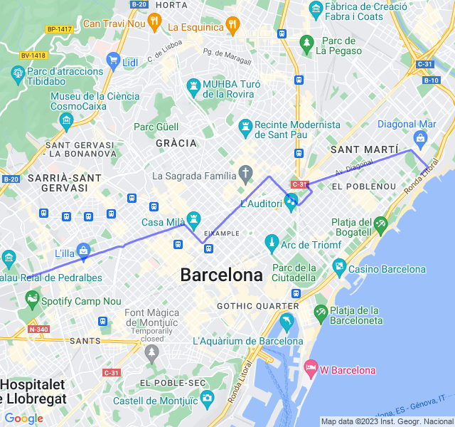

Test VDOT. Come concordato Test VDOT in gara da 10K, Cursa Diagonal.

<!--more--> 

Andata dal mio punto di vista meglio del previsto.

Sono partito con pochissime aspettative; non ho ben capito come sono state fatte le griglie e mi sono ritrovato nell'ultima, insieme ai pacers del 1h. Non avevo molti riferimenti visto che le impostazioni che avevo messo per il mio VDOT iniziale erano un po' vecchie: sia di tempo che di chili 😐.

Ho tenuto d'occhio le pulsazioni cercando di stare per la prima metà in Z3 alta e poi in Z4 e l'ultimo km quel che c'era c'era. Direi che mi è riuscito abbastanza bene e ho chiuso con fatica ma senza mollare. Le sensazioni son state sempre buone.
Il mio VDOT attuale diceva 42:54 e sono arrivato a 41:32, abbastanza vicino ai tempi migliori nonostante gli 8kg di troppo rispetto a quel periodo. La cosa migliore sarebbe perderli...!


