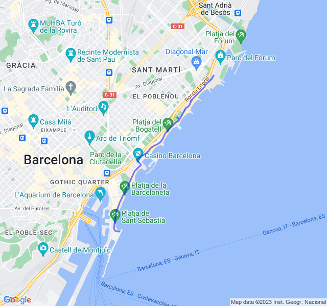

Ritmo medio 8km. 
<!--more--> 

Oggi ho visto da subito che non era una gran giornata: caldo e gambe pesanti. Son anche partito un po troppo forte 🤬. Alla fine ho finito gli 8km ma ho sforato come battiti e fatica percepita allegramente in Z4. Ho dovuto anche fermarmi per poco a bere perché stavo cuocendo.
Non particolarmente soddisfatto.


