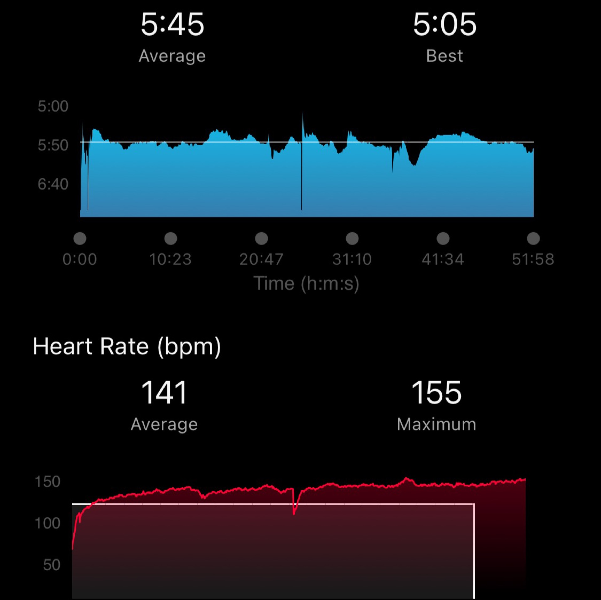
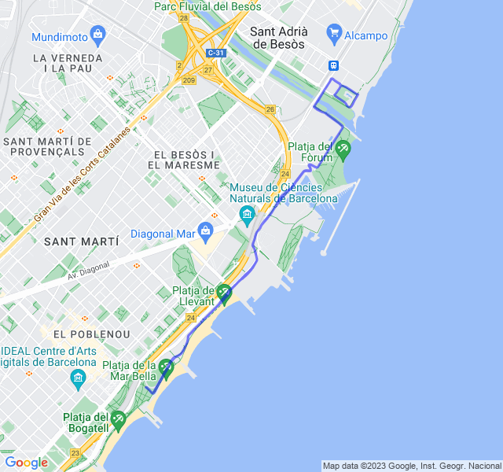
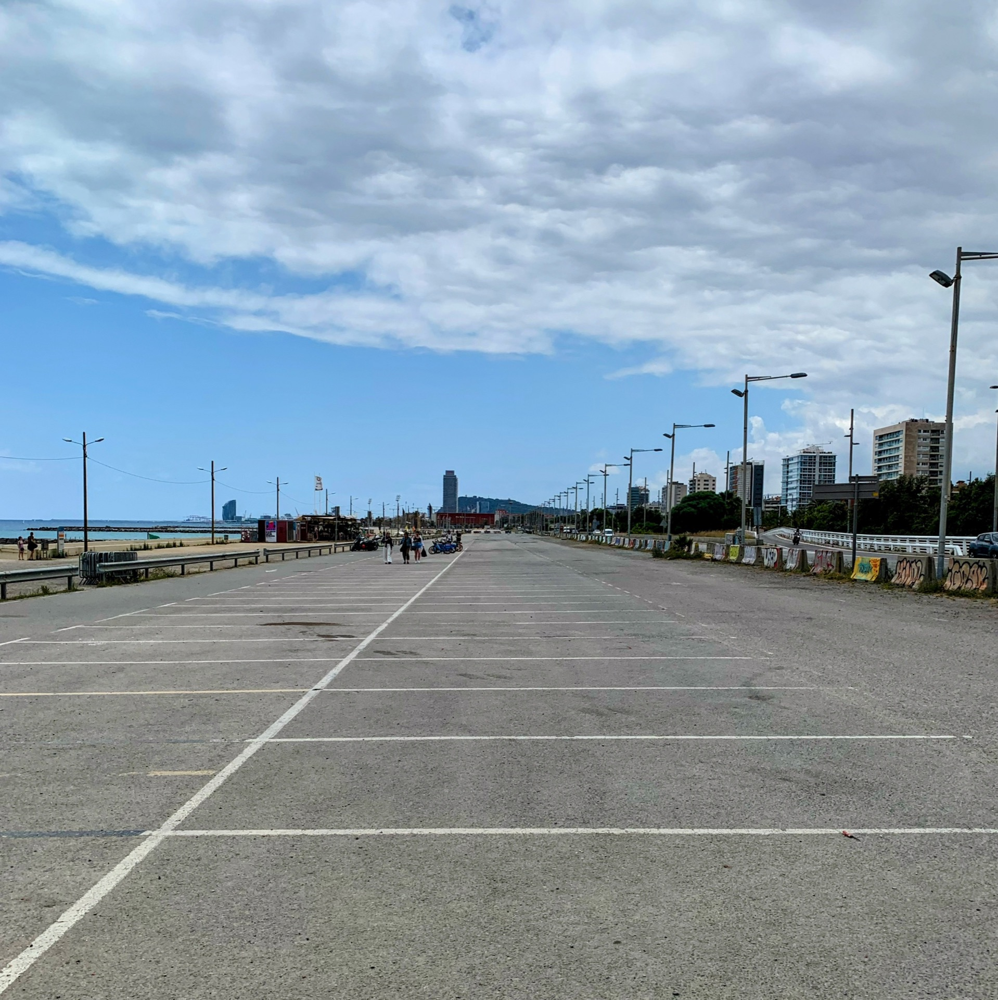
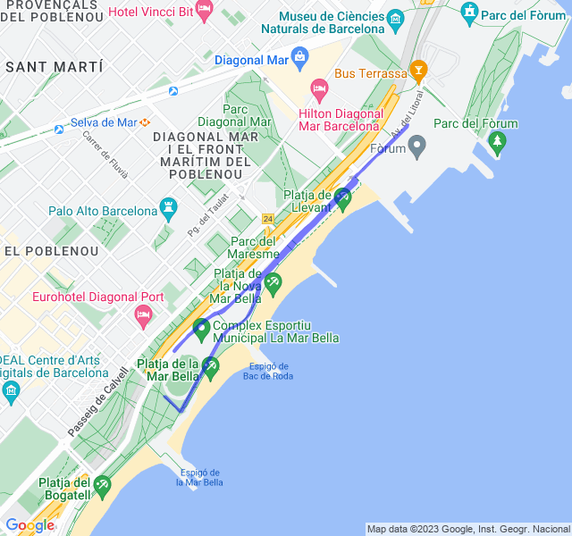
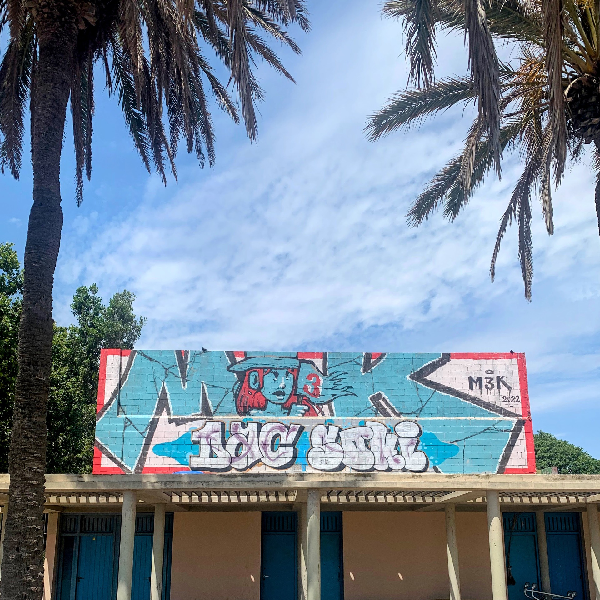
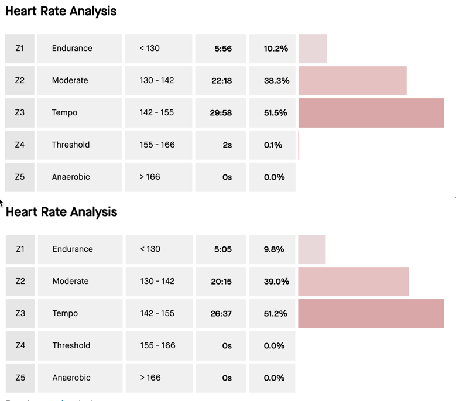
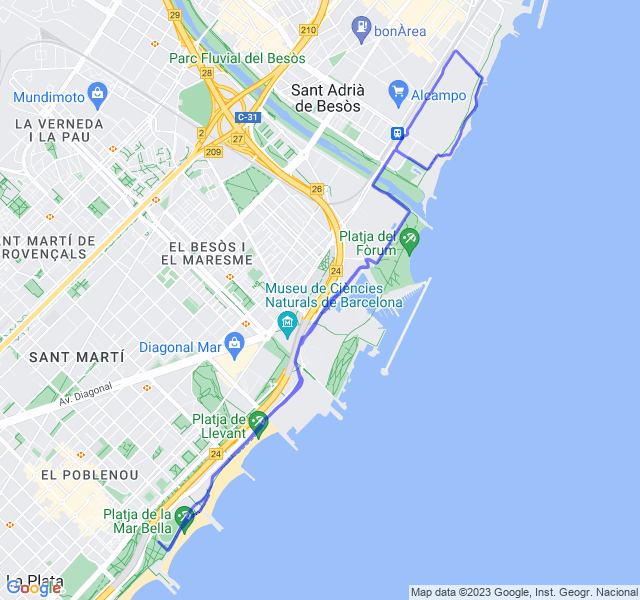

Altro stop, questa volta per dolore al ginocchio e due giri di febbre! Prima settimana di ripartenza...
<!--more--> 

Dopo quasi 4 settimane di stop completo, ricominciare non è facile.
Sapevo che non sarebbe stato semplice soprattutto mentalmente e in effetti è stato proprio così.

## Prima uscita

Prima uscita di Z1 fatta per buona parte in Z3! Il passo era quello di una Z1 ma il cuore non ne voleva sapere di stare giù. Il caldo ci ha messo del suo, ma anche senza ho paura che non sarebbe migliorato molto. 



## Seconda uscita

Un bel lavoro di alta intensità su questo rettilineo infuocato, finito camminando nei recuperi e tagliando l'ultima parte. Anche qui sapevo di non essere particolarmente pronto ma da qualche parte bisogna pur ricominciare.



## Terza uscita

Lento Z1 anche questa finita in Z3 anche se solo per metà del tempo.

Per il momento non ci sono ancora indizi di miglioramento. Questo una comparazione tra i due lenti Z1, stessa distribuzione della FC 😐.



