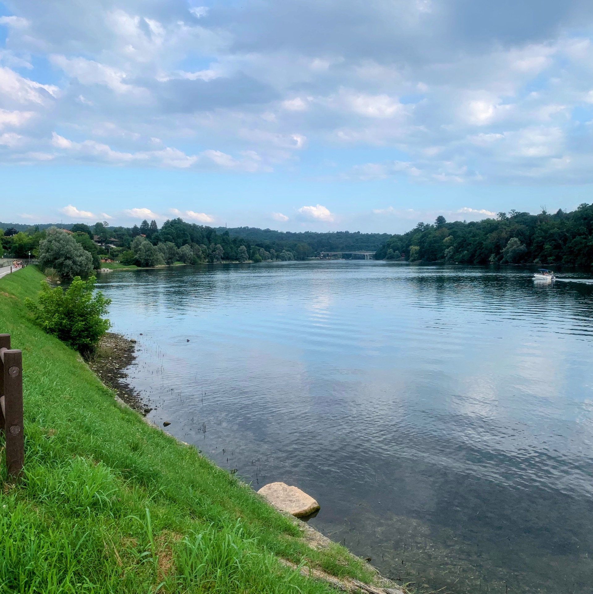
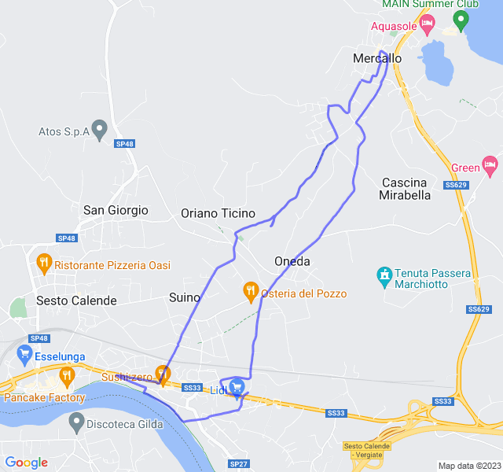
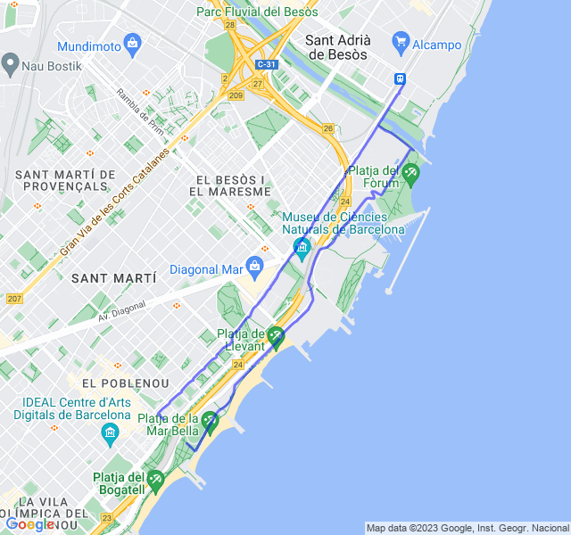
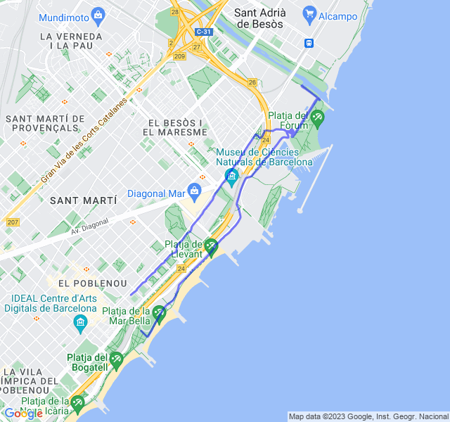
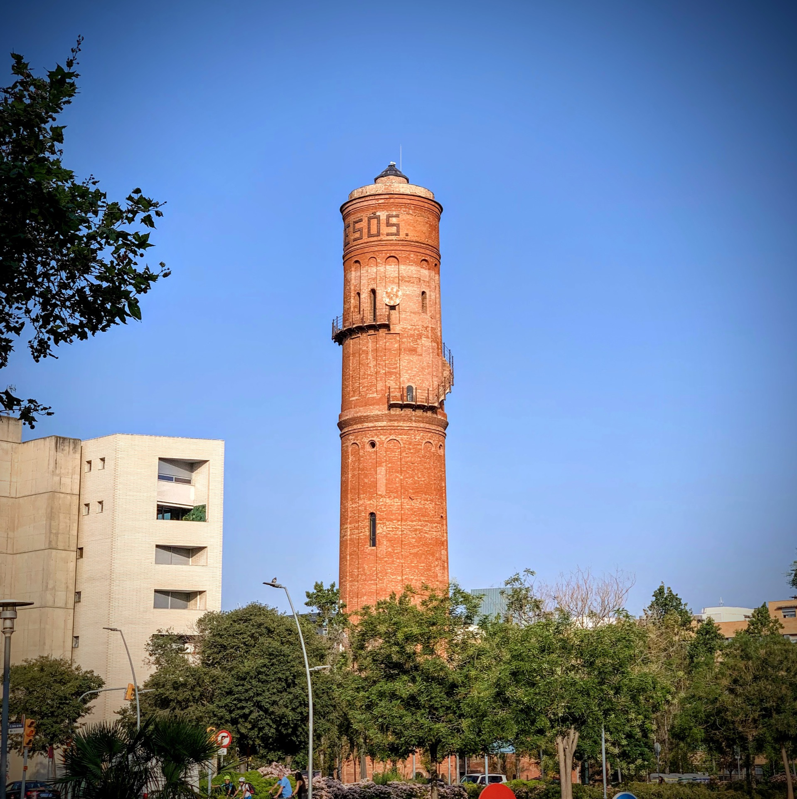
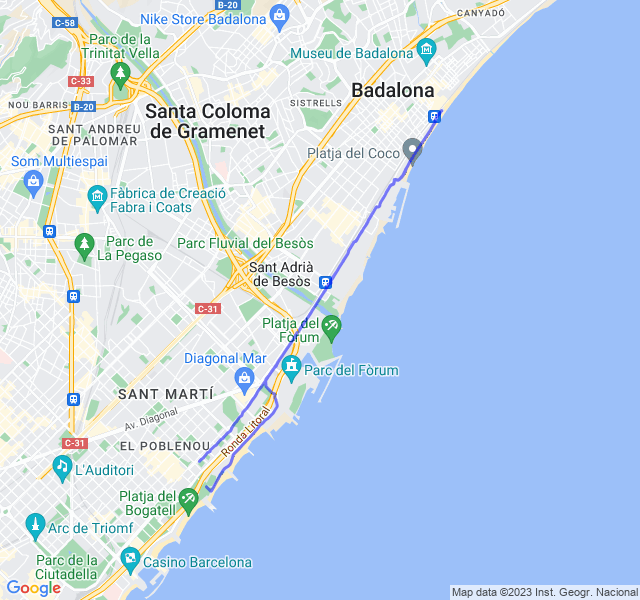

Settimana con trasferta in italia e un po' di cambi di programma ma nel complesso positiva.
<!--more--> 

Prima uscita fatta di domenica per cercare di compensare il lunedì che sarei stato in viaggio.

Settimana abbastanza positiva, ancora non al 100% ma in miglioramento.

## Prima uscita

Un lento che doveva essere in Z1 ma in realtà è stato a sensazione sforando allegramente in Ze e Z3. Il percorso era non conosciuto e il fatto di essere su strade senza marciapiede non ha aiutato ad essere rilassati.

Bello l'arrivo fino al fiume ma, nonostante fossero le sei di sera, l'umidità e il caldo erano soffocanti.



## Seconda uscita

Questa è stata la giornata no della settimana. Tornato alla 1:30 dall'Italia la mattina il serbatoio era completamente vuoto.
Sono partito lo stesso con l'intenzione di fare l'allenamento in programma: un bel 8x400 ma dopo il riscaldamento ho preferito ripiegare ul lento che avrei dovuto fare il giorno dopo.

Sicuramente la scelta migliore che potevo fare, non sarei riuscito a portare a termine il programma oltre a rischiare di farmi male. Alla fine, sempre meglio ascoltare il proprio corpo e non forzare se non c'è necessità.



## Terza uscita

Recupero della sessione precedente: 8x400 Z5 con recupero 400 molto lento. Non male come sessione anche se i recuperi li ho camminati per metà per recuperare perché altrimenti sarebbe stata dura arrivare alla fine.

Non ho ancora nelle gambe questo tipo di sessioni ma sicuramente il miglioramento si vede. Settimana prossima mi aspetta un altro bel allenamento in Z5 e vedremo se andrà meglio.



## Quarta uscita

Ultima uscita della settimana dopo aver fatto per due giorni consecutivi allenamenti muscolarmente impegnativi (Z5 e potenziamento). Pensavo di soffrire parecchio ma in realtà è andata bene, un po' di fatica alla fine ma non eccessiva.

)

Ritmi tenuti sia per la parte veloce che per il recupero: dopo lo stop sicuramente l'allenamento meglio riuscito. Speriamo che sia sempre così d'ora in poi!



