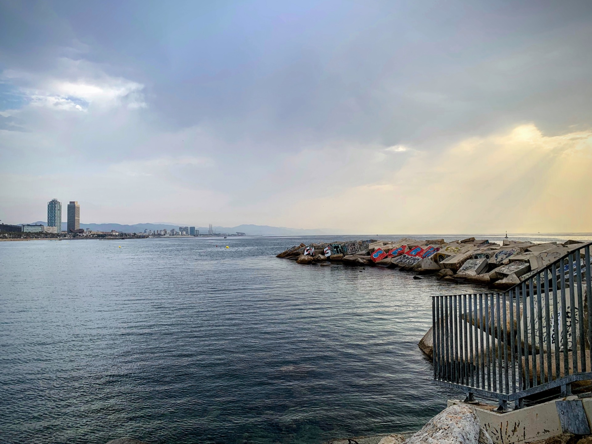
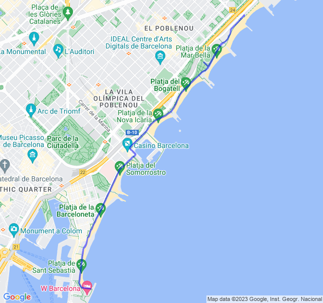
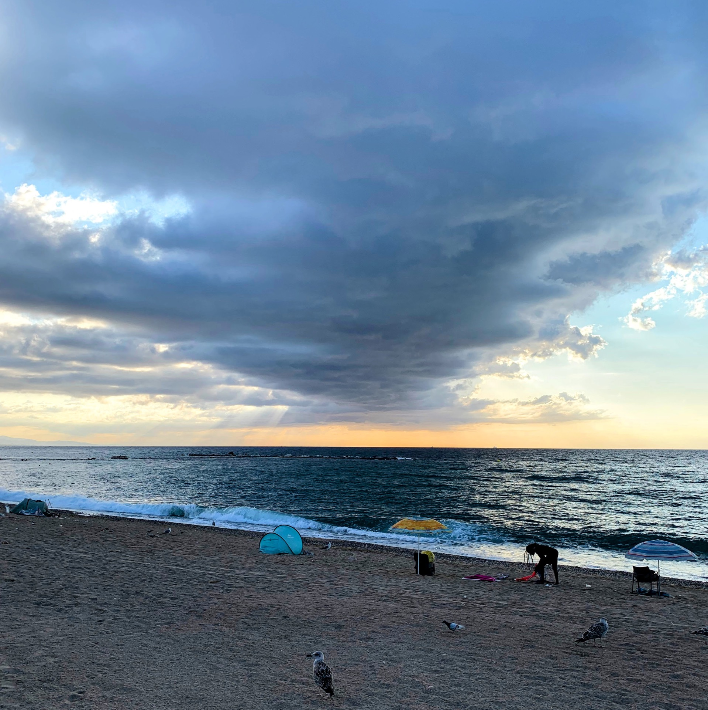
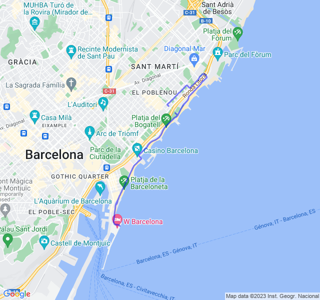
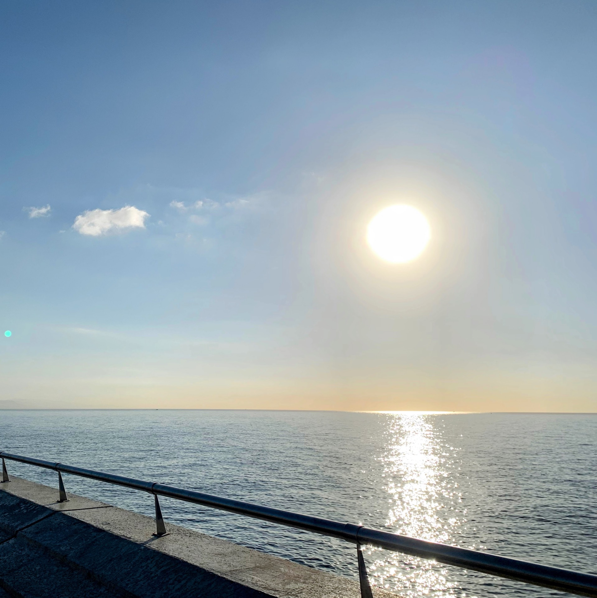
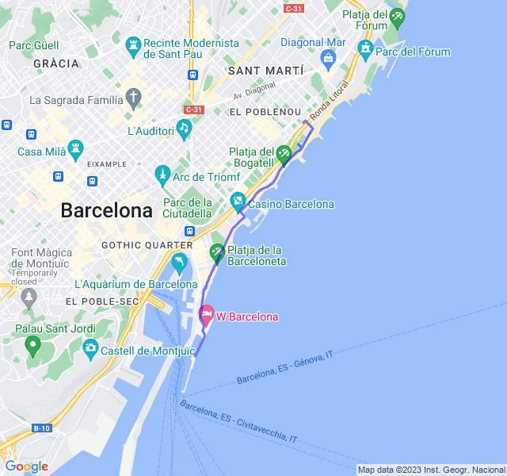
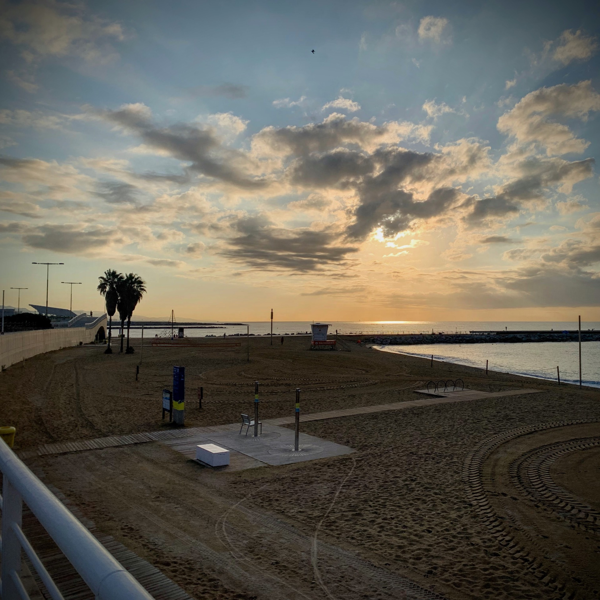
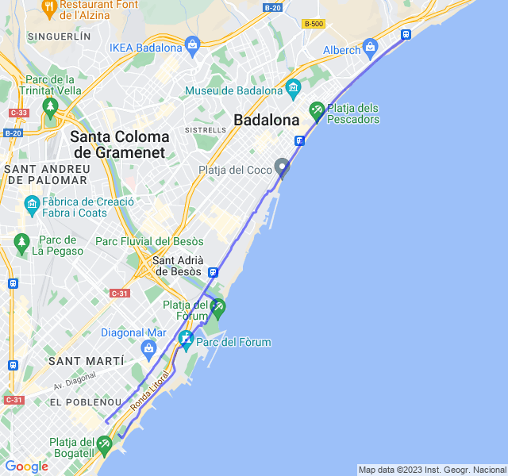

Settimana di allenamento piena superando i 50km! Si inizia a macinare!

<!--more--> 

Una settimana completa senza cambi di programma: 2 lenti, un lavoro _anaerobico_ e uno _ritmo_.

Nel complesso andata bene anche se i lenti sono sempre troppo veloci e troppo faticosi ma prendiamo quello che viene.

## Prima uscita

I lenti, appunto. 10km Z1 fatti quasi tutti in Z2 e finiti in Z3. Sicuramente non svolto nella maniera corretta ma non c'è modo di tenere i battiti bassi nemmeno rallentando.

Sarà colpa del caldo o del poco allenamento, speriamo migliori.



## Seconda uscita

Allenamento inteso di _Interval training_ andato discretamente: ho tenuto bene i ritmi sia delle parti veloci che di quelle lente. Il miglior allenamento della settimana e forse degli ultimi mesi!



## Terza uscita

Lento fotocopia di quello fatto il lunedì: frequenza alta e fatica altrettanto.



## Quarta uscita

Allenamento lungo con variazioni in Z3. Sicuramente impegnativo e fatto discretamente.

Un paio di pause per rifiatare, bere e mangiare un gel. Il fatto di partire a digiuno non aiuta molto e dopo mezz'ora si sente già il calo di energie. Ritmi tenuti bene, sia nella parte veloce che nella parte lenta.


