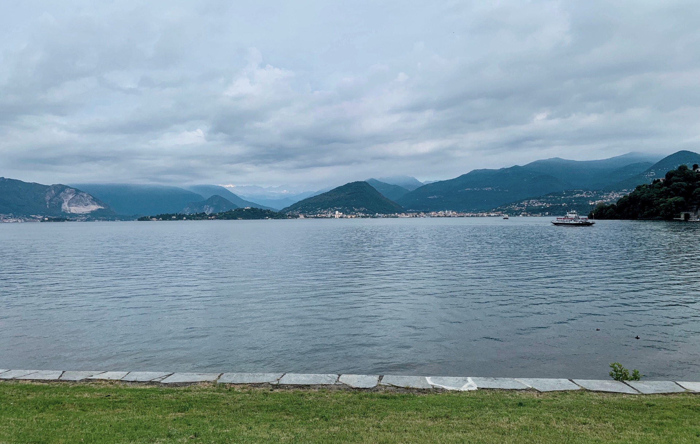
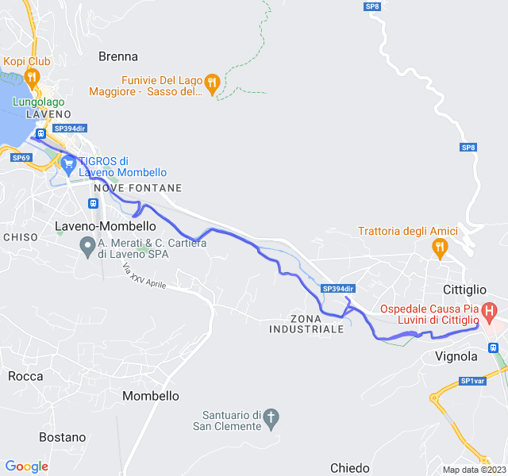
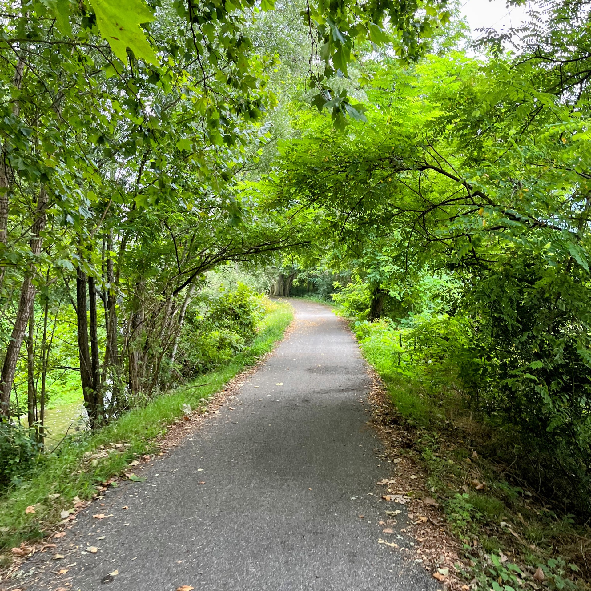
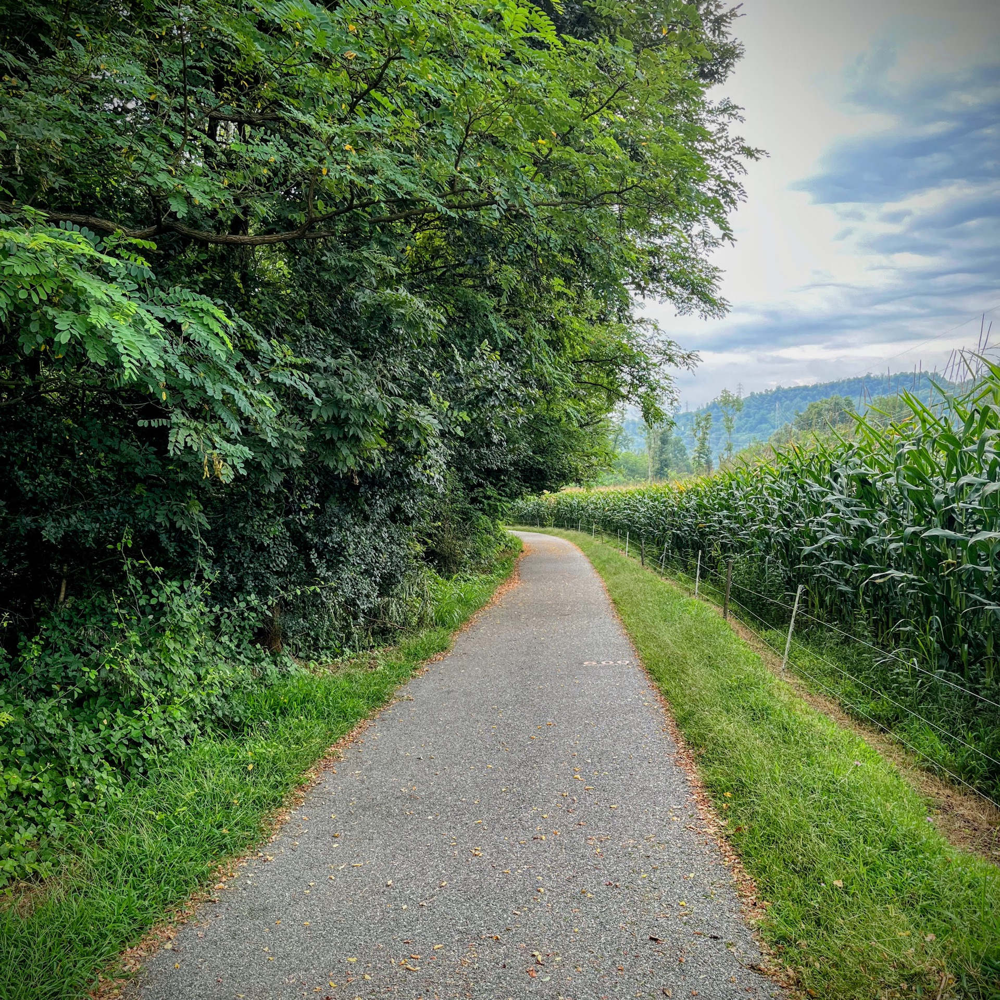
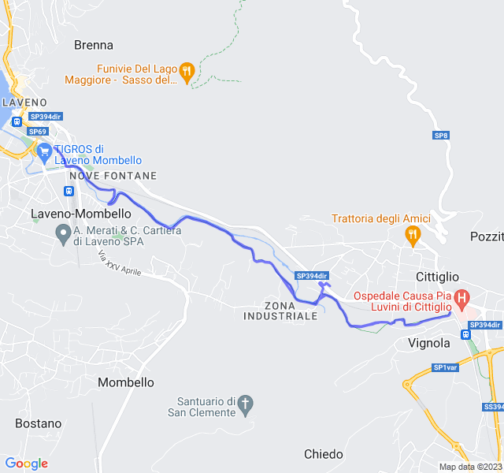
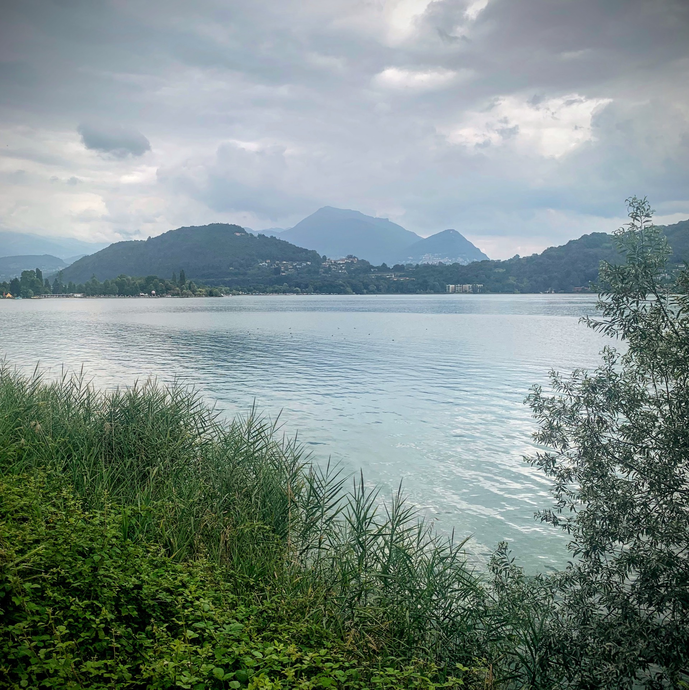
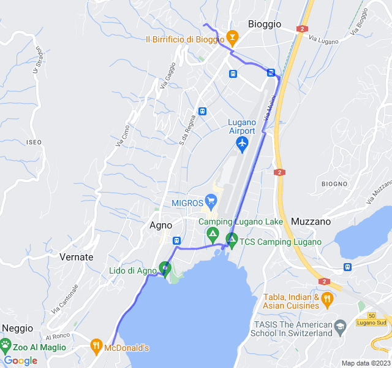
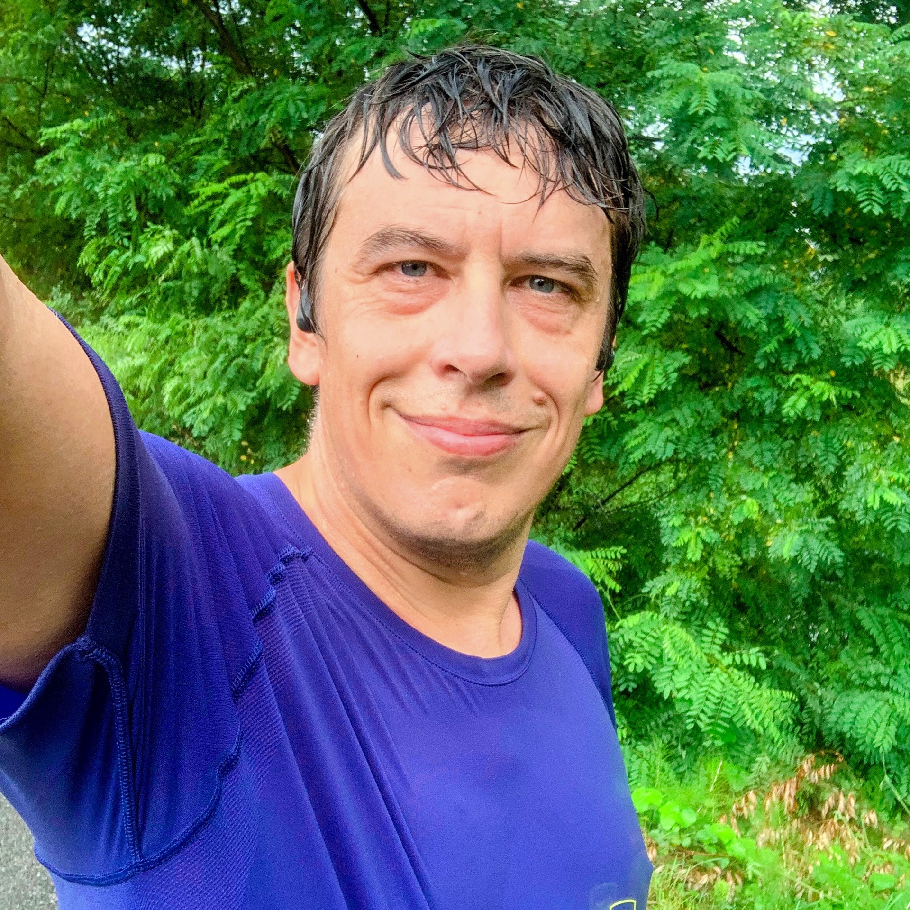
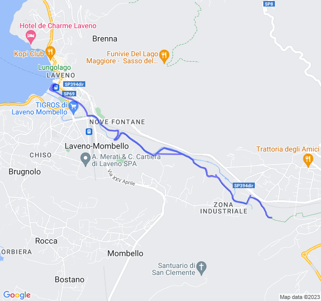

Settimana di allenamento in Italia; al fresco!
<!--more--> 

Allenamenti andati tutti abbastanza bene, probabilmente per il fresco che ha evitato che i miei battiti salissero troppo come al solito.

## Prima uscita

Prima uscita in ciclabile a Laveno: 10 gradi meno di Barcellona e 10 battiti meno!

Niente di particolare da segnalare, i lenti stanno iniziando a diventare _normali_."



## Seconda uscita

Allenamento molto impegnativo, 6x1000 in Z4 con soli 200mt di recupero. 
Gli ultimi recuperi non sono riuscito a tenerli bene e ho parzialmente camminato ma in generale tutto ok.



## Terza uscita

Altro lento, altro Lago. Anche qui poco da segnalare, tutto abbastanza sotto controllo.



## Quarta uscita

Anche questo è stato un allenamento bello impegnativo: 10km Z3.

L'allenamento è andato abbastanza bene. Ho tenuto un ritmo leggermente più veloce del previsto ma pioveva talmente tanto che non vedevo nemmeno l'orologio. 

I battiti sono stati un po' più alti del previsto ma la percezione non è stata di molta fatica. Rispetto ai 6x1000 di 3 giorni prima ho avuto battiti medi più alti fin dal primo chilometro ma la fatica percepita è stata mooolto più bassa. Il mio corpo proprio non lo capisco!

Il questo caso ho seguito il passo (più o meno) e le sensazioni come da indicazioni ma alla fine più che Z3 è stato quasi uno Z4. 


