Settimana di buoni allenamenti ma purtroppo con un inizio di dolore al ginocchio. 😐
<!--more--> 

## Prima uscita
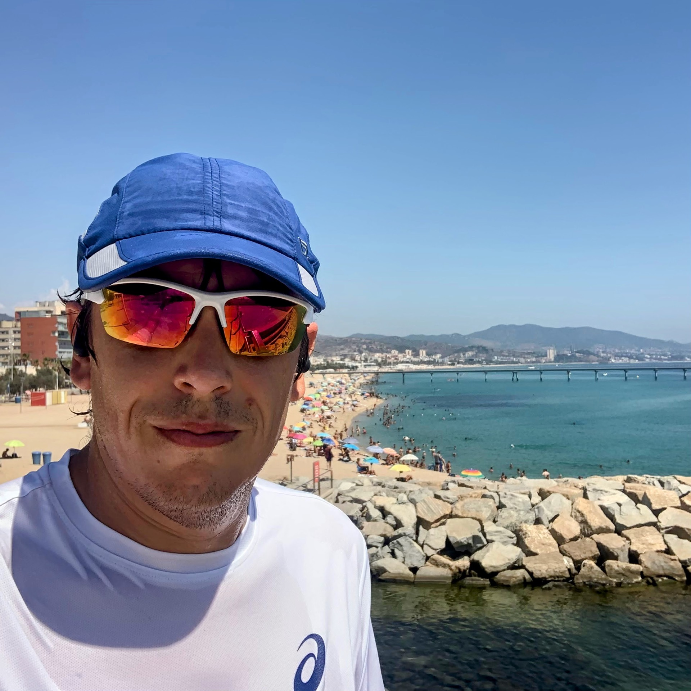
Corsa lenta con un caldo terribile.
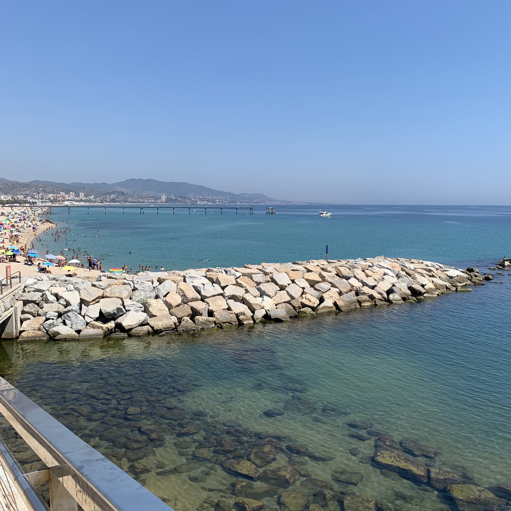
Ad un certo punto mi son dovuto fermare a strizzare la maglietta perché era troppo bagnata e pesante.
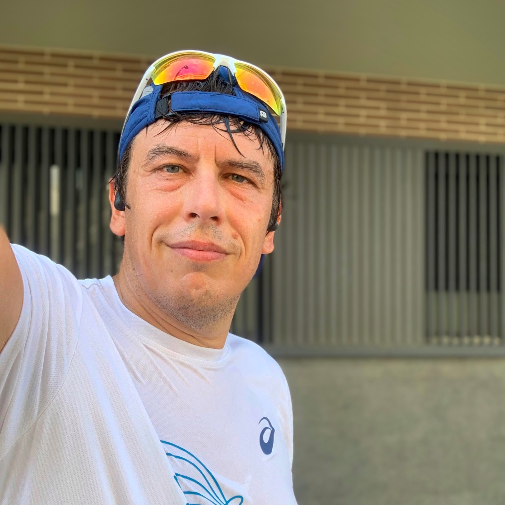
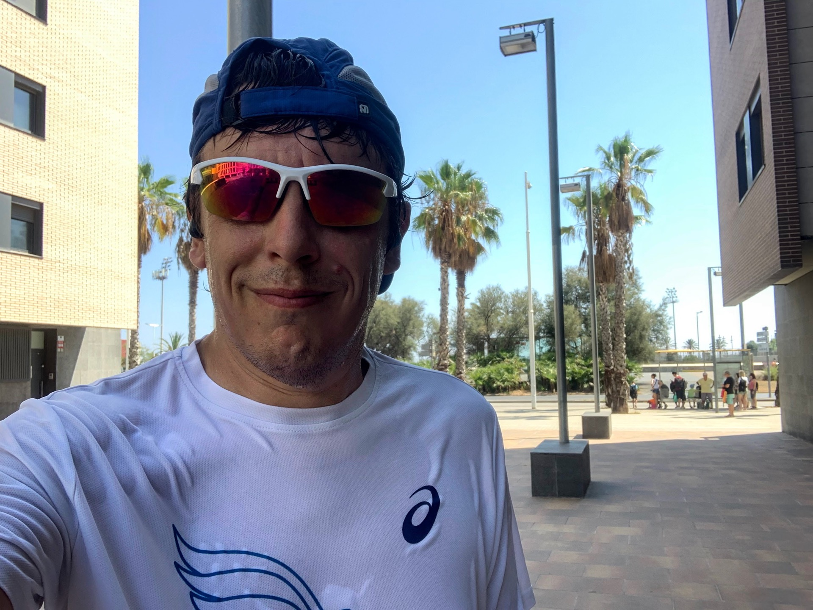

Una Z2 un po' troppo alta come al solito quando fa caldo.

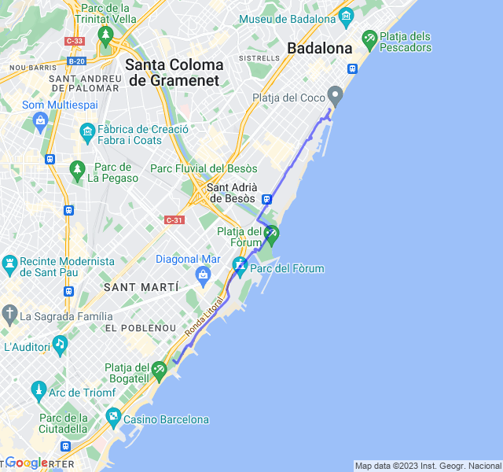



## Seconda uscita
Ripetute lunghe (2000) in Z4. Molto faticose ma, nonostante non credevo di potercela fare, son riuscito a tenere un buon ritmo.

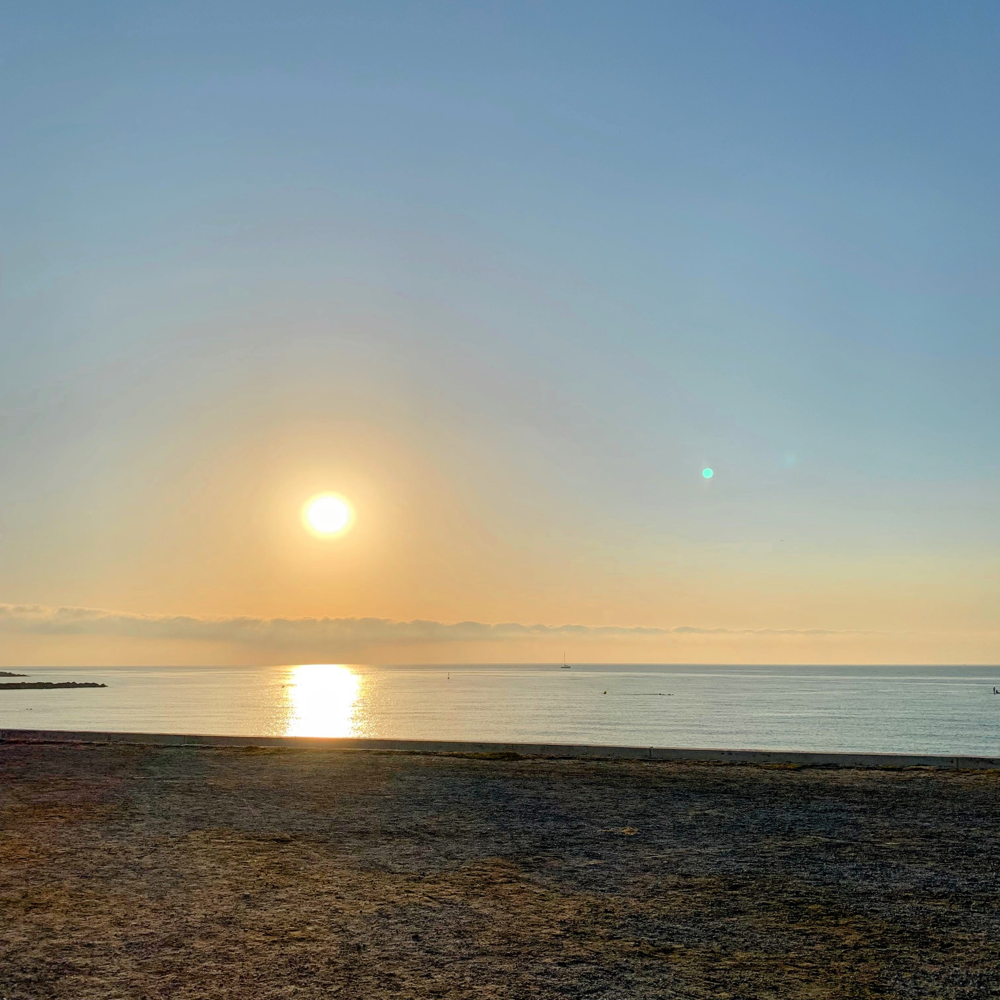

Un po' troppo lenti gli ultimi recuperi e troppo veloce il primo, la prossima volta devo stare più attento.

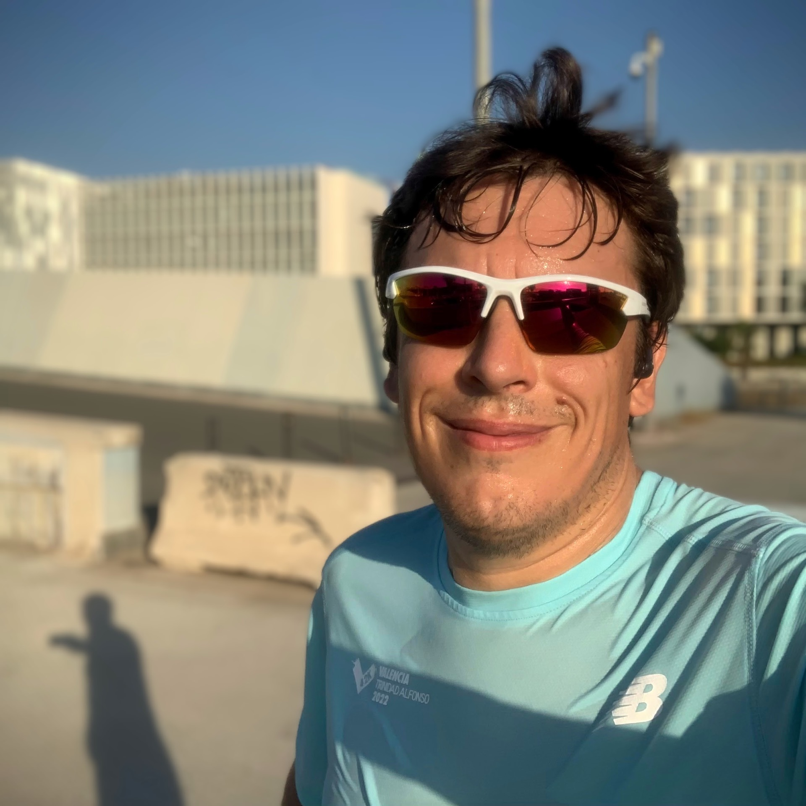
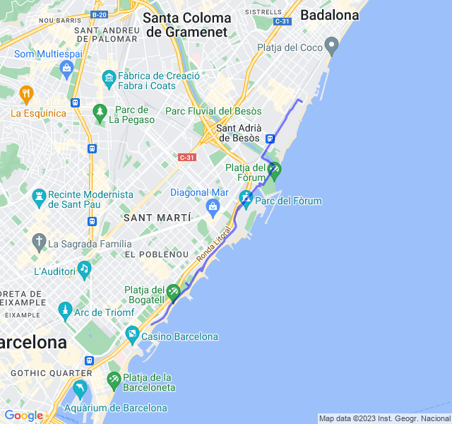



## Terza uscita
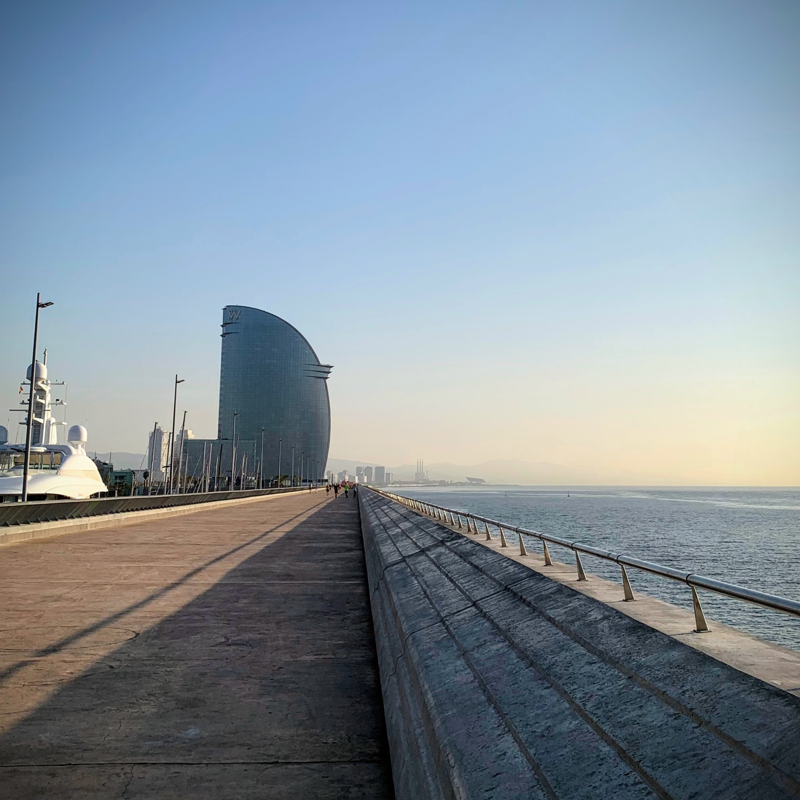

Z1 super easy, come sempre sforata in Z2.

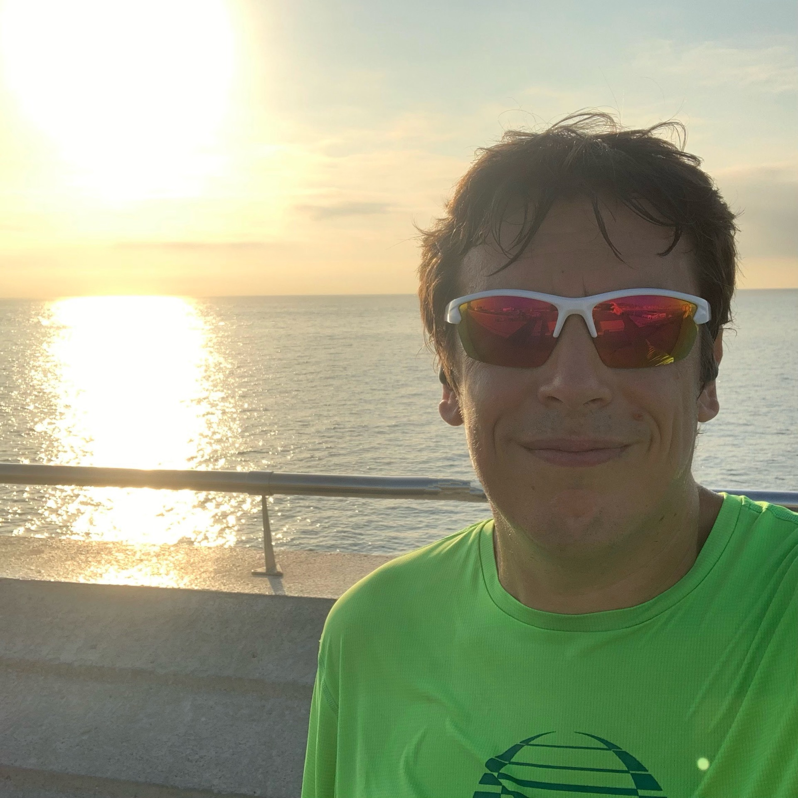

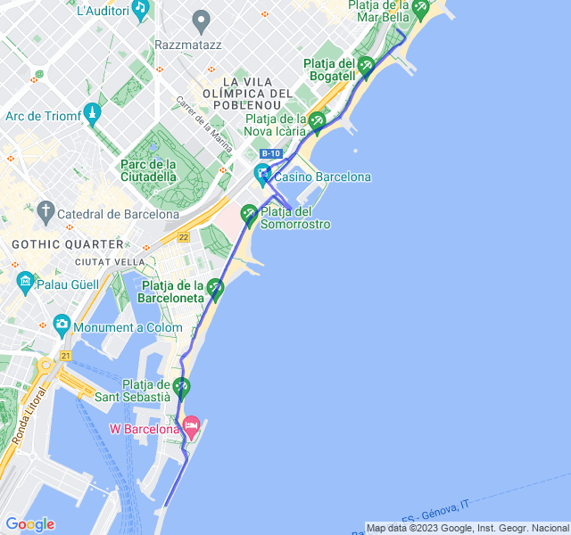



## Quarta uscita

Lungo di 18km. Andato molto bene, sempre in controllo anche con la FC.

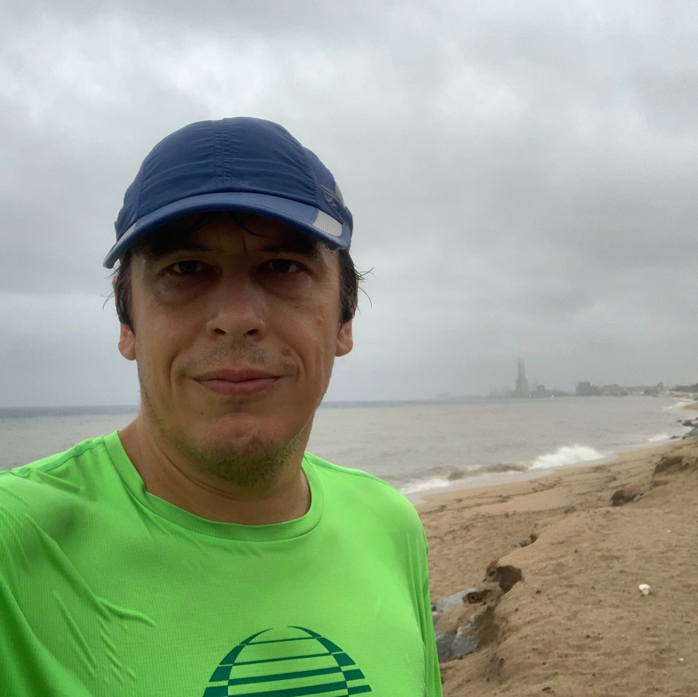

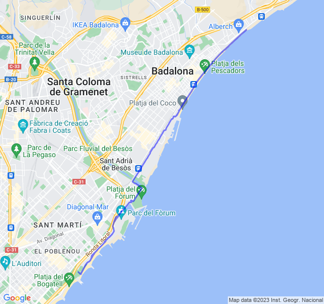


