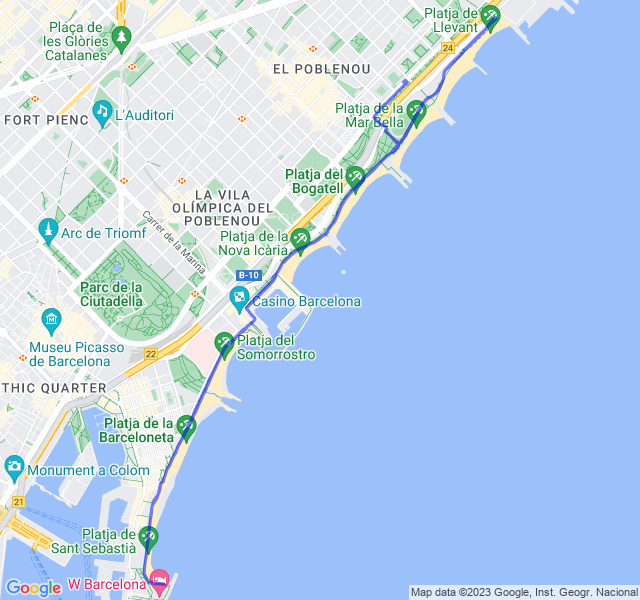
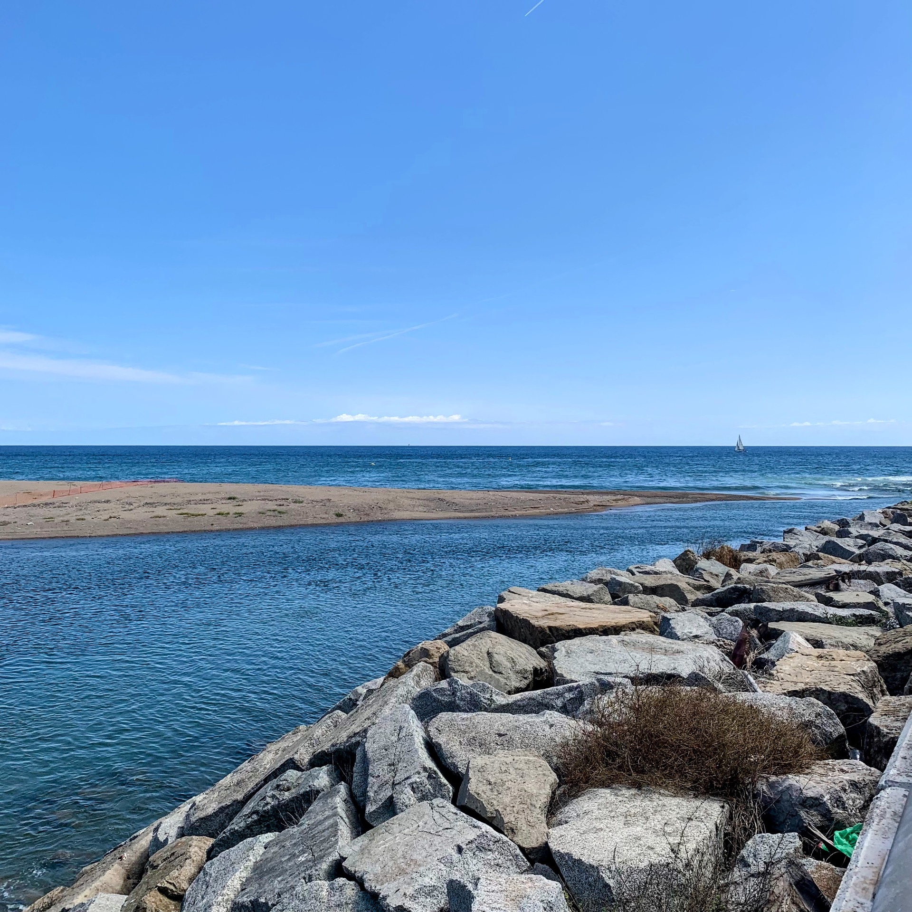
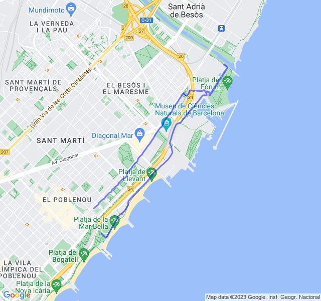

Settimana molto corta purtroppo a causa del dolore al ginocchio esterno sinistro ma con ottimi risultati.
<!--more--> 

## Prima uscita
Priam Z1 fatta bene, senza sforare. Ottime sensazioni e anche buon ritmo.



## Seconda uscita

Ripetute corte in Z5, sono andate anche queste molto bene, un po' troppo veloci i recuperi tra le ripetute e troppo lento quello tra le serie ma in generale proprio ben riuscito!


