Settimana di tapering e gara! 
<!--more--> 

## Prima uscita
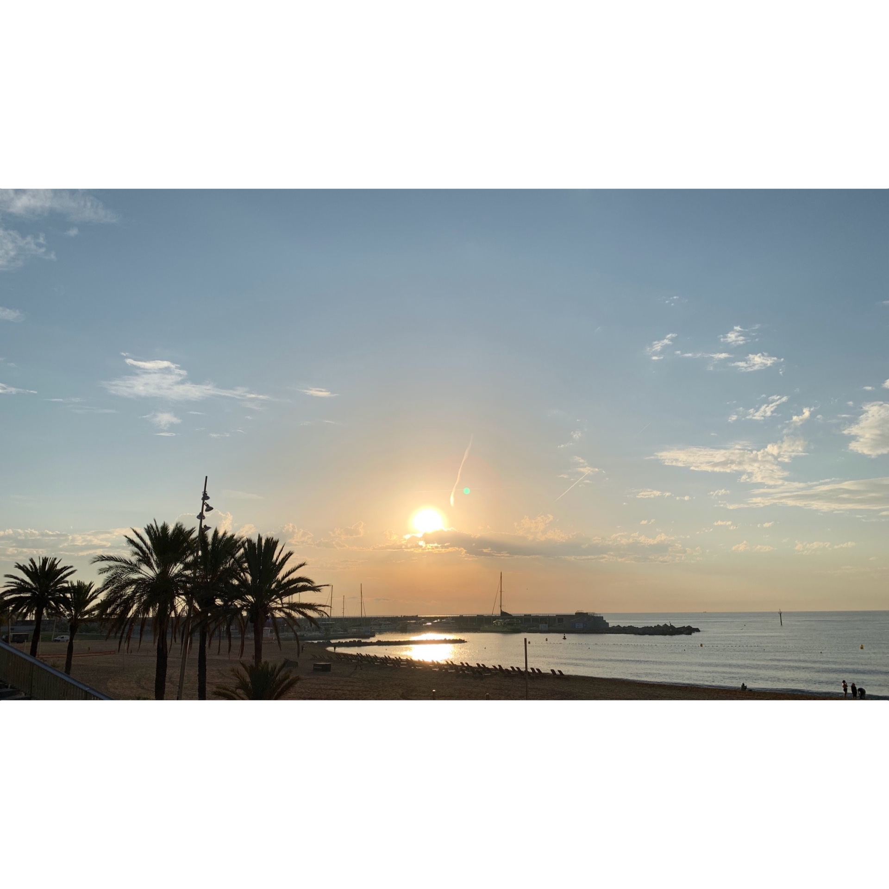
7x200 Z5. Amo i rossi delle settimane di scarico!
Tutto bene direi.

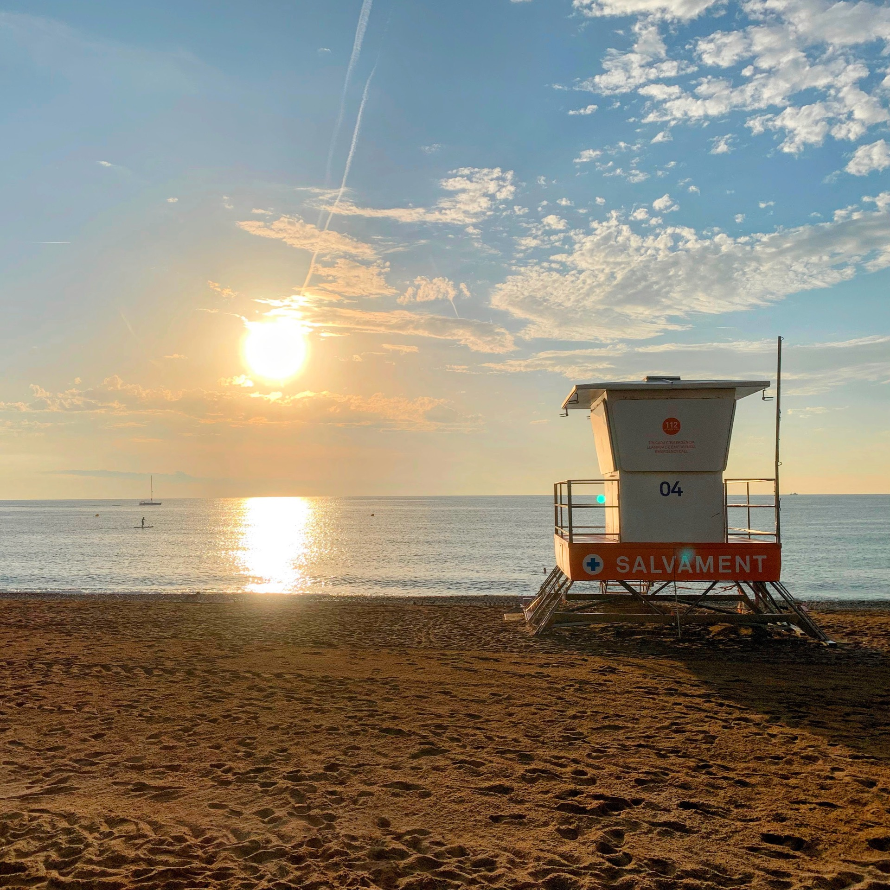

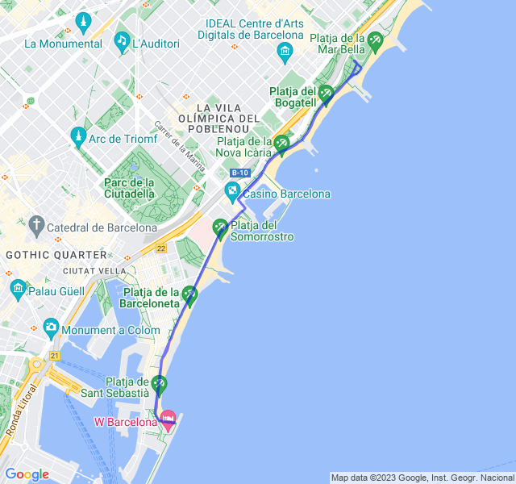



## Seconda uscita

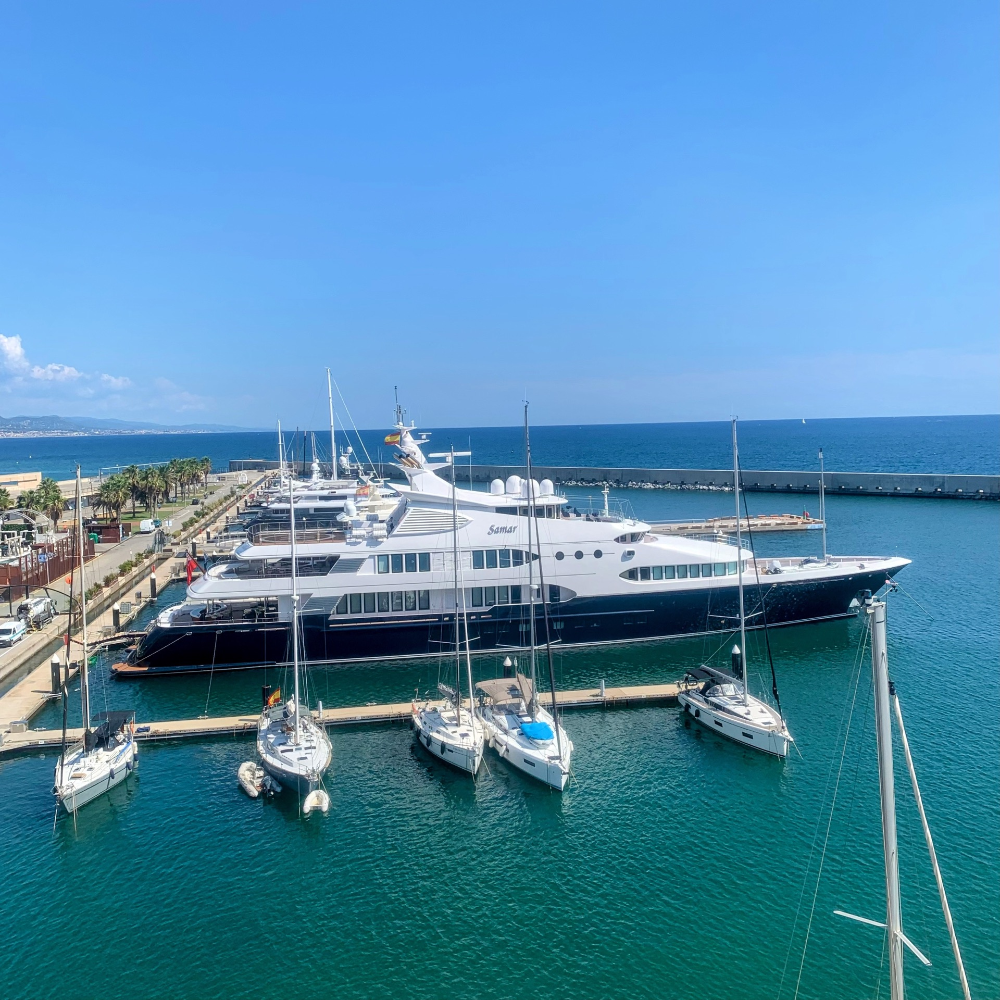
8km Z2. Nulla di particolare da segnalare, mi pare di aver tenuto bene la FC anche ad un buon passo per i miei standard!

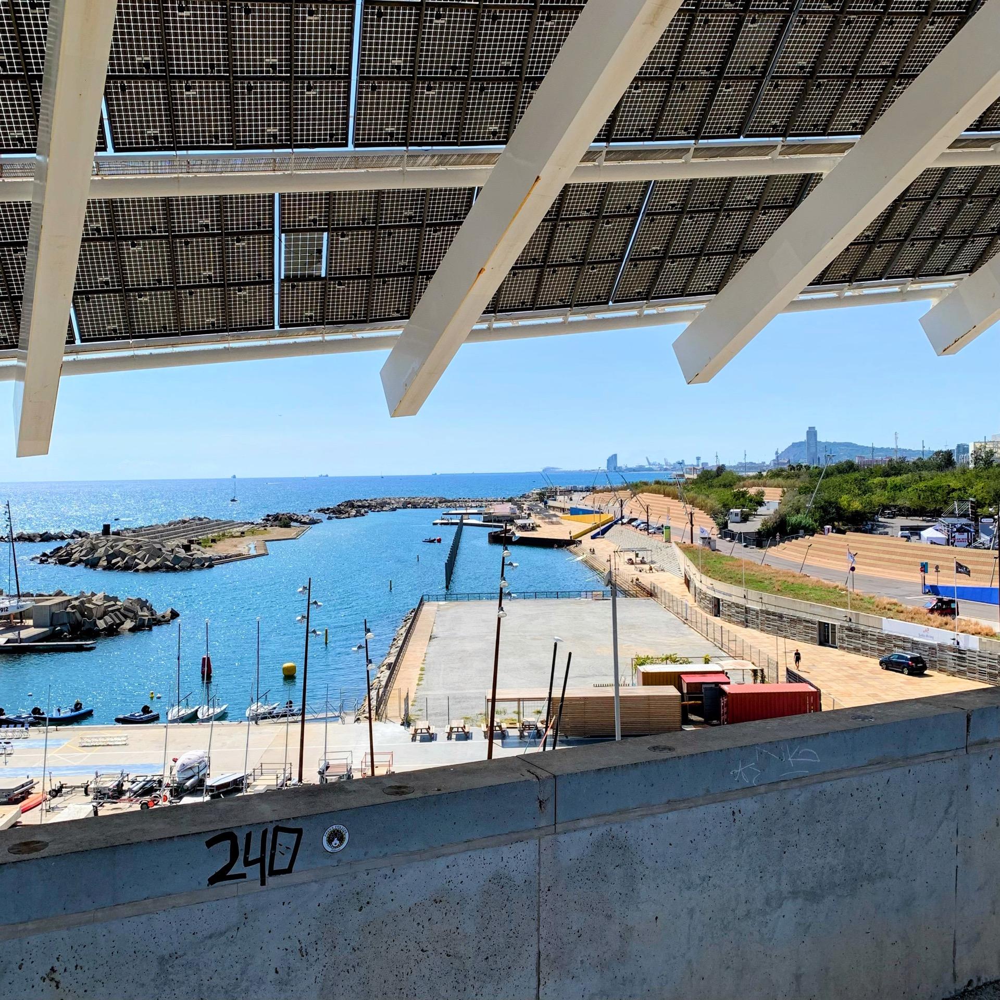

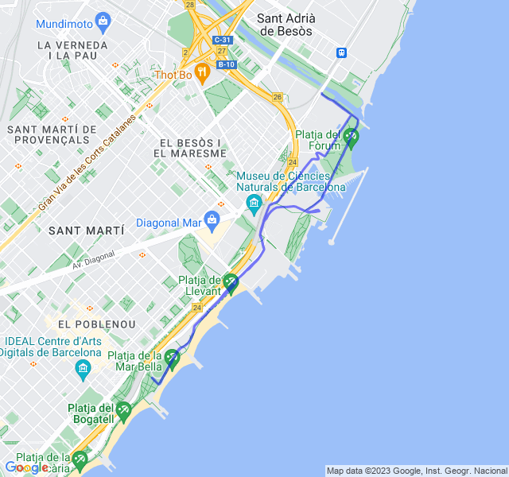



## Terza uscita

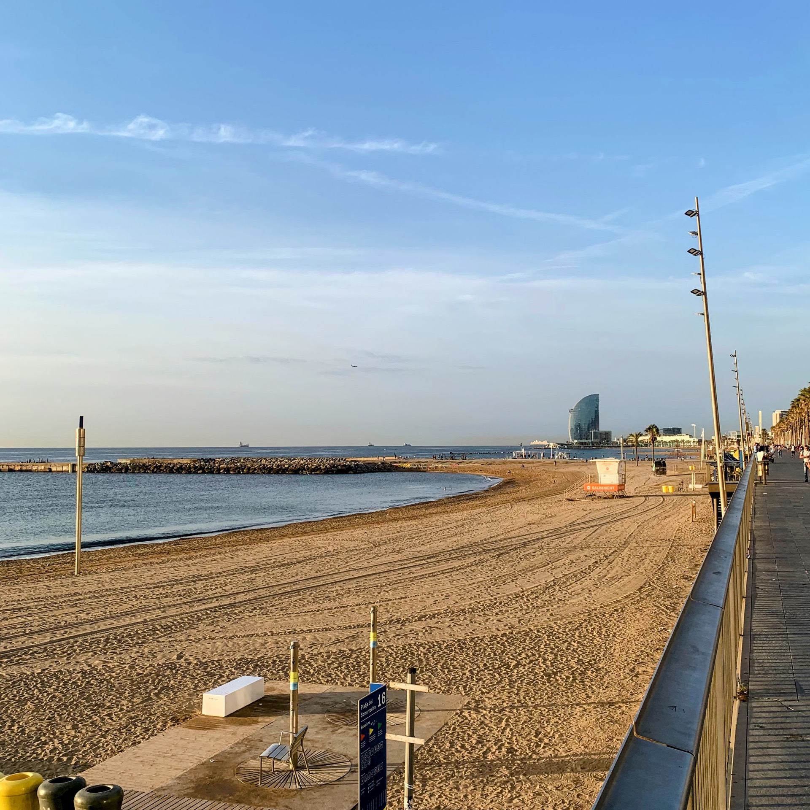
8km Z1 + allunghi.
Ultima uscita prima della gara di domenica. Tutto bene, anche le Z1 iniziano ad avere una bella forma!

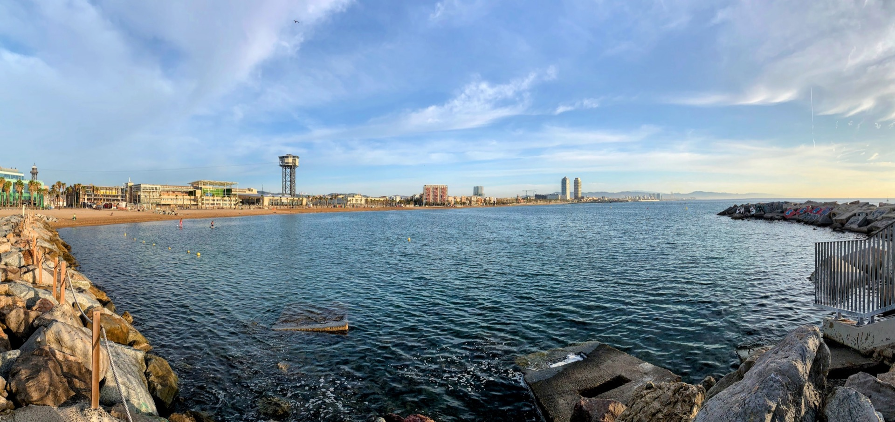

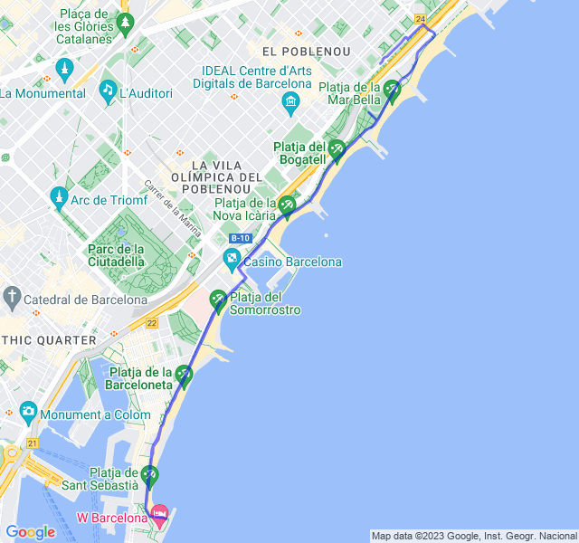



## Quarta uscita

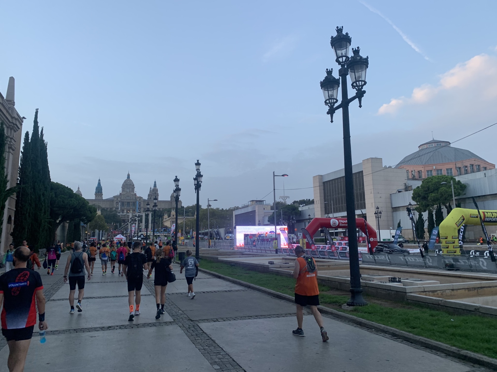
🏁 “Cursa de la Mercè” ( e test VDOT). Sono abbastanza soddisfatto.
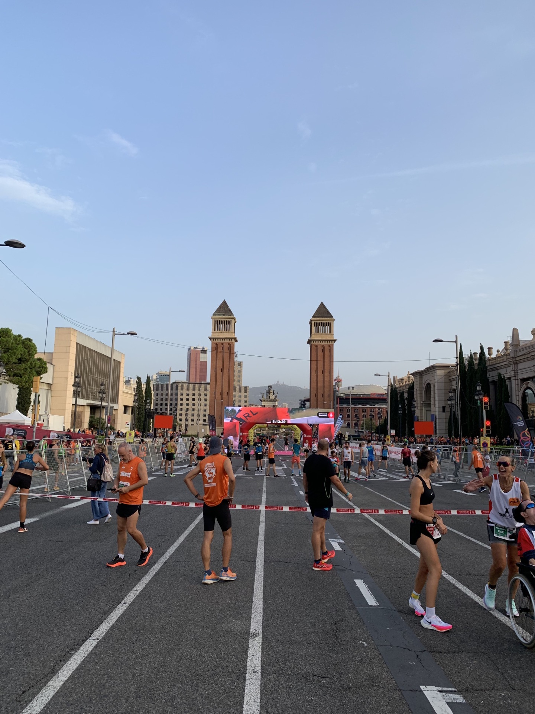

Speravo di scendere sotto i 41 minuti ma durante i primi 2 km è stato davvero difficile tenere il ritmo corretto e poi non sono riuscito a recuperare i secondi che avevo perso.

Gli ultimi 2 km con un leggero falsopiano in salita e il rettilineo finale con una pendenza leggermente superiore mi hanno stroncato! 😜
Sempre bello gareggiare! 🏃‍♂️💪🏻

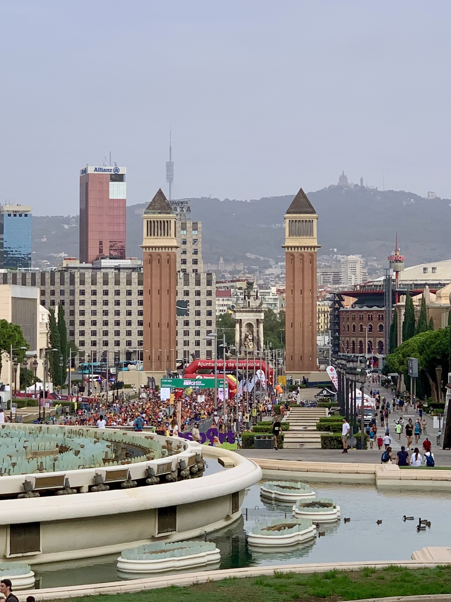
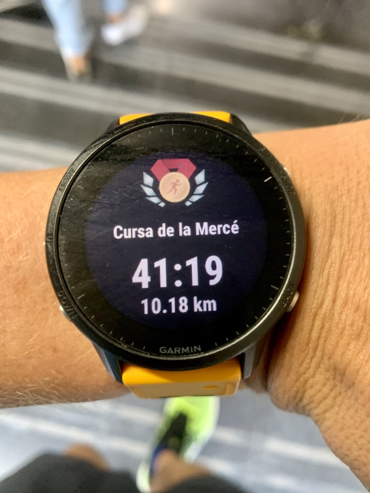

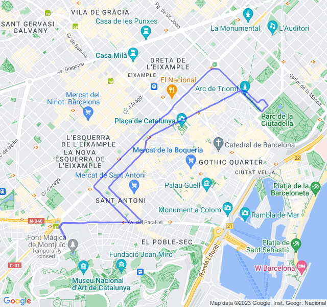


