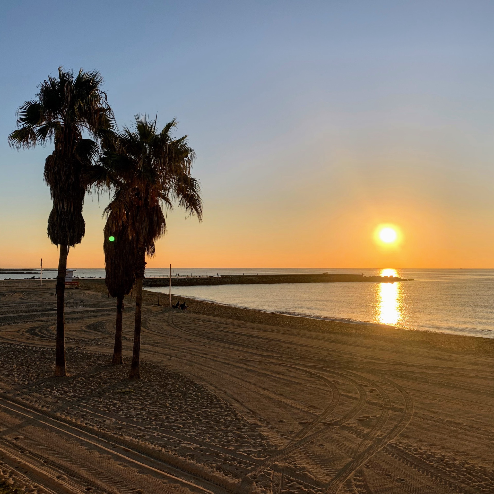
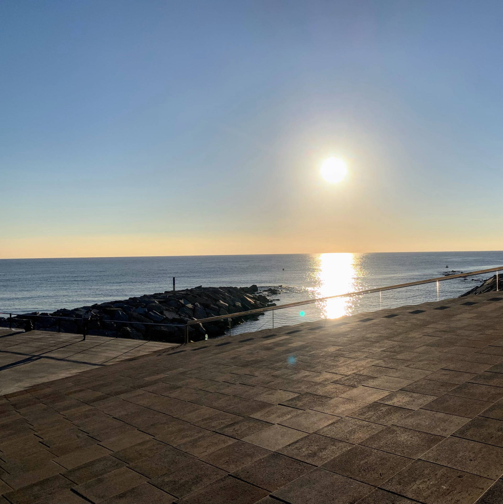
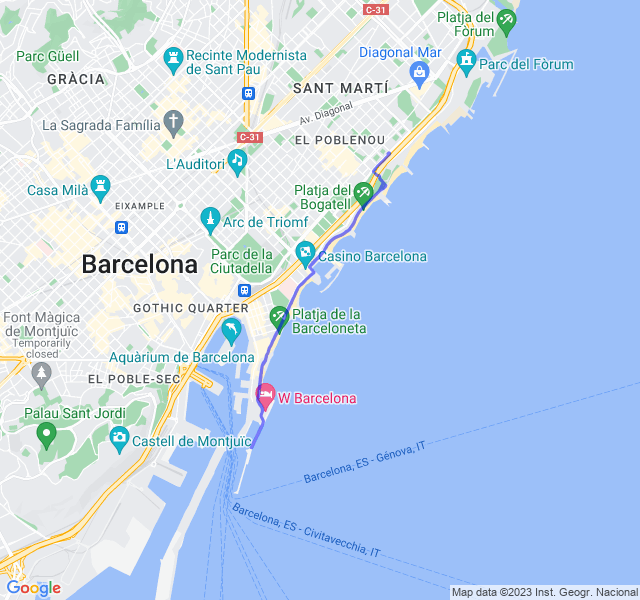
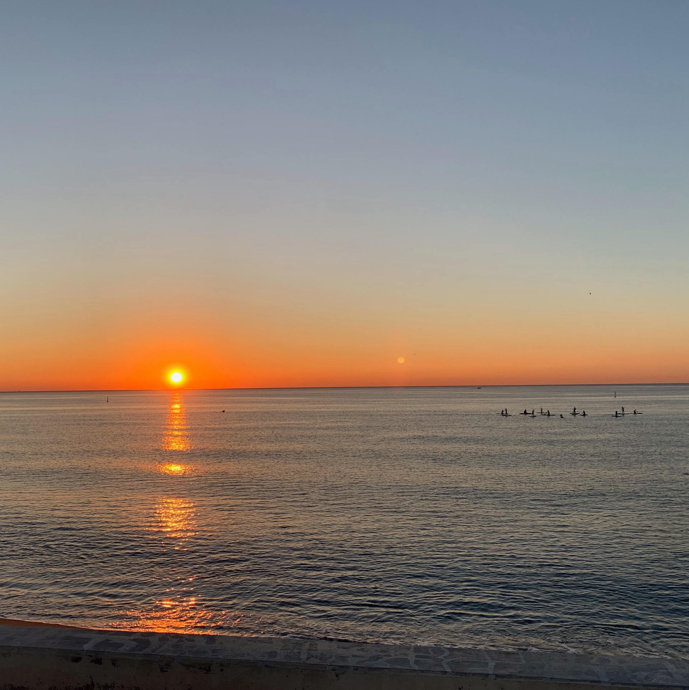
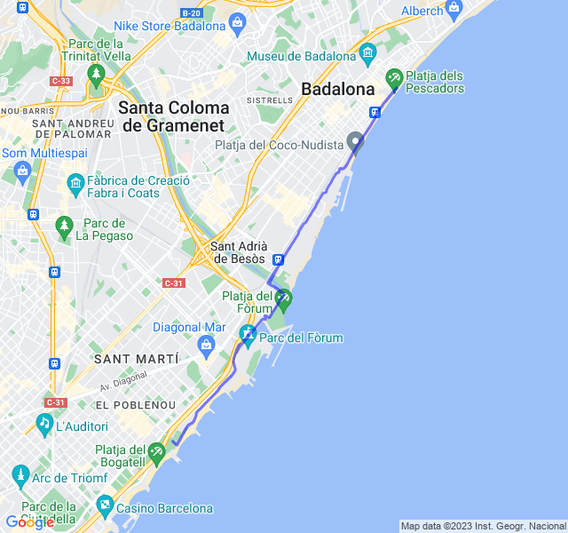
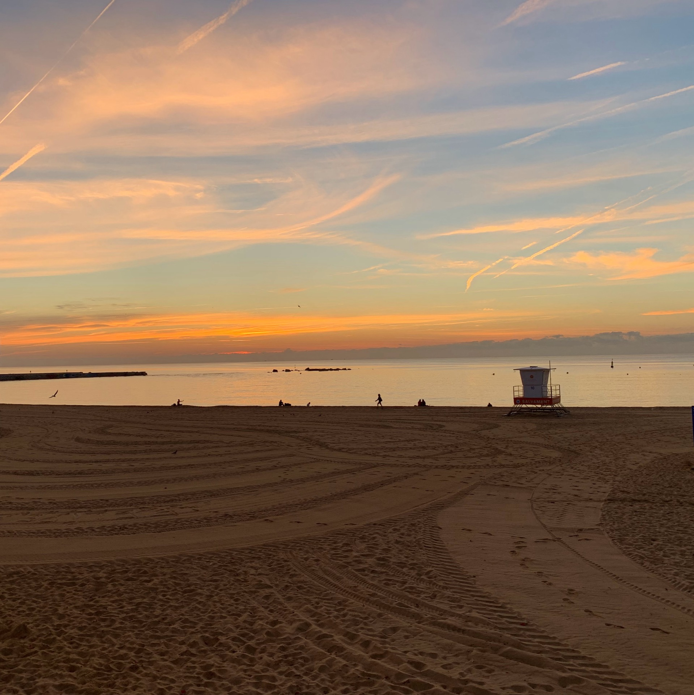
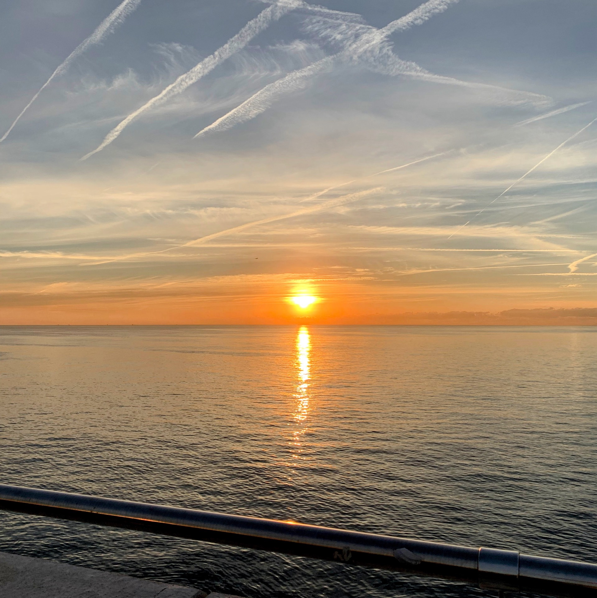
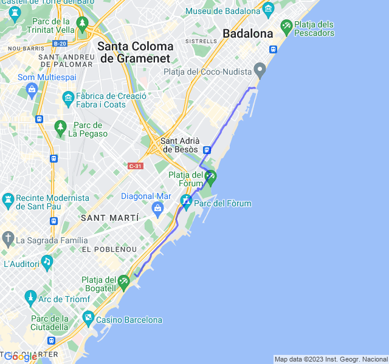
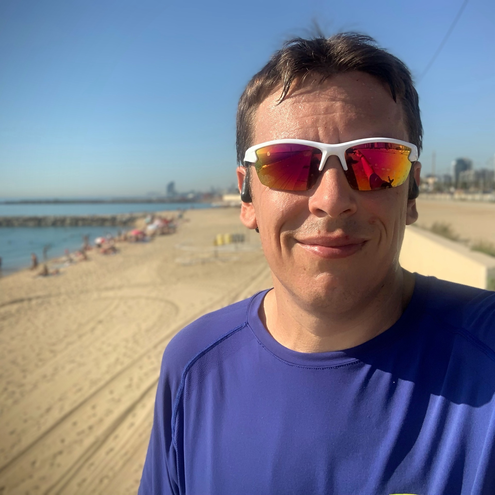
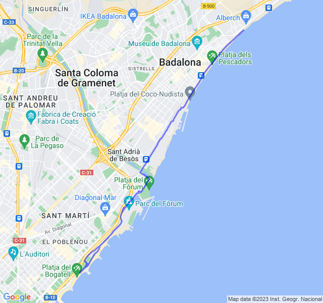

Prima settimana full dopo la _Cursa de la Mercé_!

<!--more--> 

Allenamenti non proprio ben distribuiti con 3 allenamenti di fila che non aiutano.

## Prima uscita

12km Z1. Tutto tranquillo: sempre un po' sul filo della Z2 ma buon passo. Le gambe sembrano abbastanza riposate e pronte a riprendere gli allenamenti!



## Seconda uscita

2x2000 + 3x1000 in soglia. Pensavo di morire in malo modo durante l'allenamento invece è stato impegnativo ma non mortale. Mi pare andato abbastanza bene anche se il tempo effettivo in soglia non è stato moltissimo. Comunque soddisfatto del risultato!



## Terza uscita

Gambe un po' pesanti dopo il rosso del giorno prima.

E il giorno dopo giallo lungo!



## Quarta uscita

Lungo con ripetute a ritmo medio 3x2000 + 3x1000 Z3. Il paio di 🍻 bevute ieri sera  non mi facevano ben sperare invece l'allenamento è andato discretamente bene. Ho seguito il consiglio di dare un'occhiata anche alla FC per la Z3 ma questa volta non c'è stato bisogno di rallentare perché era già abbastanza in linea. 

Solo un po' di Z4 nell'ultima ripetuta su una "salita".
Nonostante questo, pensare che la Z3 sia il ritmo maratona, mi terrorizza! 😜


