Settimana intensa con 2 uscite in trasferta.

<!--more--> 

## Prima uscita
Ho invertito il rosso del martedì con il verde del lunedì per avere un po' pi`u di tempo a disposizione.

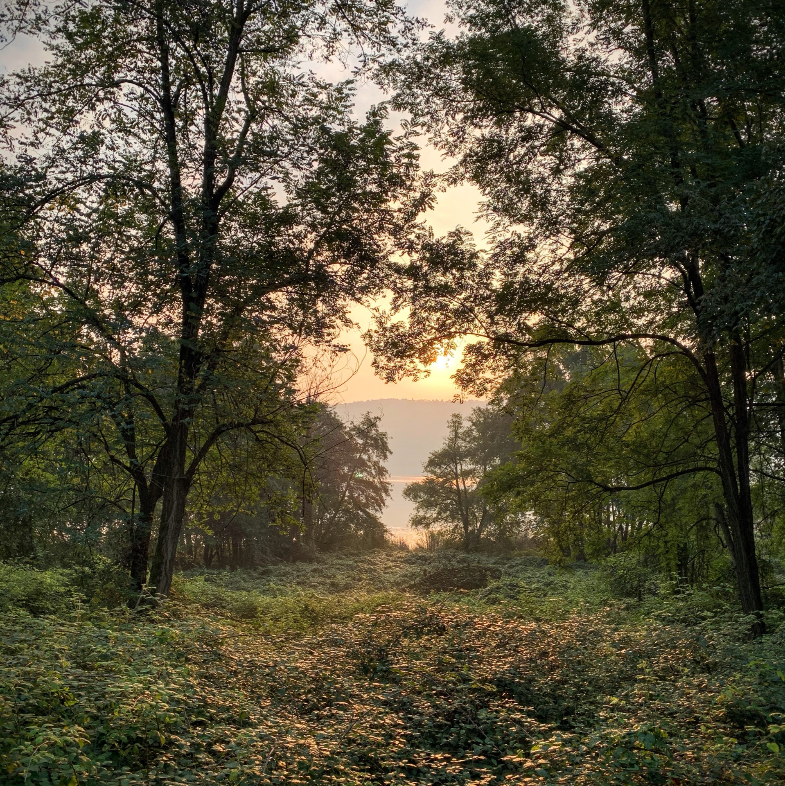

6x600 mt Z5 fatti su un percorso un po' ondulato dove tutte le salite sono state ovviamente sulla parte veloce!

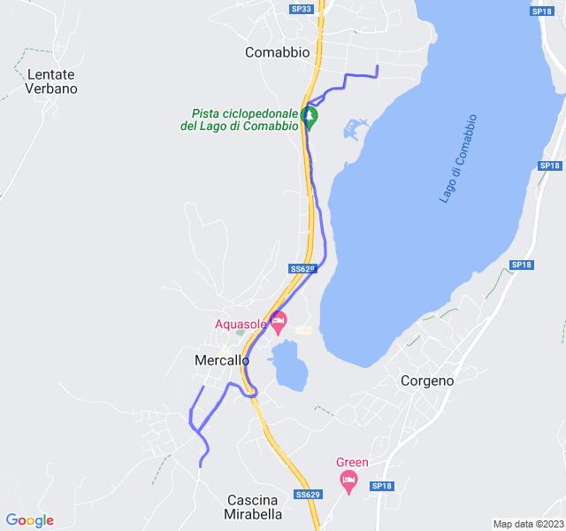



## Seconda uscita

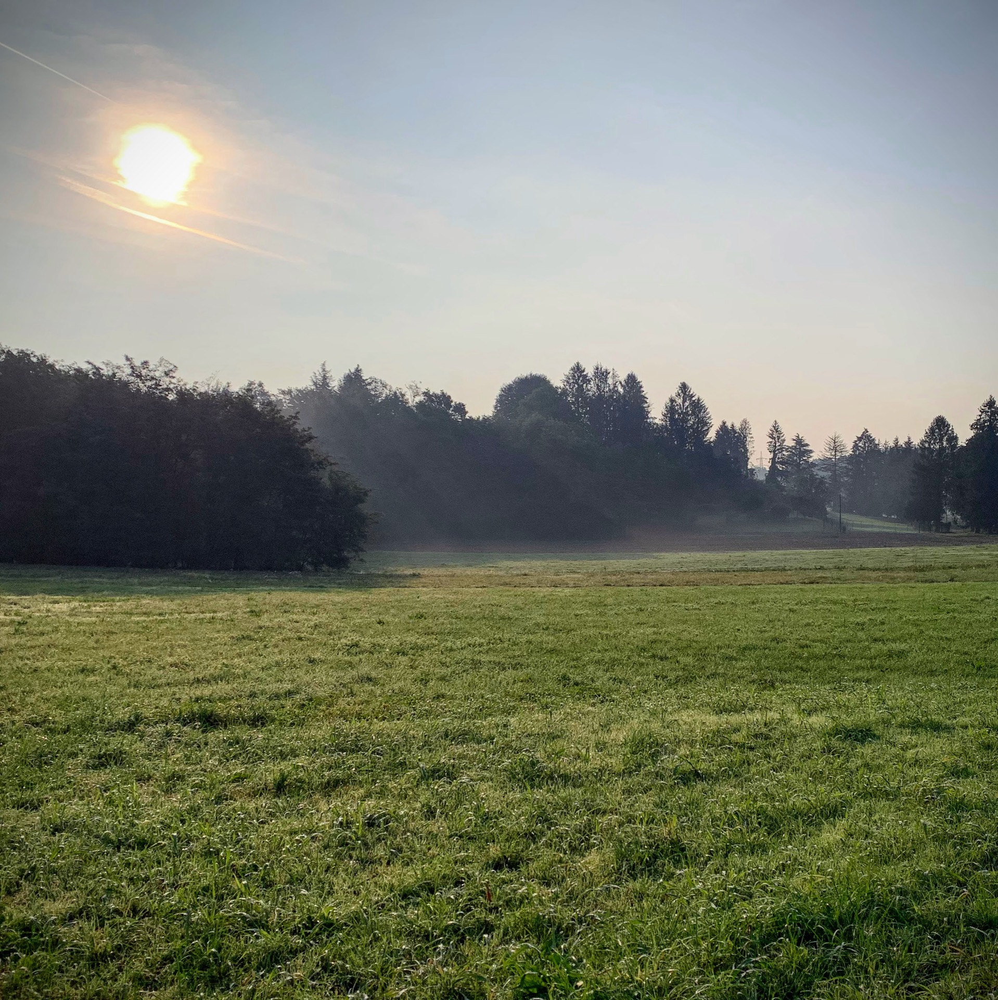

Bellissima uscita che doveva essere una Z2 ma, visto il poco tempo è stata più una Z3. 

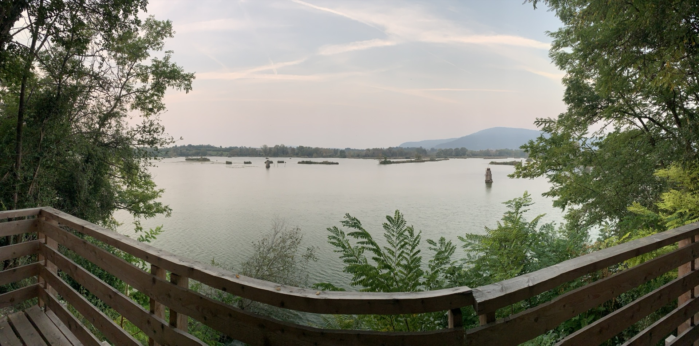

La vista dalla torbiera è stata proprio un toccasana!

Gli strascichi di questa Z3 li ho sentiti per diversi giorni 😢

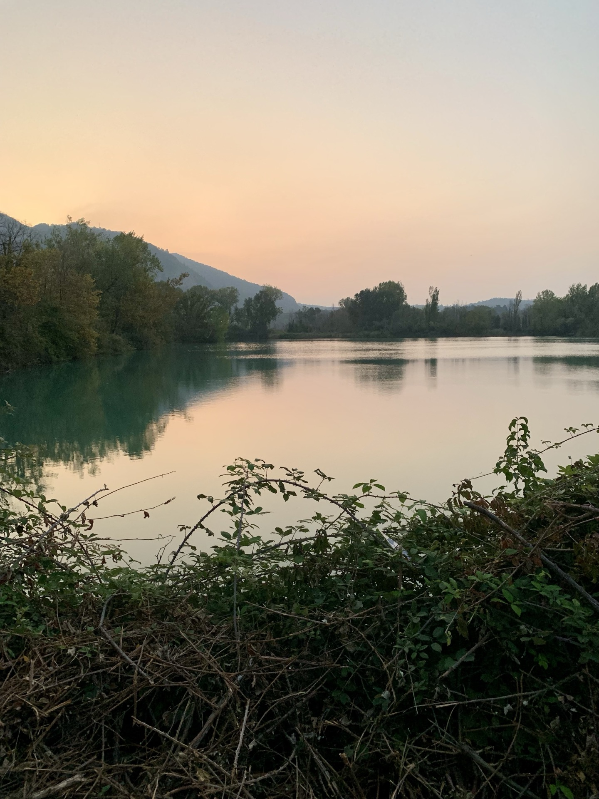

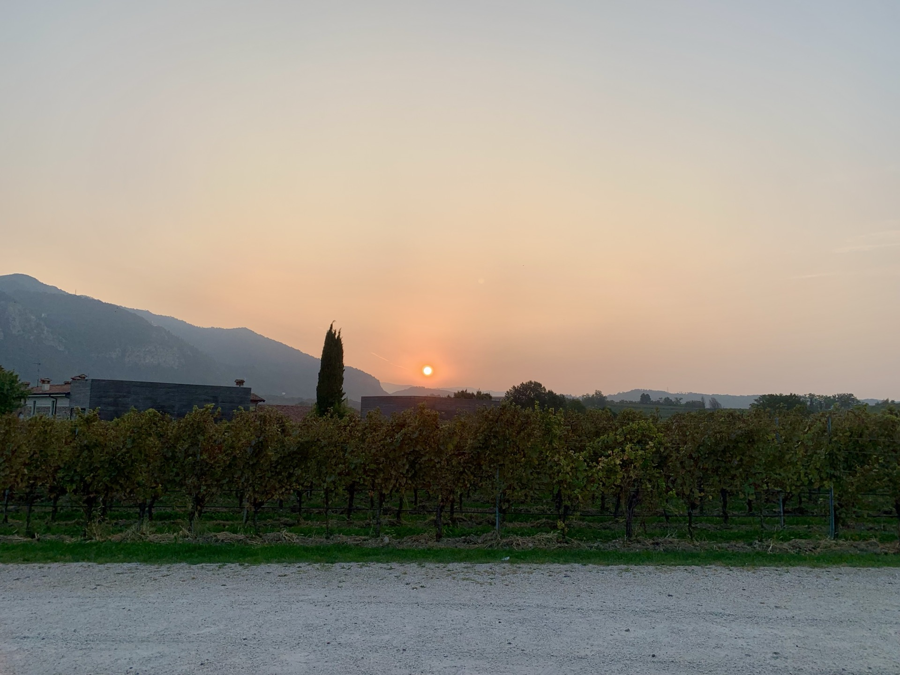

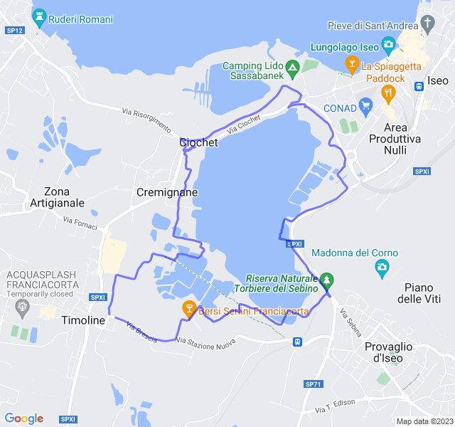



## Terza uscita

Lento tranquillo di ritorno dalla trasferta.

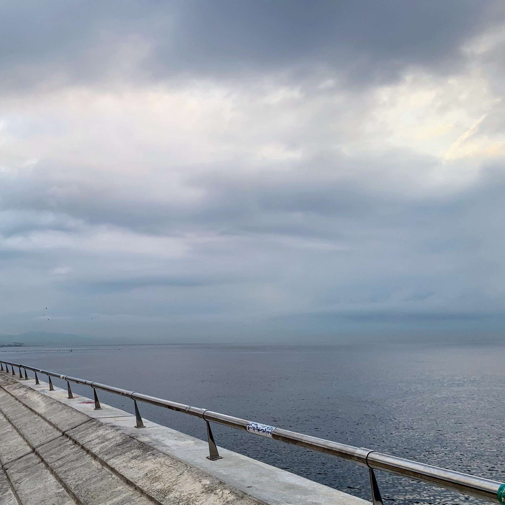
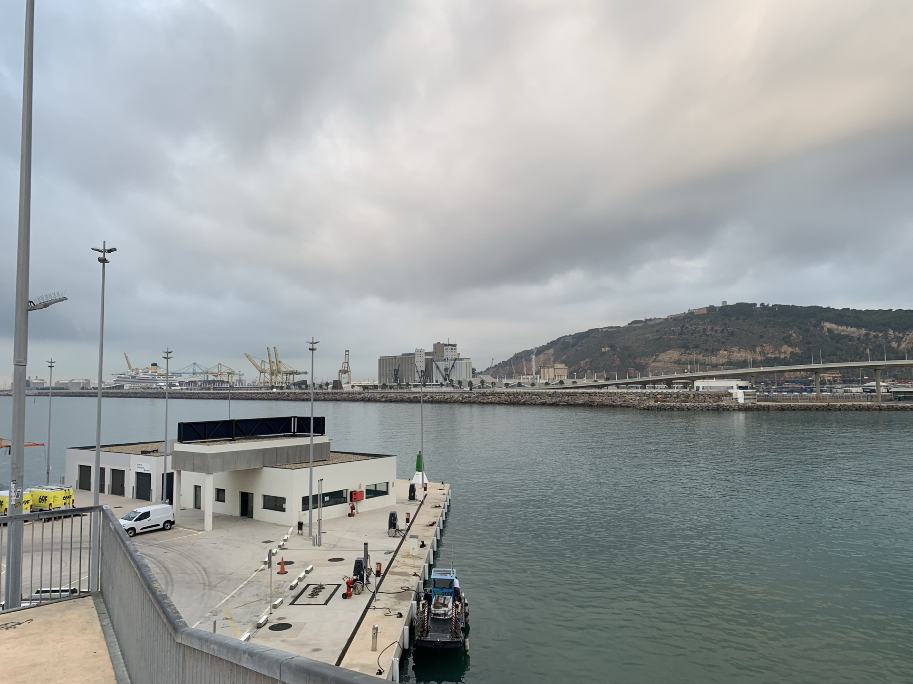

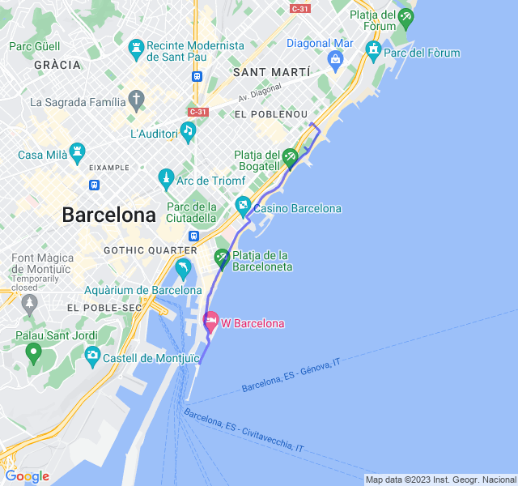



## Quarta uscita

Uscita molto impegnativa. Progressivo con molta Z3 e molta Z4 rispetto a quelli a cui sono abituato.

É andata molto meglio del previsto e sono stato bene all'interno delle zone sia di passo che di frequenza!

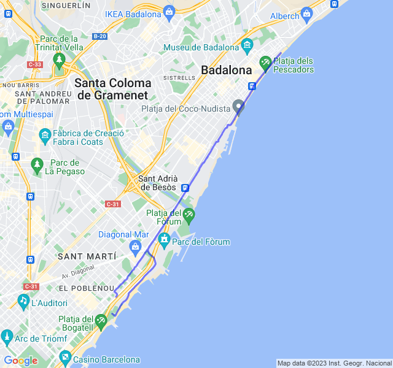


