Settimana intensa: dopo un sacco di tempo si superano i 60km!
<!--more-->

## Prima uscita

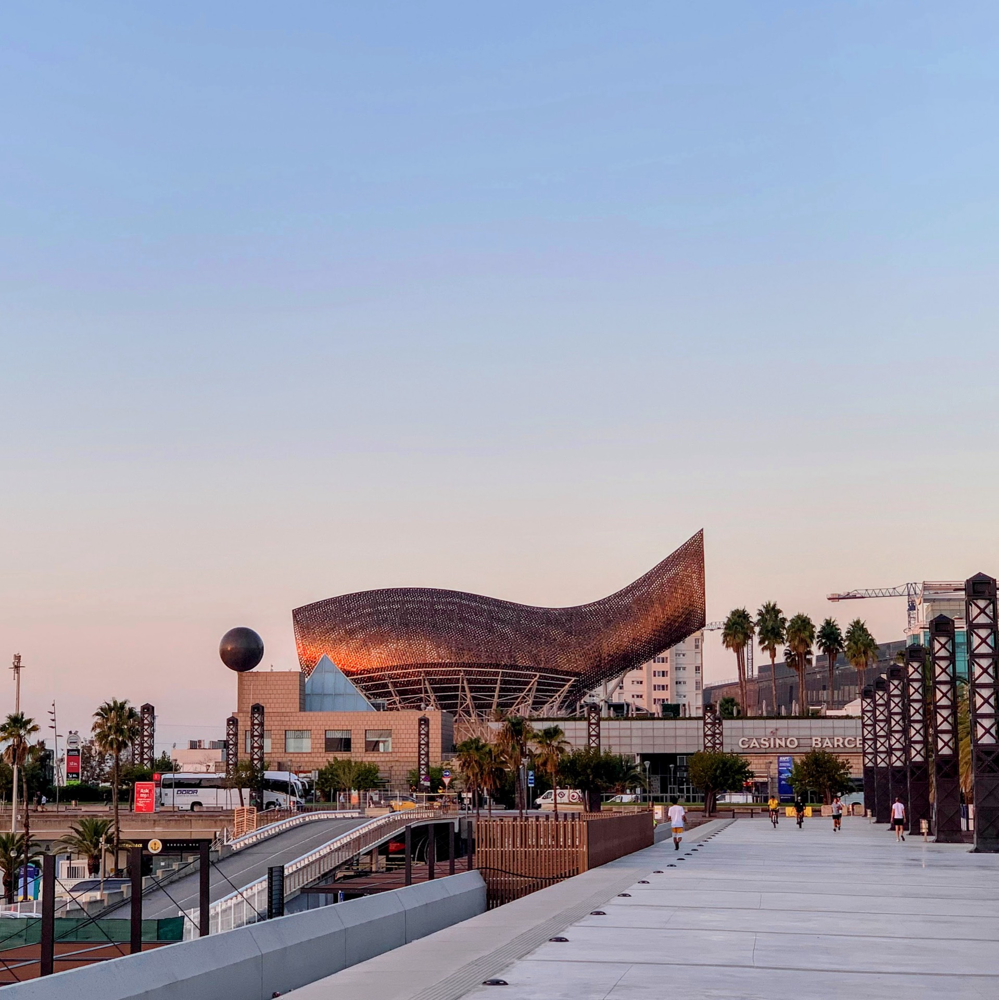

Partiamo con una corsa in Z1 di 12km senza particolari problemi ma finalmente con battiti completamente in Z1 senza troppa fatica!

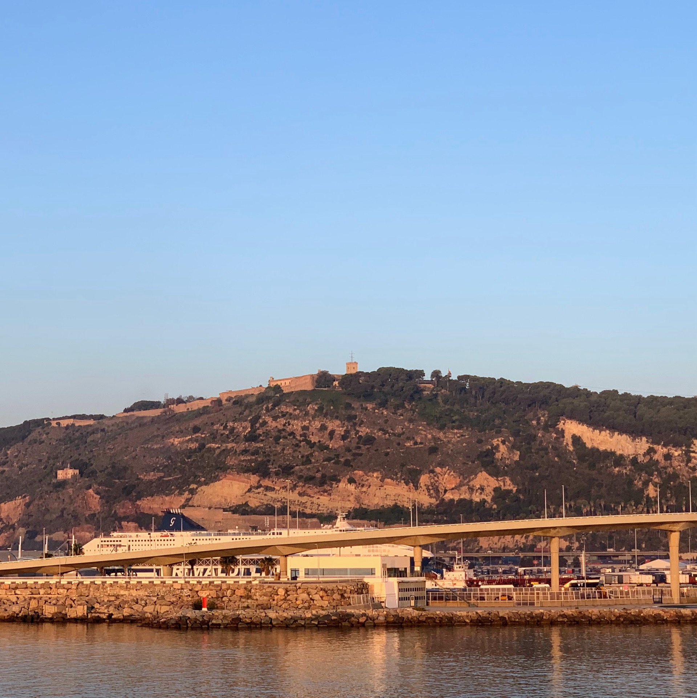

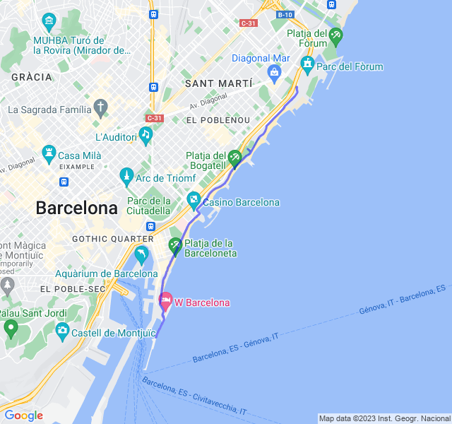



## Seconda uscita

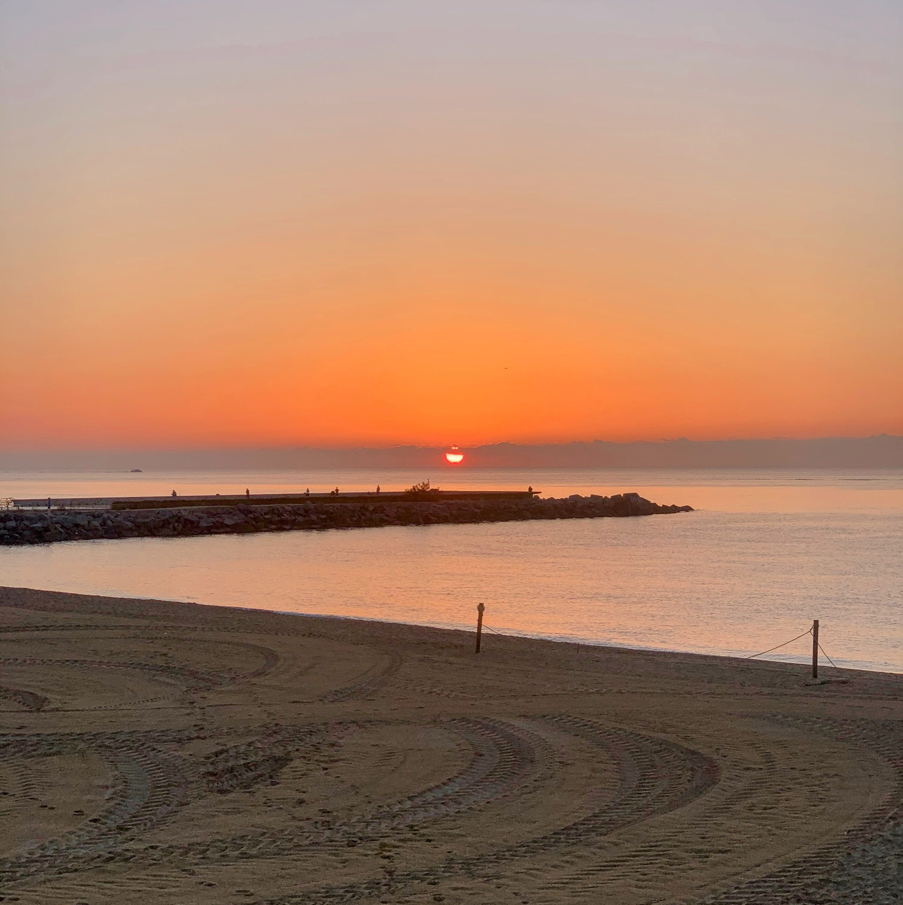

Uscita impegnativa forse la più impegnativa della settimana. Una serie di ripetute in Z4 e Z5 che non pensavo di riuscire a portare a casa facilmente.

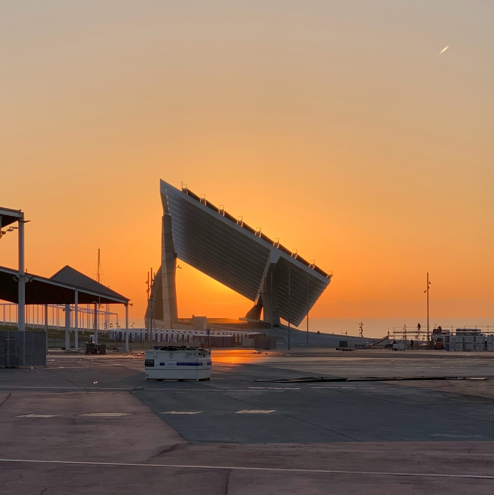

In realtà ho faticato ma son riuscito a tenere fino alle ultime mantenendo i ritmi che mi ero prefissato!
Ho ricevuto anche i complimenti dal coach!

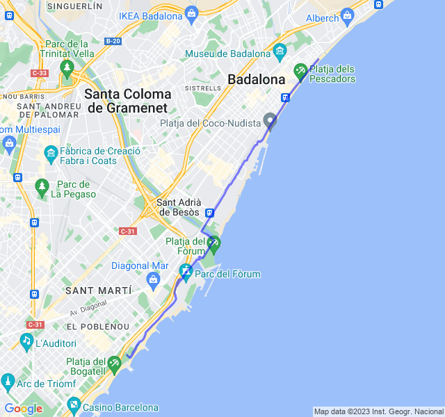



## Terza uscita

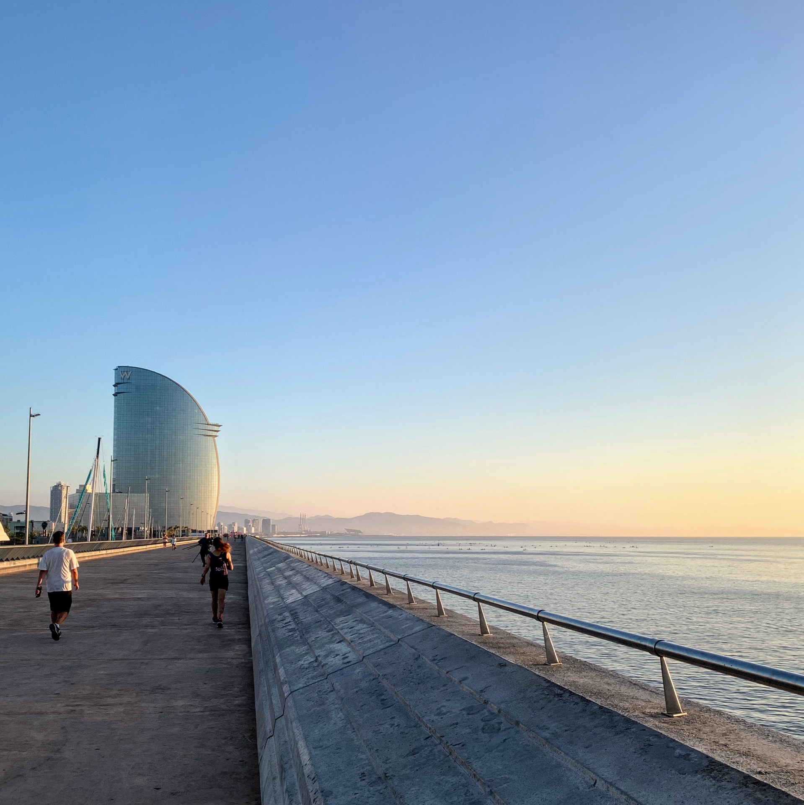

Altra corsa lenta. Questa volta le gambe non erano così fresche come il lunedì ma un po' appesantite dagli intervalli dell'ultima uscita.

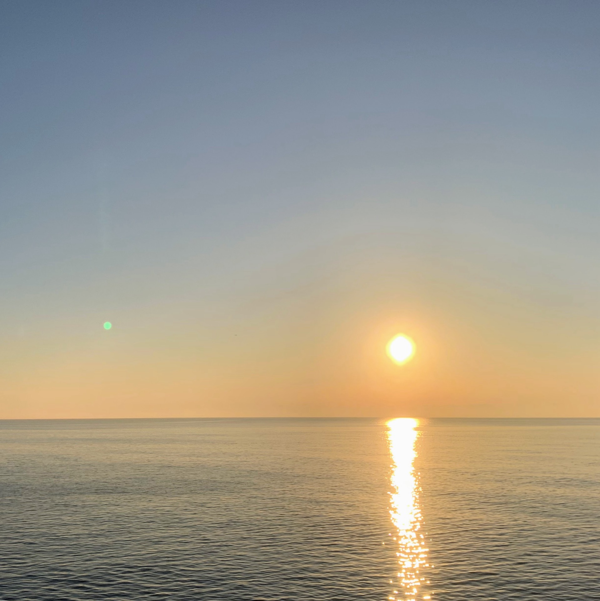

In ogni caso tutto sotto controllo con una Z2 attorno ai 5:10min/km che è ottima.

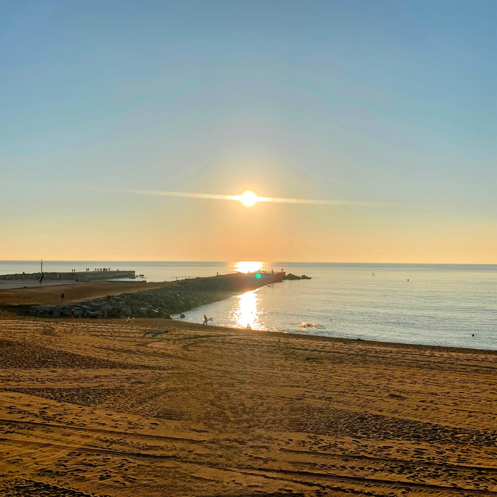

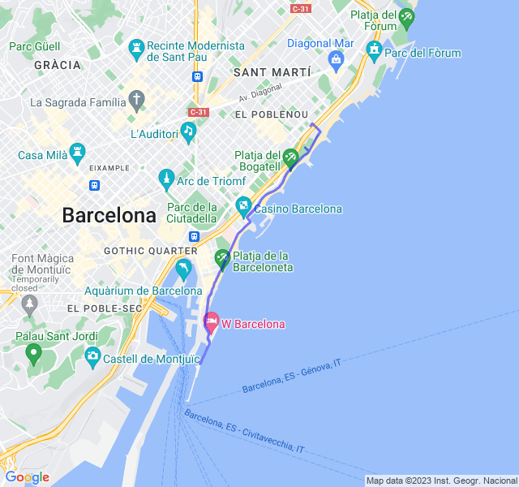



## Quarta uscita
Ultima uscita con difficoltà paragonabile alla seconda. Anche qui intervalli ma in Z3. Su un totale di 22km, 12km in Z3; tutti con un ottimo passo e ottima frequenza.

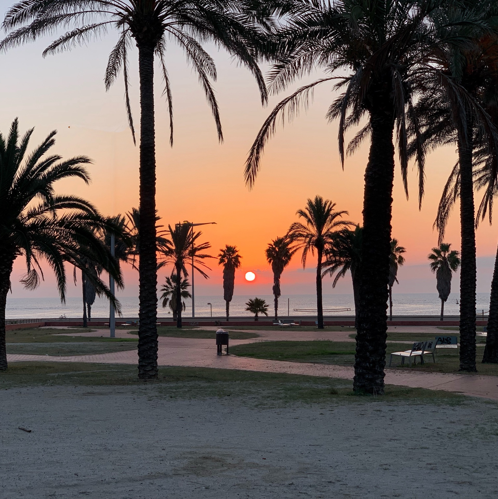

Questa uscita conclude una settimana davvero buona dal punto di vista dell'allenamento!

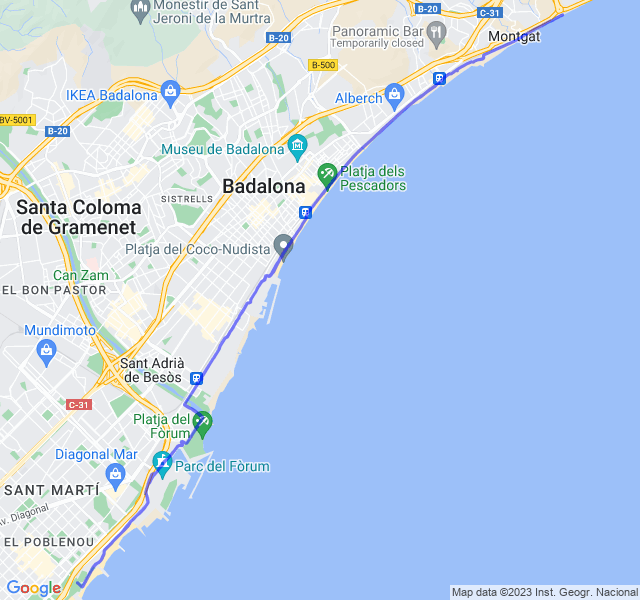


