Settimana di recupero dopo alcune settimane di carico!
<!--more-->

## Prima uscita

10km Z1. Uscita abbastanza buona, saltare per evitare le pozzanghere grandi come laghi non ha aiutato! 😜

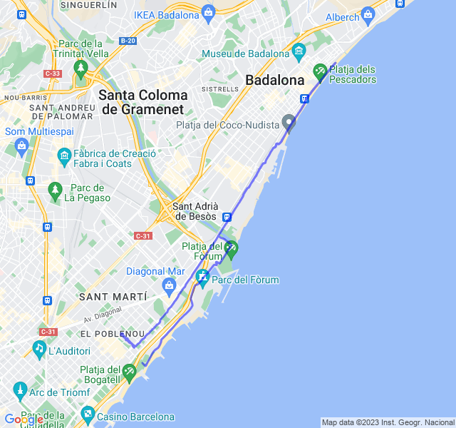



## Seconda uscita
2x3min + 4x2min Z3 rec 1min Z2.
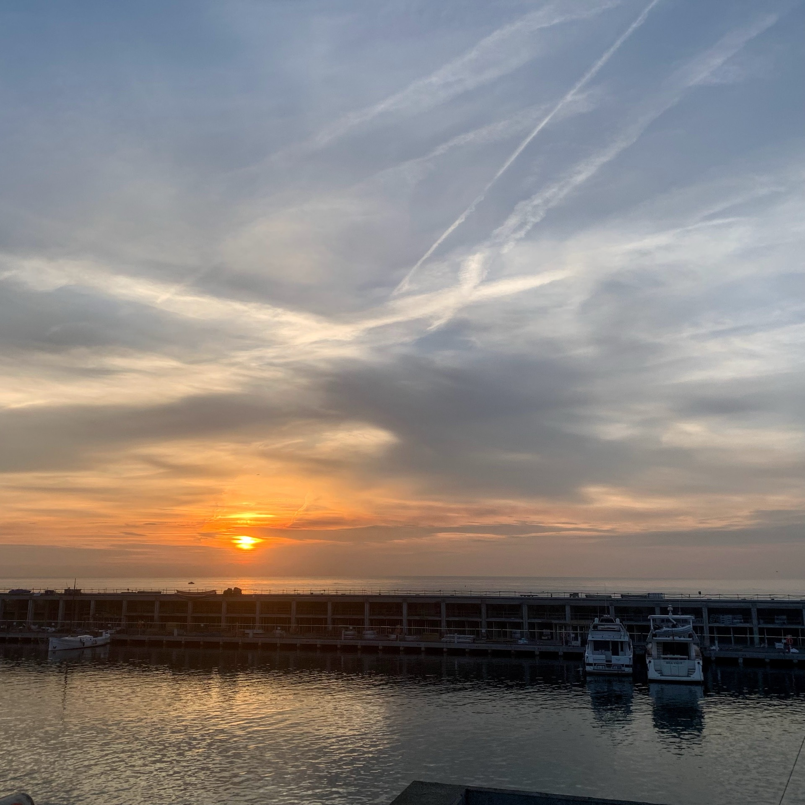

Un giallo abbastanza easy per questa settimana di scarico.
Tutto bene, forse fc un po' bassa nei minuti di Z3.

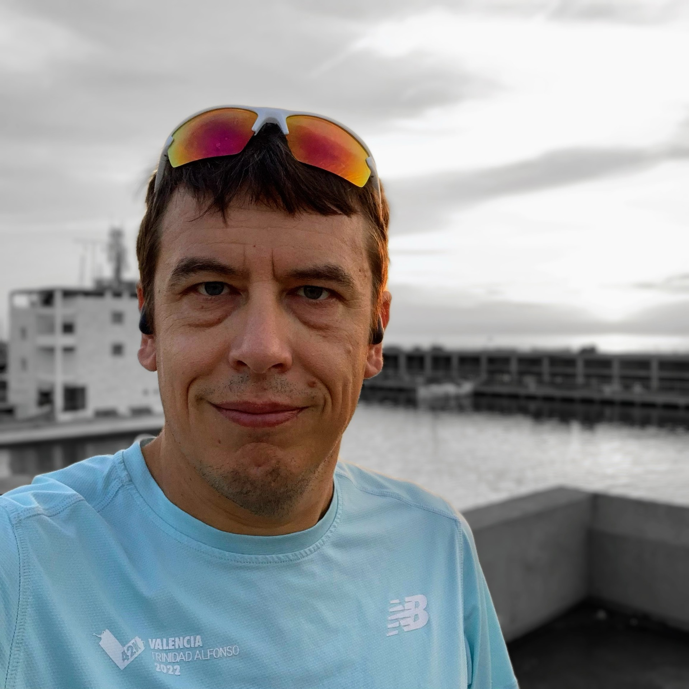

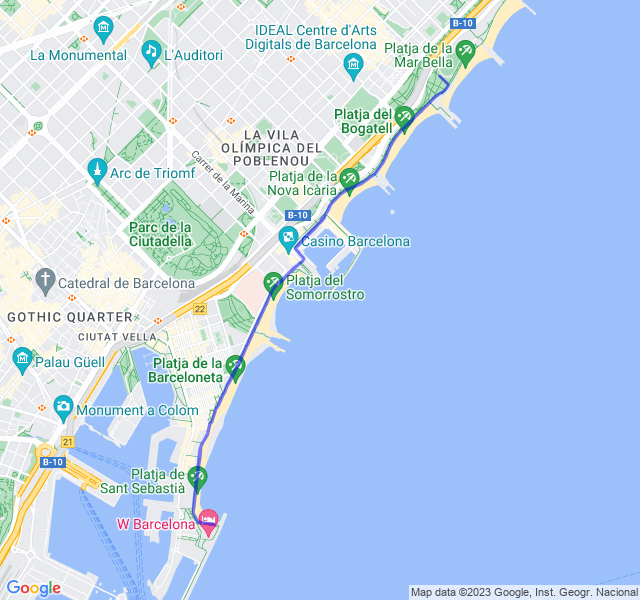



## Terza uscita
8km Z2.

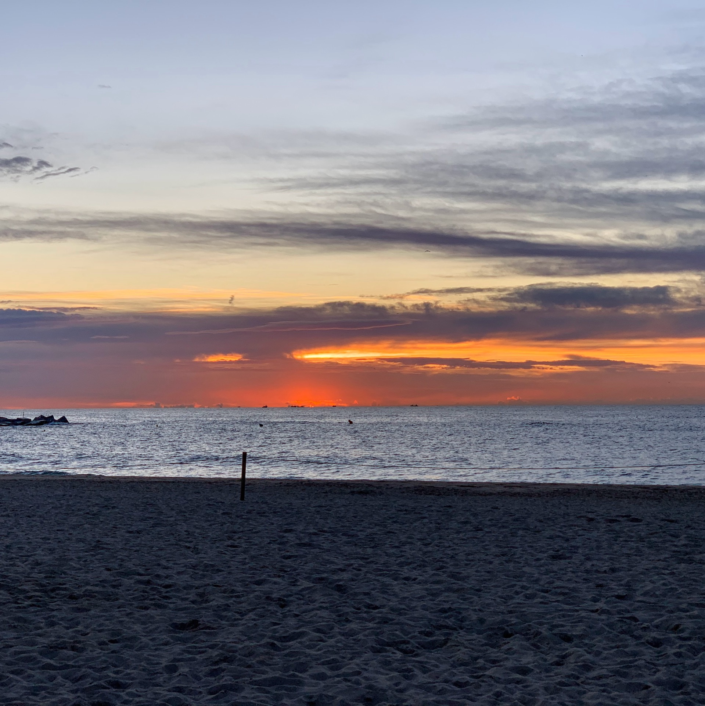

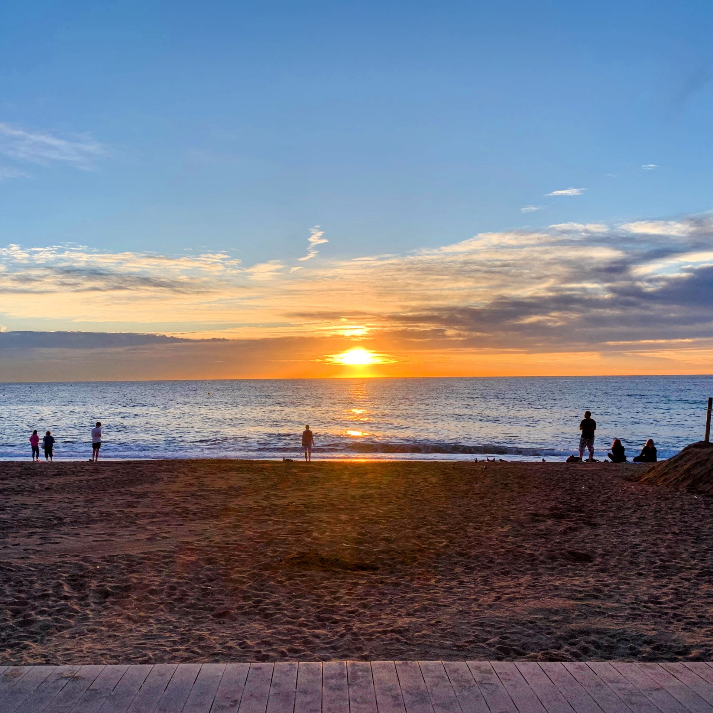

Tutto tranquillo, ritmo buono, sempre in miglioramento e pochissimo tempo in Z3, solo per un paio di cavalcavia.

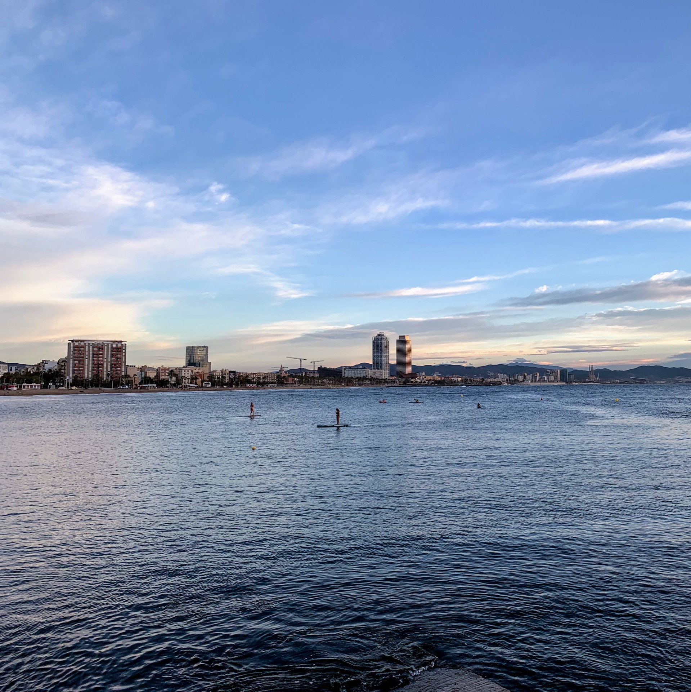

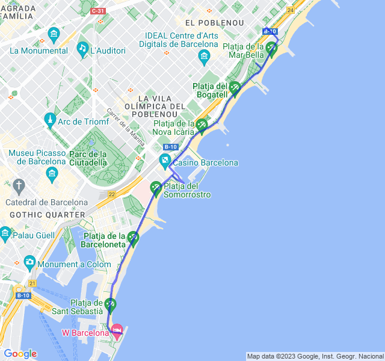



## Quarta uscita



16km Z2, ultimo allenamento della settimana.

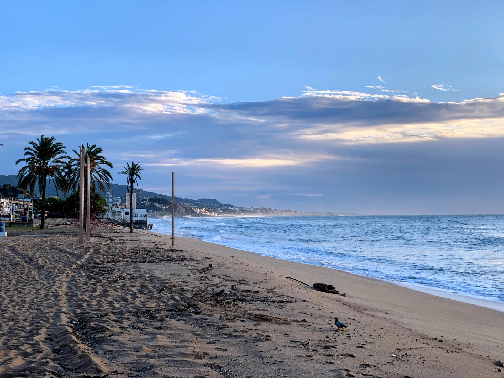

Sono molto soddisfatto, per la prima volta una Z2 sotto i 5 min/km con anche un po' di vento contrario al ritorno che dava un gran fastidio! 

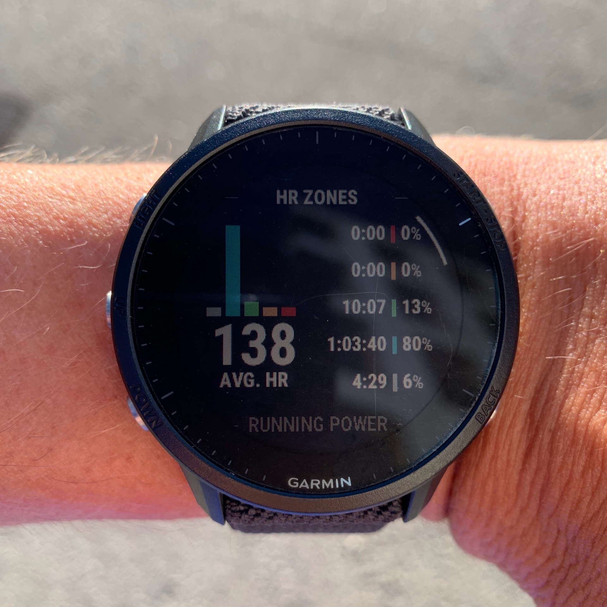

Ancora un paio di settimane e poi la prima mezza da un bel po' di tempo. Son proprio curioso di vedere come andrà.

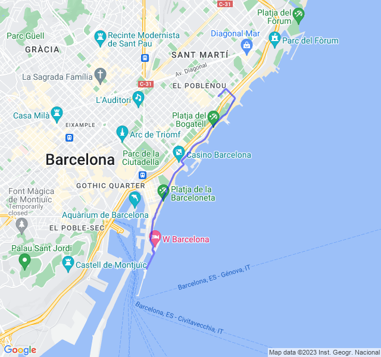


