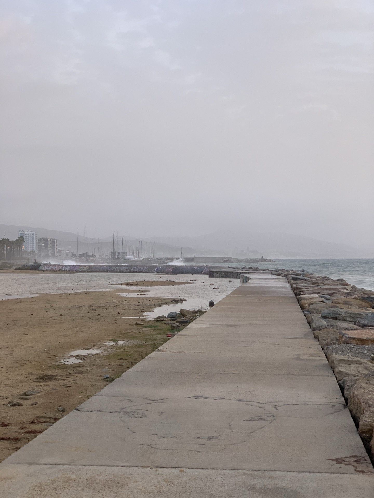
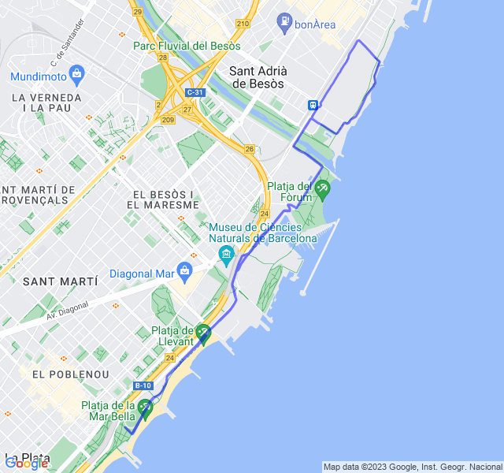
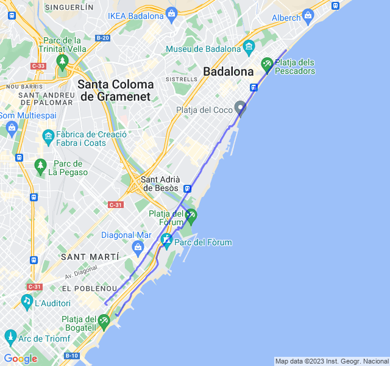
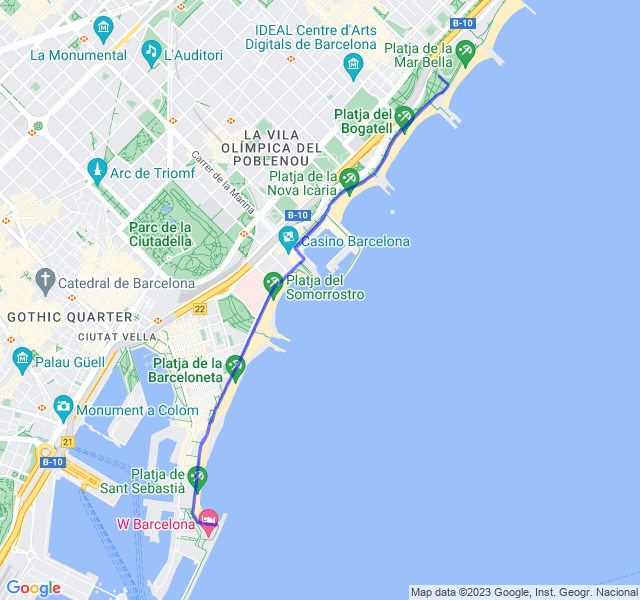
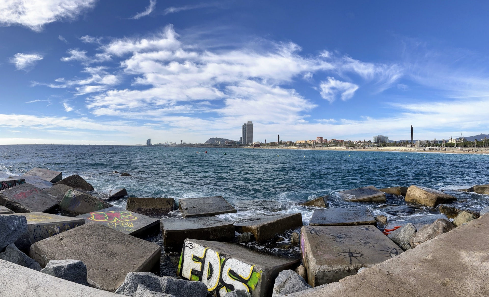
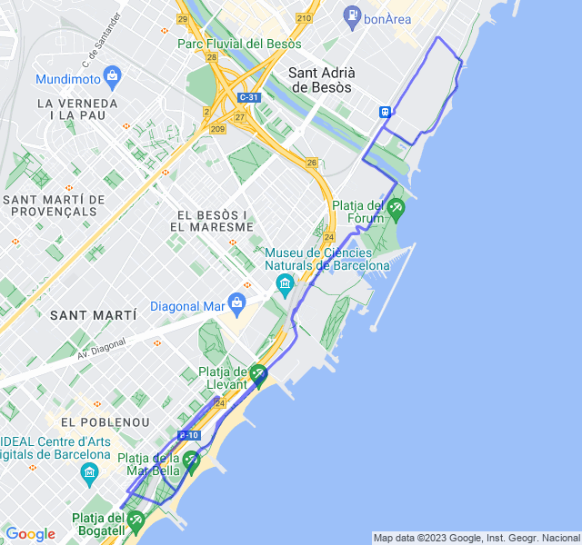

Ancora una settimana tranquilla senza troppi chilometri!

<!--more--> 

## Prima uscita
10km Z1. Un po' di vento fastidioso ma tutto bene. Correndo su un pontile mi sono anche preso una bella ondata in perfetto stile Paperissima!



## Seconda uscita

Oggi ripetute in soglia: 2000 + 2x1000 + 4x500 Z4.
Allenamento con qualche esperimento:
- mi son dimenticato la fascia cardio, ma solitamente il mio orologio traccia abbastanza bene la FC
- nella prima ripetuta da 2km e fin quasi alla fine della prima da 1km non son nemmeno entrato in Z4 quindi mi sono detto, seguendo i consigli dei coach: "acceleriamo un po' altrimenti qui resto tutto l'allenamento in Z3". Quindi dalla fine della prima da 1km fino alla fine delle ripetute ho guardato più la FC che il passo. Forse questo mi ha fatto andare un po' troppo forte, in pratica era il passo della Z5 ma la FC era bella in Z4.
- ho sbagliato i conti e son tornato indietro troppo tardi e così ho allungato l'allenamento di un 2km abbondanti

Detto questo mi son divertito!



## Terza uscita

10km Z2. Tutto abbastanza tranquillo. Muscoli affaticati dal potenziamento di ieri.



## Quarta uscita

Ultima uscita della settimana con un bel ritmo medio di 10km. 

Per una volta sono in compagnia e questo aiuta a non fare per nulla fatica.

Sicuramente un po' troppo forti gli ultimi 2km che mi hanno fatto sforare in Z4.


