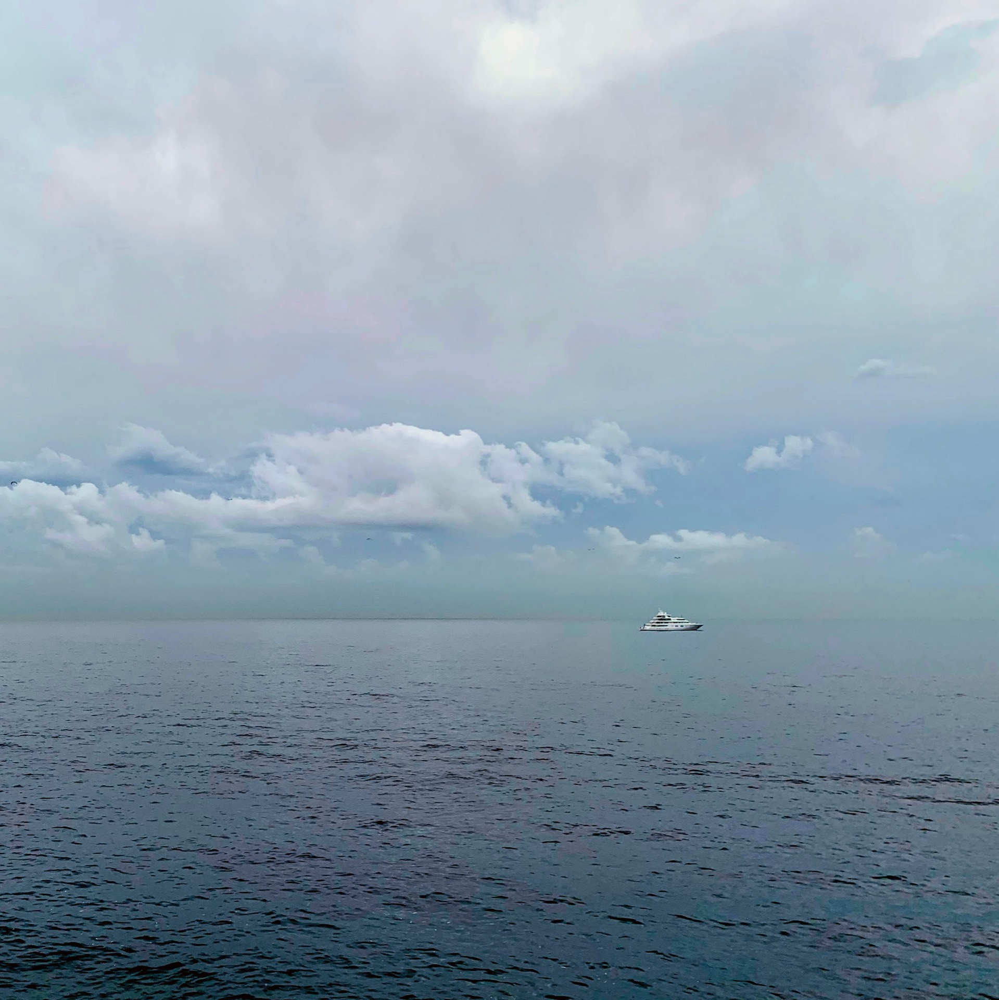
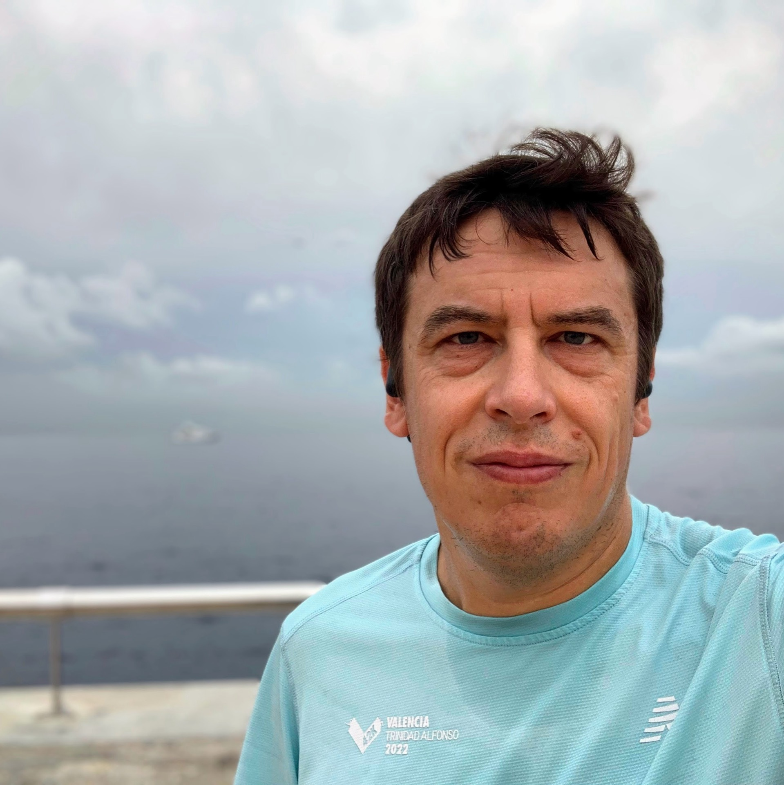
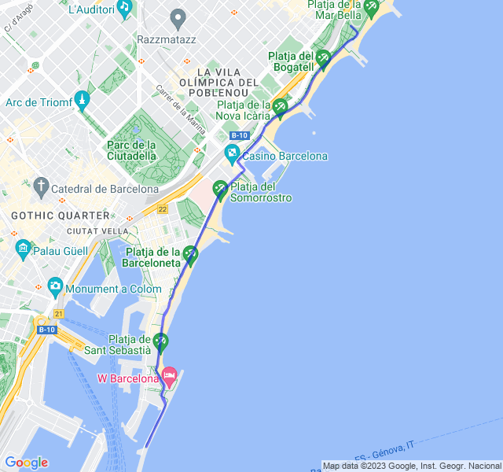
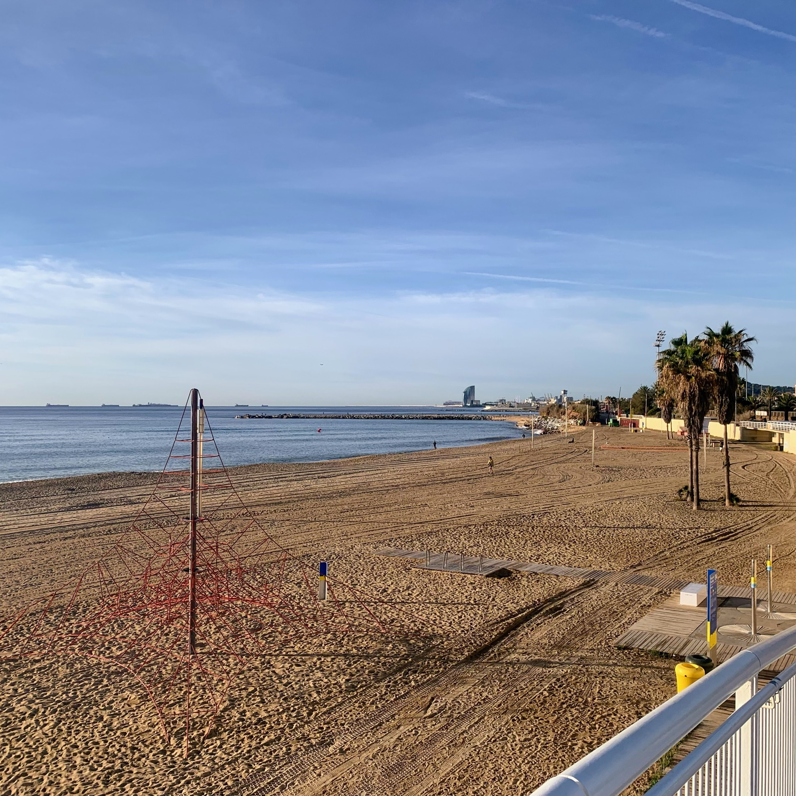
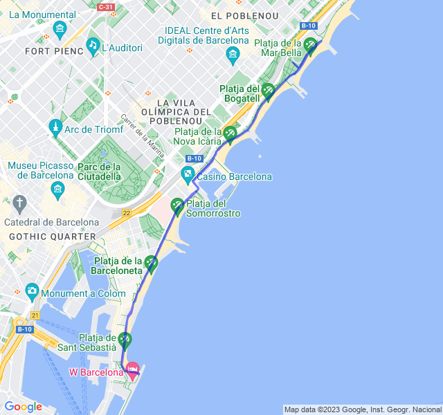
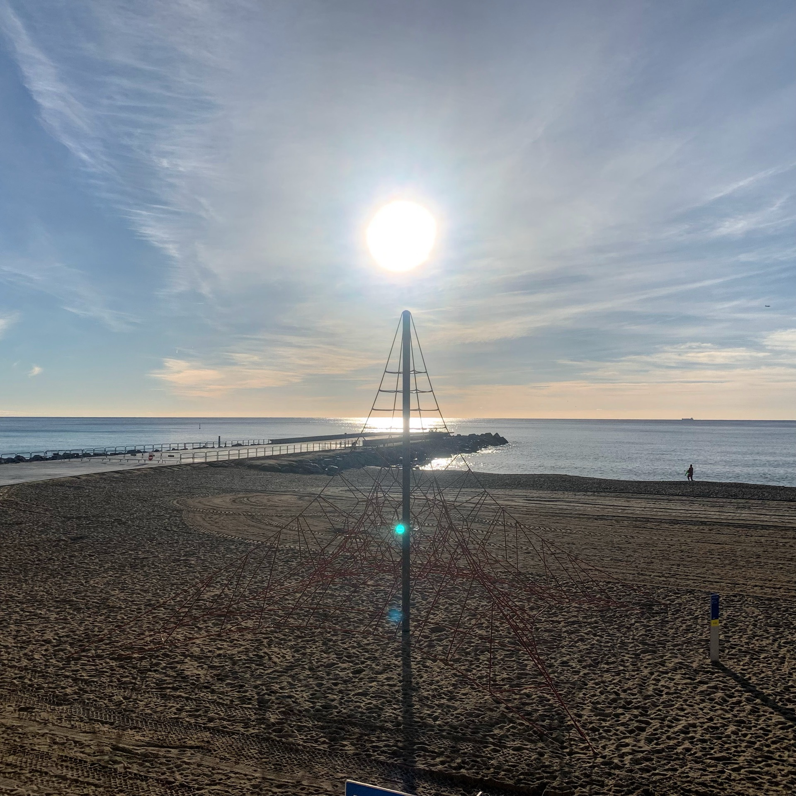
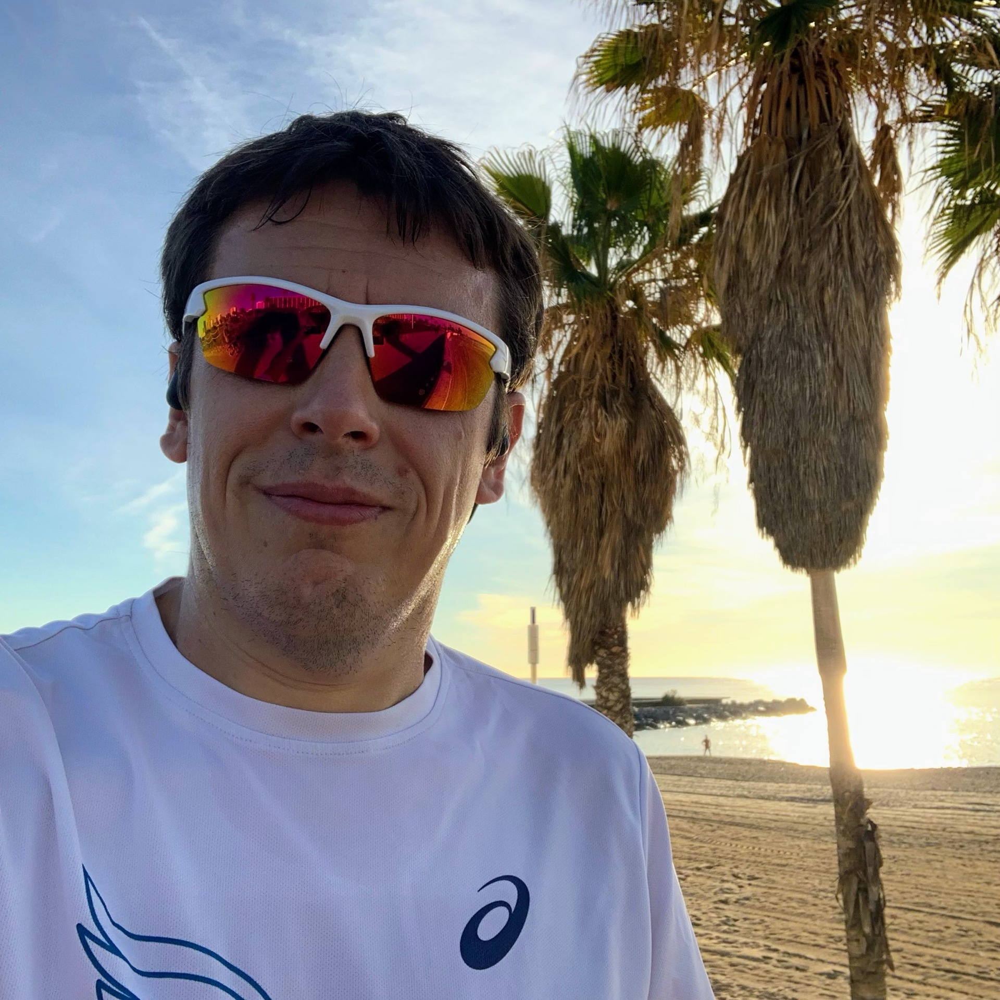
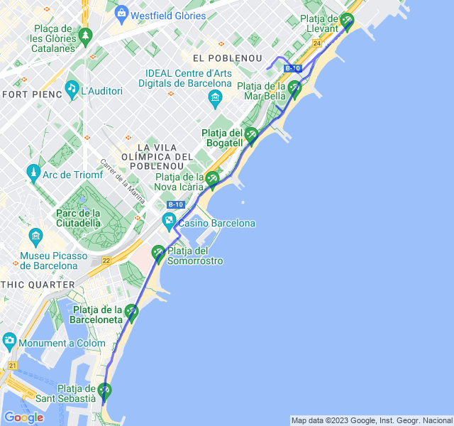
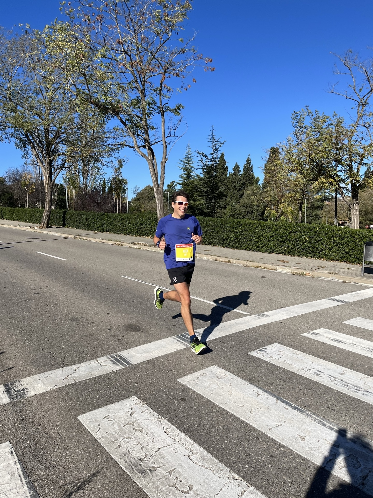
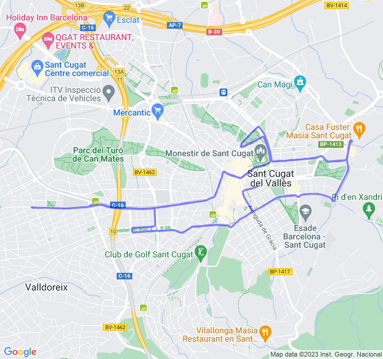

Settimana di gara: Mezza di Sant Cugat!
<!--more-->

## Prima uscita

10km Z2. Non so bene da dove sia saltata fuori questa Z2, ho guardato solo la FC e mi son reso conto solo alla fine del passo.
Soprattutto dopo la Z3 di ieri non me lo sarei aspettato.
Molto bene!



## Seconda uscita

8x(1' Z3 + 1' Z2). Anche oggi ho provato a seguire un po' la FC per la parte in Z3. Ci son riuscito abbastanza bene anche se i ritmi son stati più veloci del previsto 😛



## Terza uscita

8km Z1 + allunghi. Tutto tranquillo, ultimo allenamento prima della mezza di domenica!



## Quarta uscita

🏁 Mezza maratona di Sant Cugat.
Devo dire che è andata meglio del previsto, volevo chiuderla alla media di 4:20min/km e invece è venuto fuori un bel 4:18min/km per 1:30:47.
La cosa che mi rende ancor più soddisfatto è che c'era un vento particolarmente forte (raffiche a 55km/h) e un percorso pieno di saliscendi senza un attimo di pianura.

Un po' di sofferenza negli ultimi chilometri, soprattutto sulle parti di "salita" ma ho anche avuto un seconda metà di gara più veloce della prima (forse dovuta più che altro allo sprint nella discesa finale 🙂)


