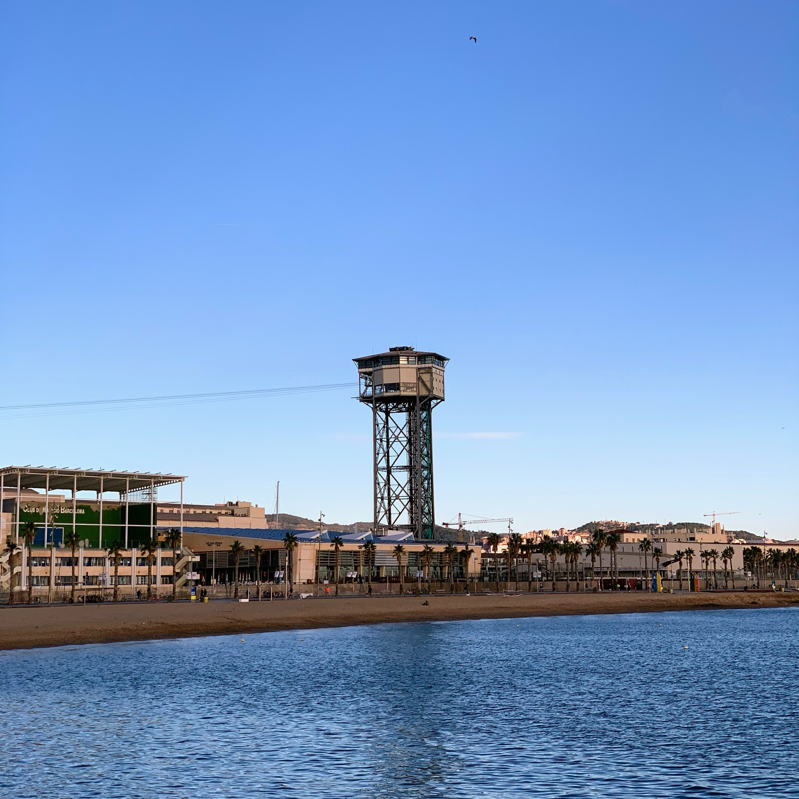
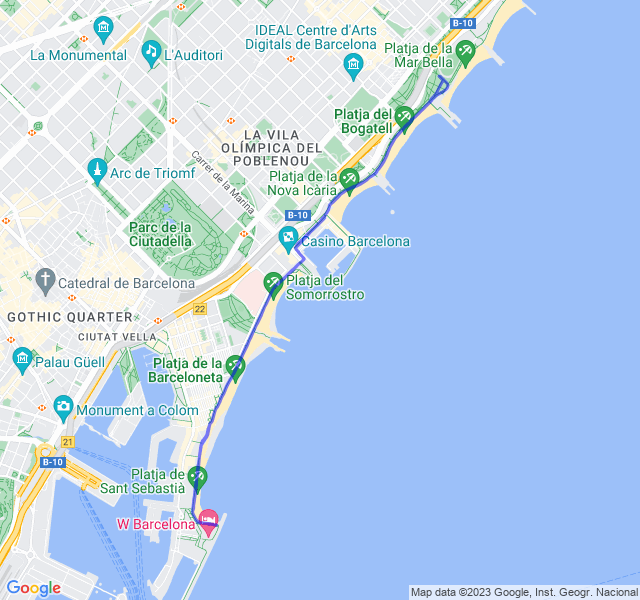
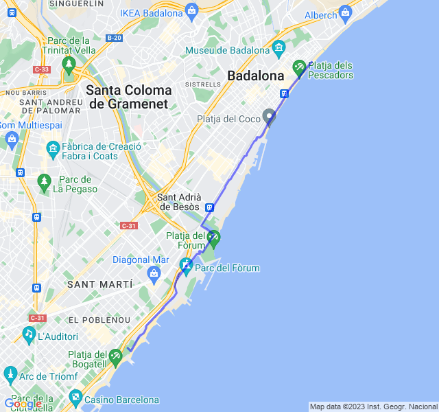

Settimana di recupero post gara!
<!--more-->

## Prima uscita

10km Z1. Uscita un po' strana; la FC è salita un bel po' appena partito poi si è un po stabilizzata ma comunque più alta del solito.
Non so se possa essere dovuta alla gara o al riposo.



## Seconda uscita

16km Z2. Oggi non una grande Z2, ancora FC un po' alta e soprattutto super suscettibile a qualsiasi cambio di ritmo/pendenza.


