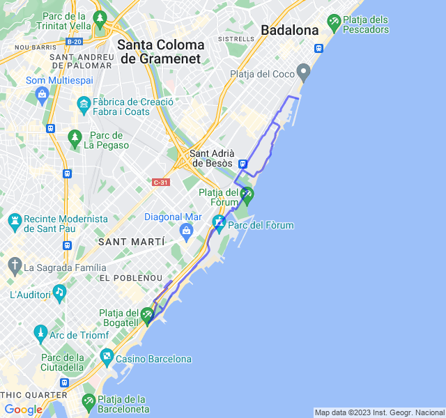
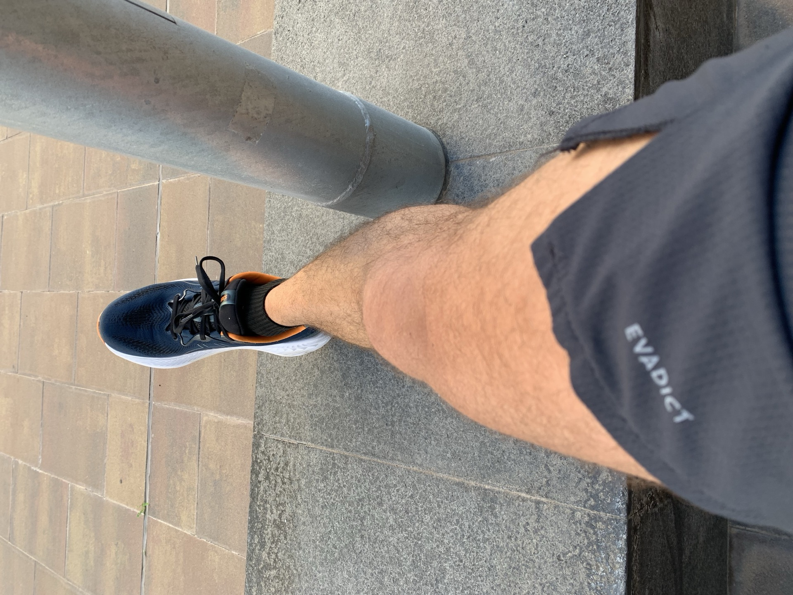
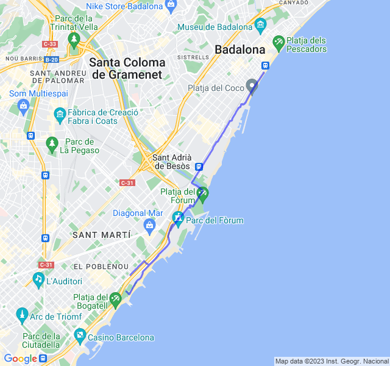
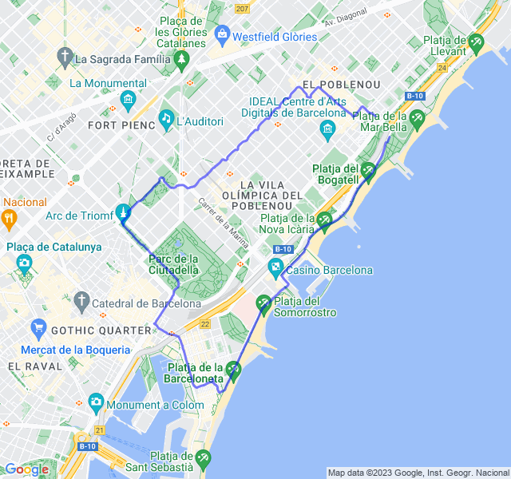

Settimana caratterizzata da una bella influenza con febbre abbastanza alta. Fortunatamente si è risolto in pochi giorni.

<!--more-->

## Prima uscita

12km Z1 + andature + allunghi. FC ancora un po' alta e ballerina.
Non ho recuperato ancora benissimo la gara anche per una settimana un po' complicata. Domani un bel rosso di quelli tosti, vediamo come andrà.



## Seconda uscita

6x1200 Z4 rec 300.
Allenamento andato bene nonostante da qualche giorno il mio HRV sia a picco.
Non so bene come interpretare l'allenamento, non ho faticato moltissimo nonostante il passo un po' più veloce del VDOT (tra l'altro appena aggiornato dopo la mezza di domenica scorsa) tranne le ultime 2 ripetute ma più per il fatto che in queste ho preso in pieno le uniche due salite del percorso che per lo sforzo della corsa in se.

La FC è stata abbastanza bassa e direi che è andata poco in Z4 tranne appunto in queste ultime 2.



## Terza uscita

Uscita per testare come andasse la ripresa post febbre. Tutto bene, il corpo sembra reagire.


