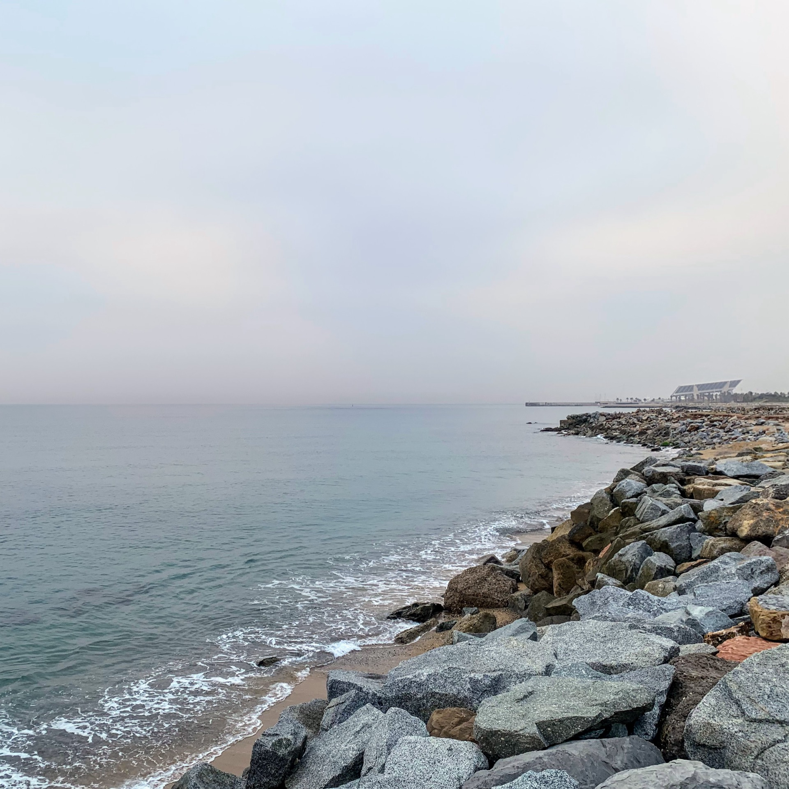
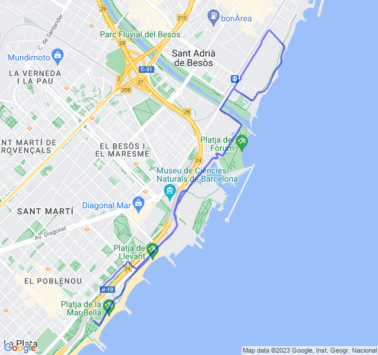
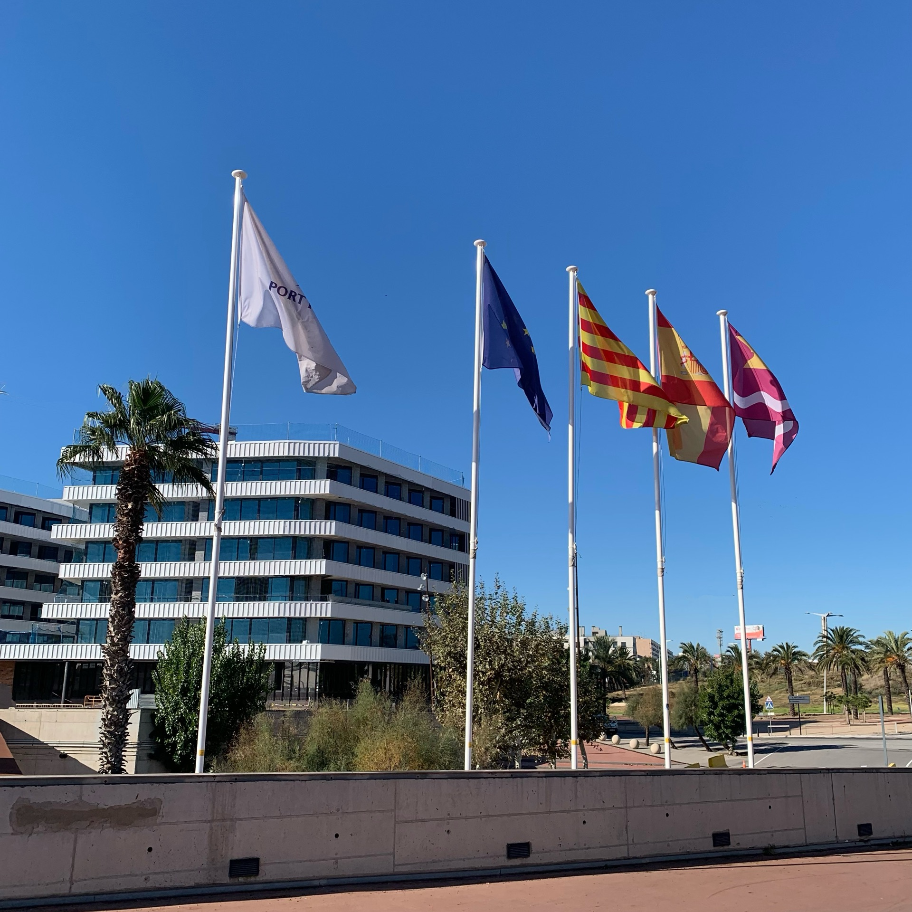
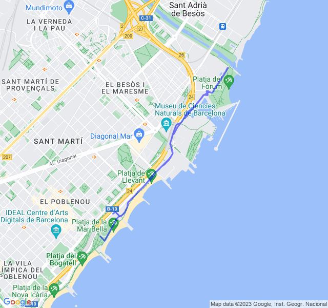
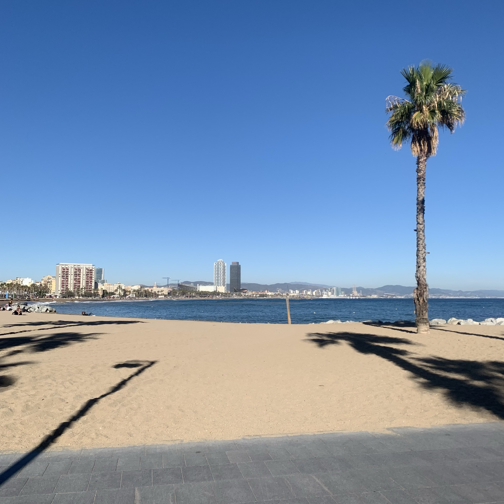
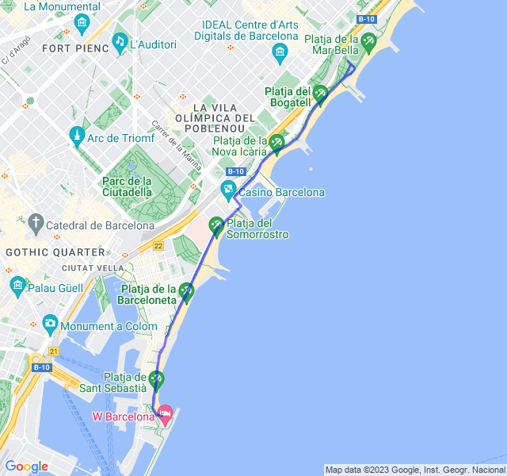
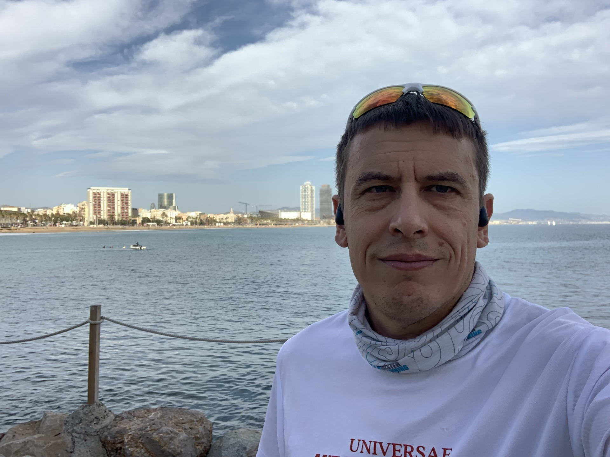
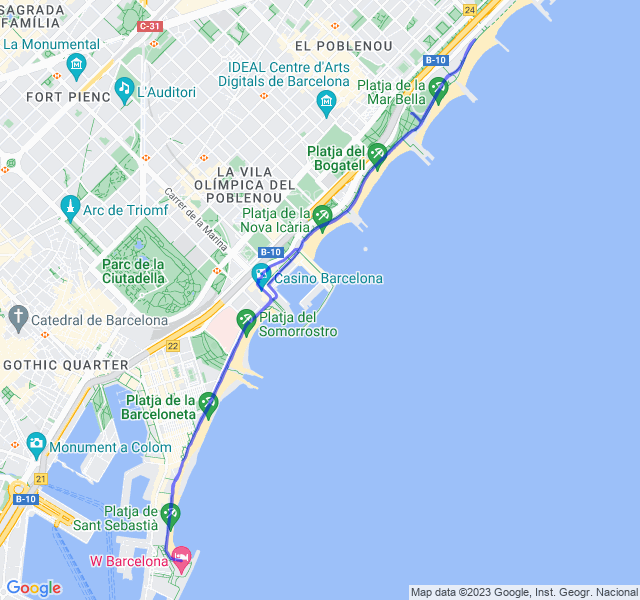
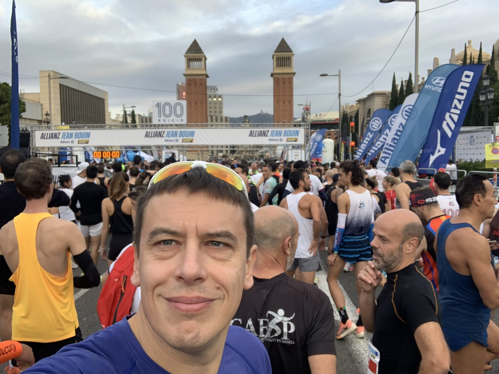
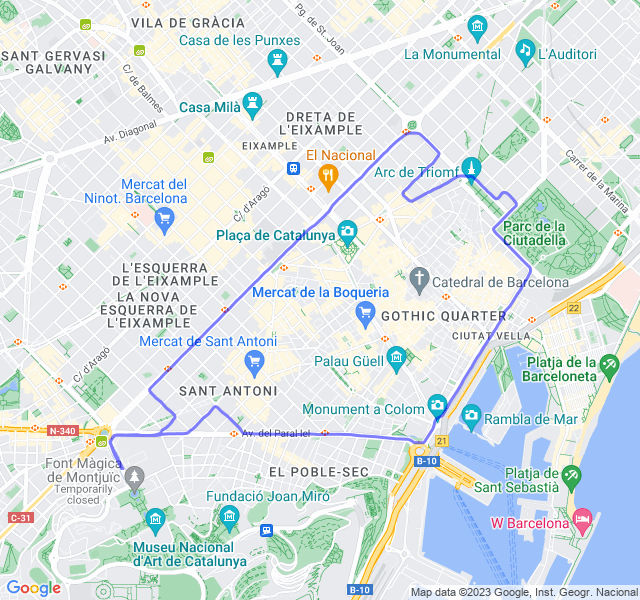

<!--more-->

## Prima uscita

10km Z2.
Settimana scorsa, dopo il rosso del martedì, come la mia HRV aveva previsto, mi sono ammalato: due giorni di febbre.
Ho saltato il potenziamento del mercoledì e le due uscite di giovedì e venerdì.
Domenica uscita easy di 8km giusto per vedere come andava.
Ed eccoci a oggi. Z2 un po' strana: ho fatto fatica a far salire la FC; nonostante il buon passo son stato la maggior parte in Z1.
Domani rosso, vediamo come va



## Seconda uscita

10x150m Z5. Tutto tranquillo. Come già altre volte in questi allenamenti corti la Z5 non la raggiungo mai, nonostante il buon ritmo (anche sotto Z5).



## Terza uscita

8km Z2. Un po' troppa Z3 ma la FC non voleva stare al suo posto! 😡



## Quarta uscita

8km Z1. Anche oggi FC alta e allenamento quasi tutto in Z2. Speriamo bene per la gara!



## Quinta uscita

10K Allianz Jean Bouin 2023.
Che dire se non che grazie ai coach dopo 5 anni sono tornato sotto i 40 minuti con anche un PB inaspettato!
Pensavo di essere abbastanza vicino ai 40 ma credevo che il percorso, con l'ultimo km il leggera salita, mi avrebbe stroncato per bene e invece, una bella fatica su quel falsopiano ma sono riuscito a tenere abbastanza bene.
Per l'occasione ho anche provato per la prima volta il PacerPro di Garmin e non è stato male avere un'idea di quali fossero i tratti dove spingere un po' di più e quelli dove rallentare per non scoppiare.
Daje, ora un bel periodo di allenamento prima della prossima mezza!
🥳 🥳


