Ultima settimana di carico e poi settimana di recupero/ferie!
<!--more--> 
Dopo la gara ho deciso di tirare ancora per una settimana prima di scaricare per poter fare la settimana con meno uscite durante le ferie!

## Prima uscita
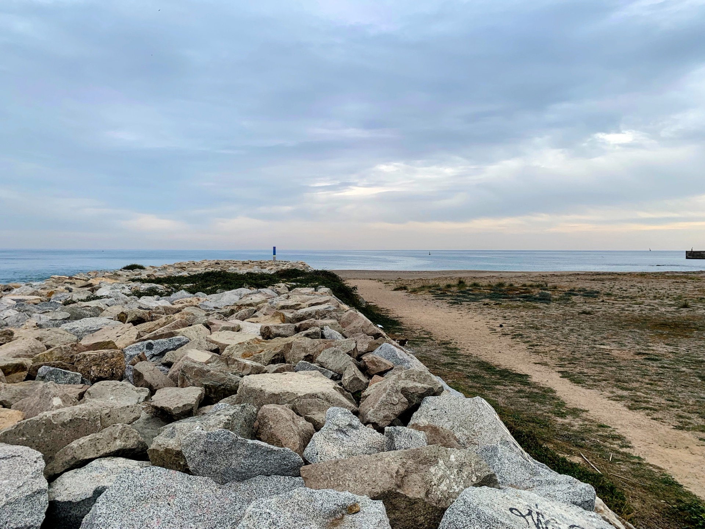

10km Z1. Uscita tranquilla post gara. Gambe un po' stanche ma tutto bene.

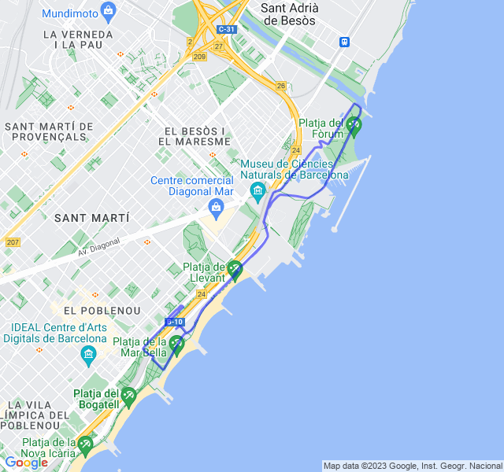



## Seconda uscita

8x200 Z5. Allenamento impegnativo ma, non ostante le gambe ancora legnose, portato a termine abbastanza bene!

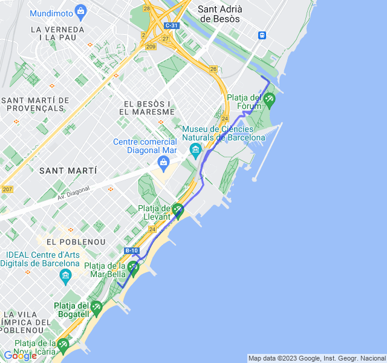


## Terza uscita
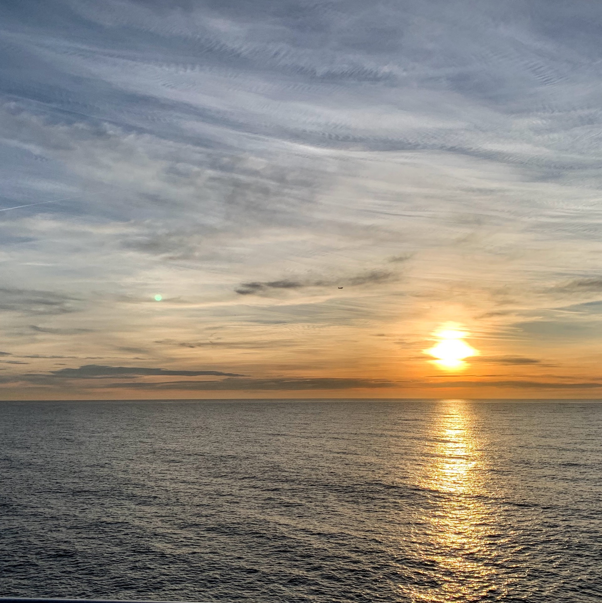

10km Z2. Oggi non ho messo la fascia perché avevo una piccola escoriazione proprio dove sfrega col petto. I battiti son stati un po’ alti e alla fine sono improvvisamente schizzati oltre la mia fc max. 😳 Direi che il cardio fa polso non ha funzionato benissimo.

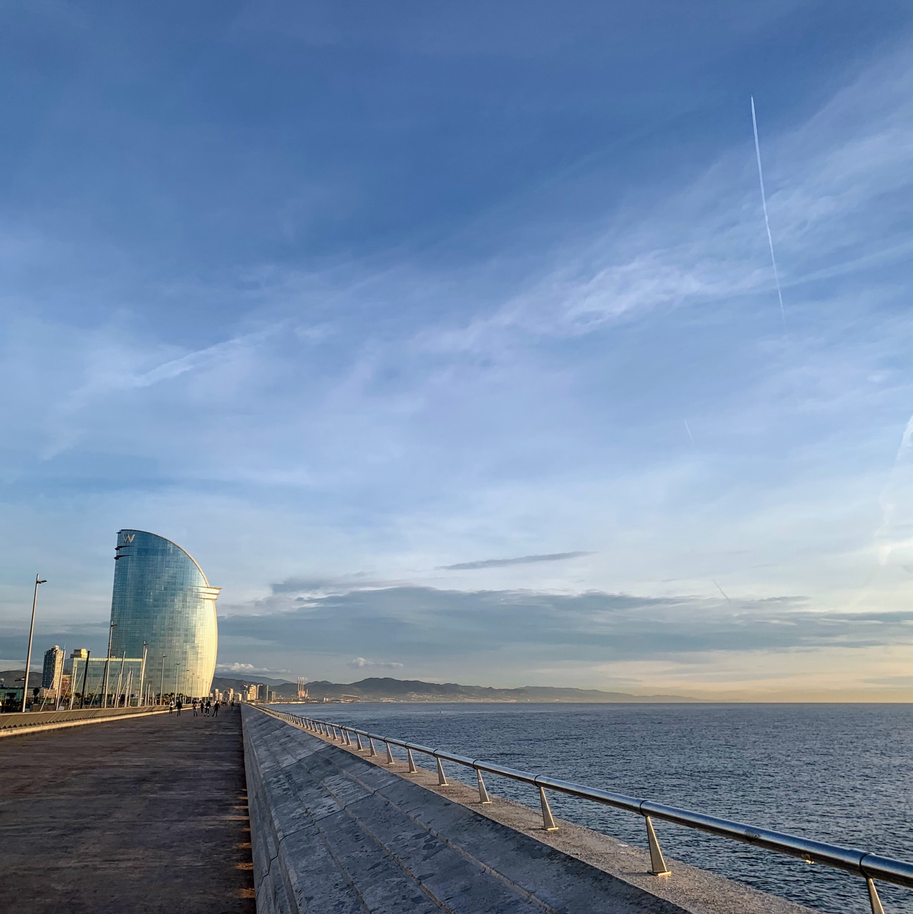

Le sensazioni comunque erano buone, da corsa in Z2.

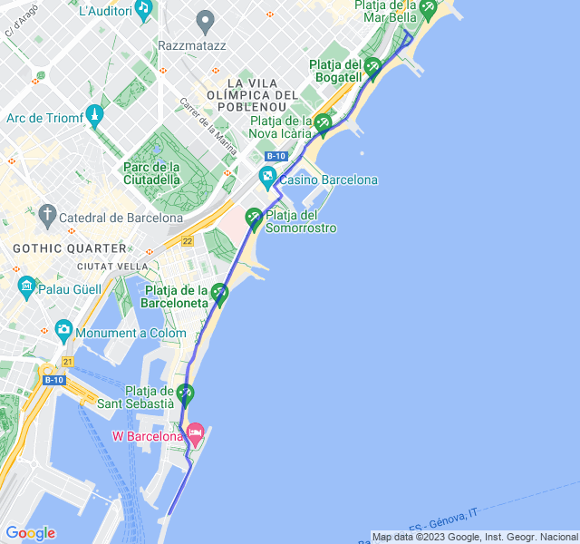


## Quarta uscita
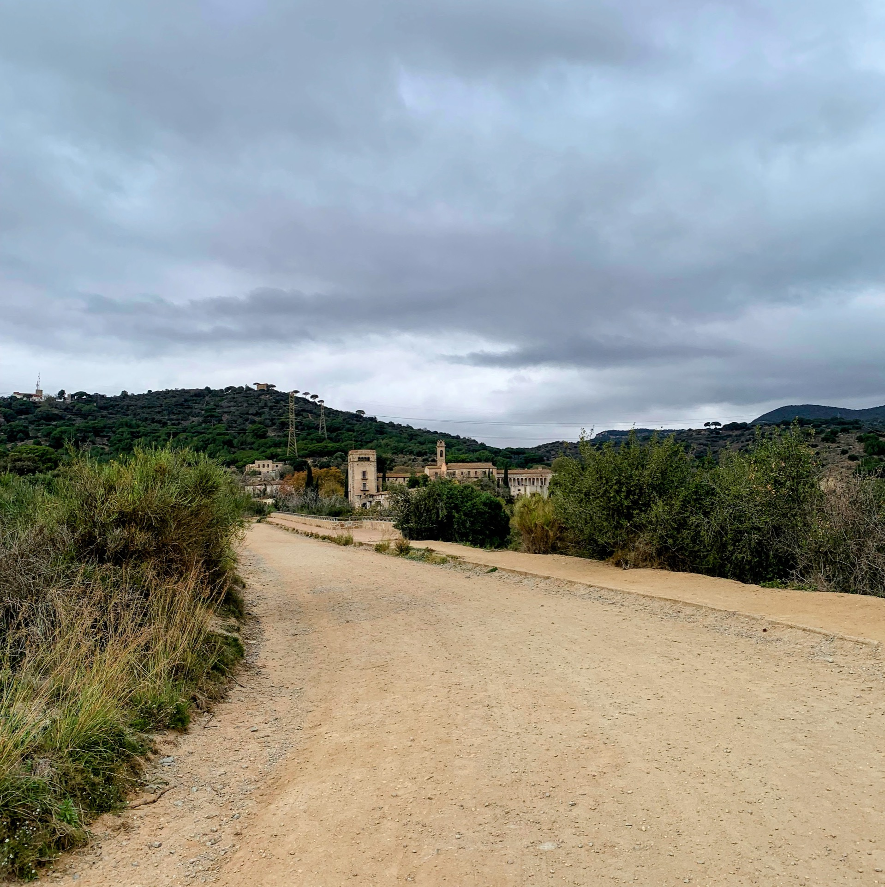

🟢 5km Z1 + 16km Z2 (ultimi 4 in progressione). Oggi un bel lunghetto. Ho deciso di provare un percorso nuovo per non fare sempre il solito lungomare (eh sì, dopo un po' stanca anche quello 😛).
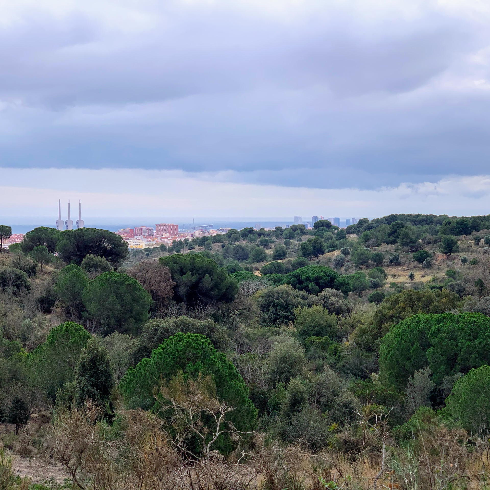
Ne è uscito un bel giro con una salitella centrale che mi ha fatto sofrare in Z3. In compenso direi buono: prima metà con fc bella bassa, seconda metà un po' più veloce e quindi fc alta di conseguenza.
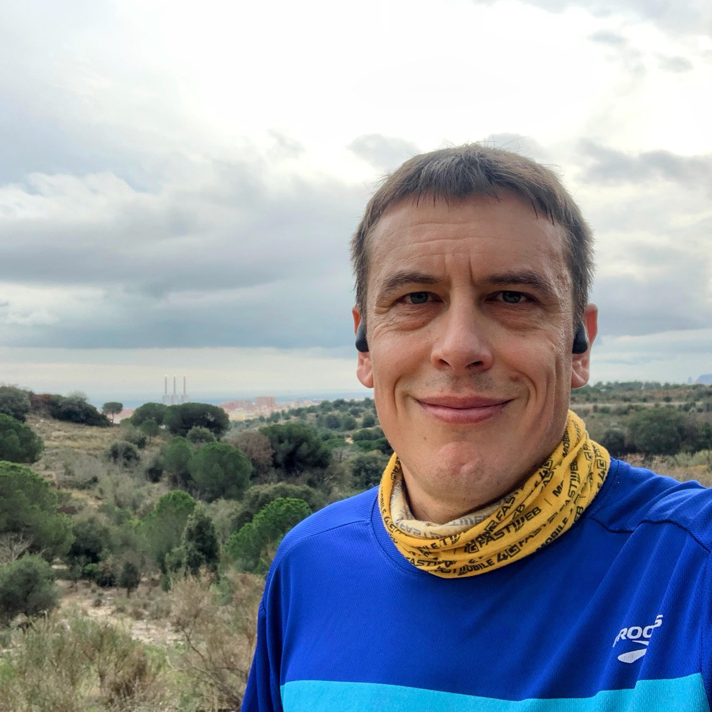
È stato divertente fare un bel lungo dopo un po' di tempo che facevo cose più corte.
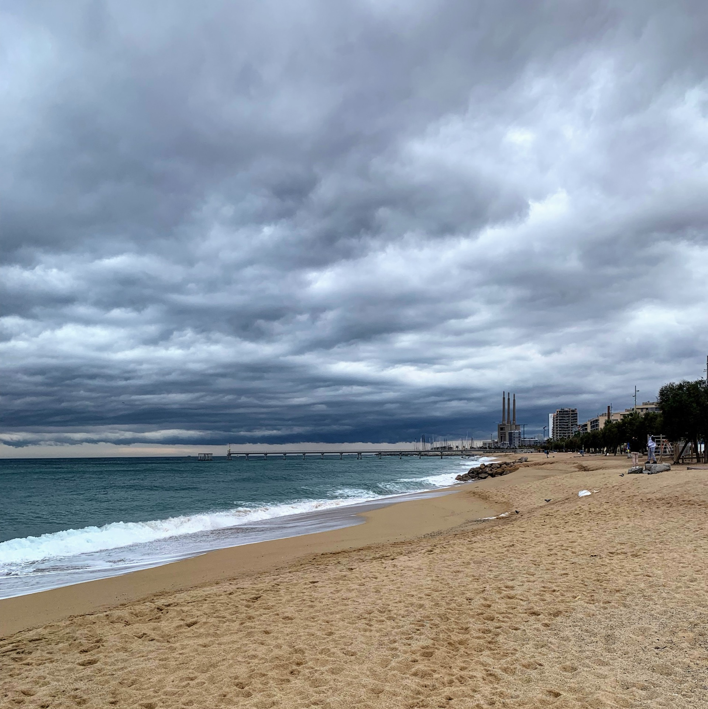
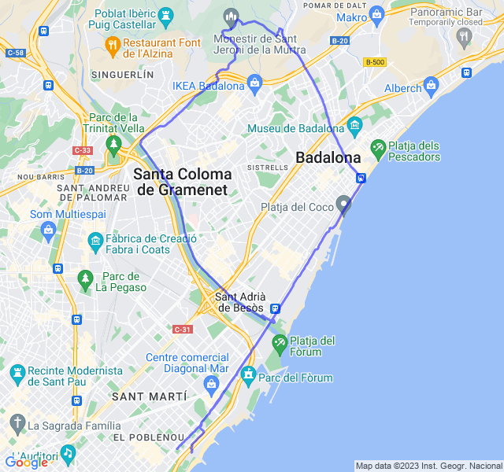



## Quinta uscita
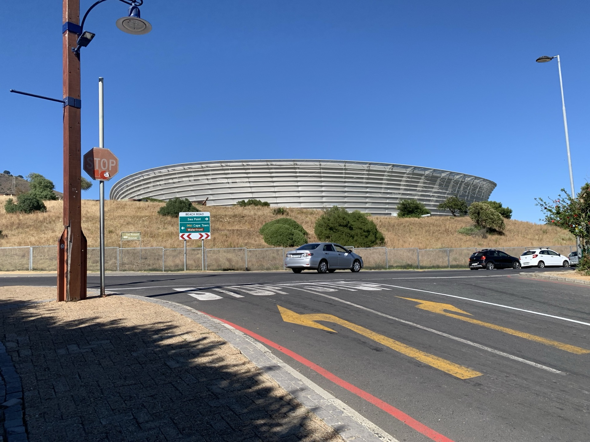

Uscita fuori porta (e che fuori porta... 😜).

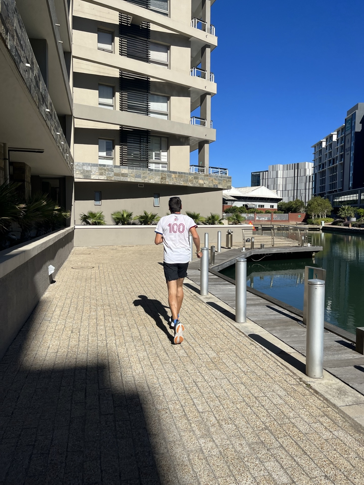

Corsa a sensazione, forse un po' forte ma quando il percorso è nuovo, difficile trattenersi!

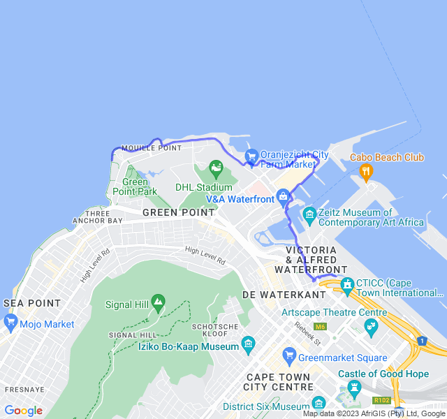


