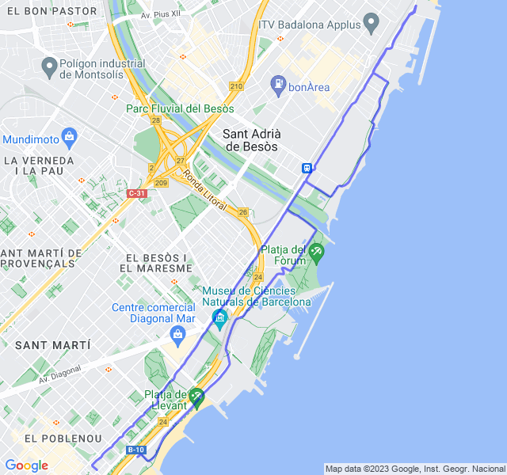
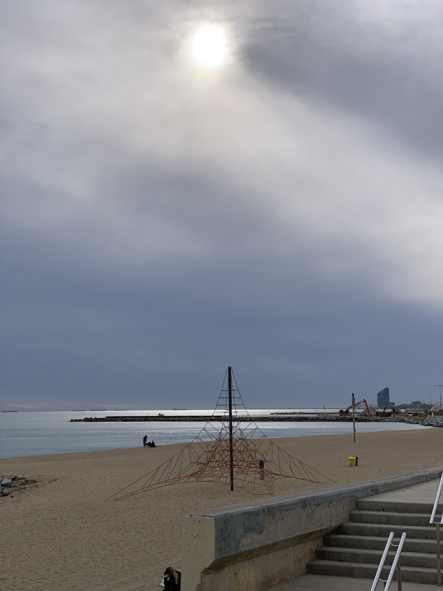
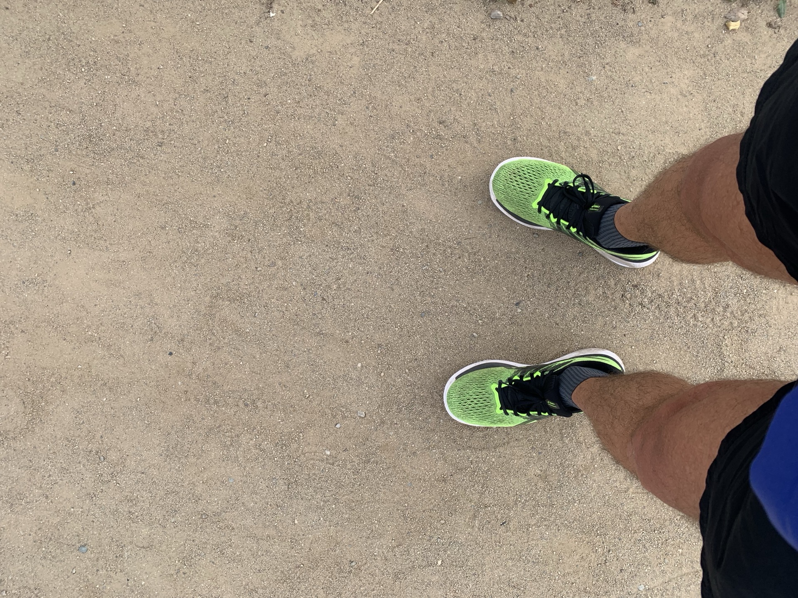
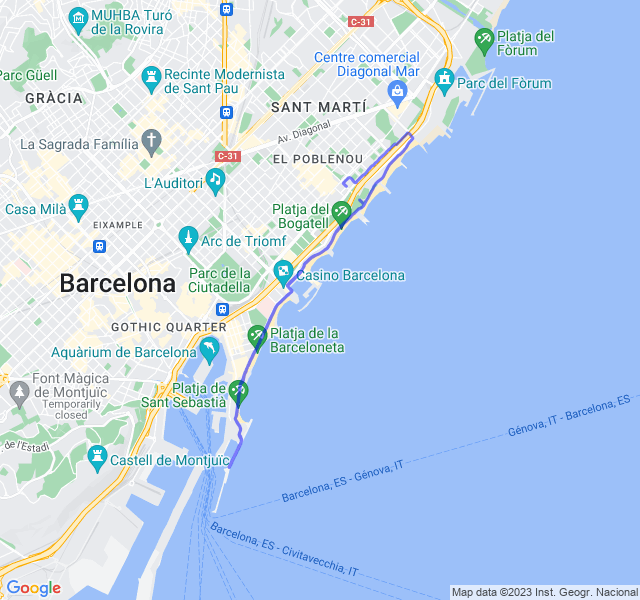
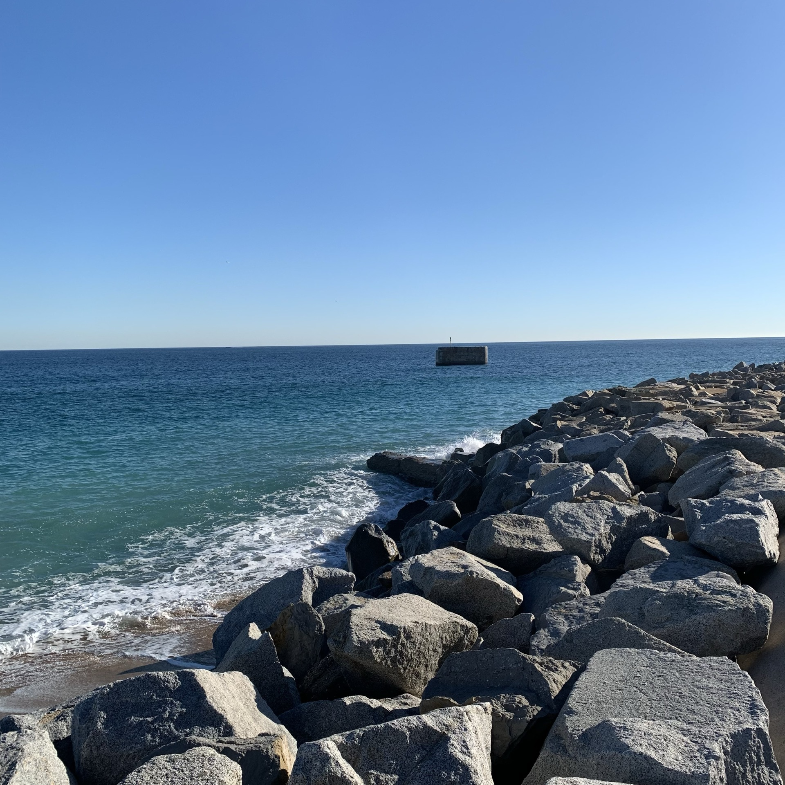
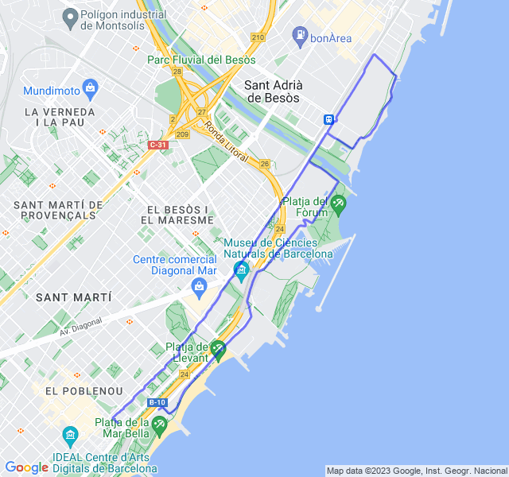

Settimana dopo le ferie!
<!--more--> 
Riprendere non è mai facile e la _stanchezza_ del viaggio si è fatta un po' sentire nel primo allenamento.

## Prima uscita

12km Z1. Dopo una settimana di stop per vacanze la ripresa è stata un po’ traumatica. 
Non malissimo ma è stata più Z2 che Z1.



## Seconda uscita

6x (2’ + 2’) Z5
Primo rosso con il nuovo VDOT e dopo le ferie. Abbastanza intenso ma mi sembra di essere andato abbastanza bene. Forse i recuperi un po’ troppo forti ma non guardavo molto l’orologio.



## Terza uscita

10 km Z2. Tutto tranquillo. Gambe un po' affaticate dal potenziamento di ieri ma tutto bene.



## Quarta uscita
10x(500Z3 + 500Z2).
Mi è piaciuto molto questo allenamento e credo che con il nuovo VDOT i passi siano molto meglio di prima. Son riuscito avere anche la frequenza in Z3 abbastanza costantemente nella parte veloce e a tornare in Z2 in quella lenta.
C'è stato un super picco di frequenza nel riscaldamento che non so a cosa sia dovuto.
Ma davvero la Z3 sarebbe il ritmo maratona?? Se così fosse ci sarebbe da festeggiare!!


