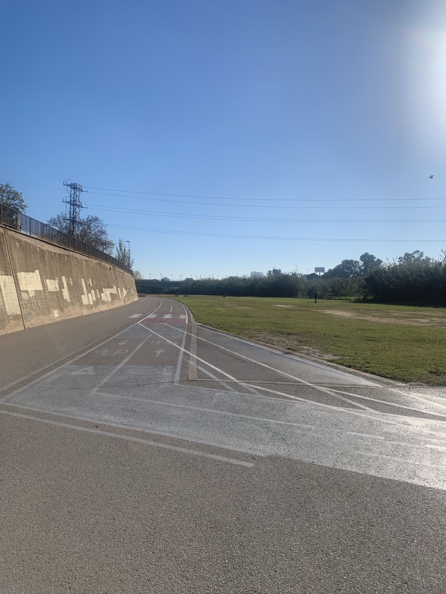
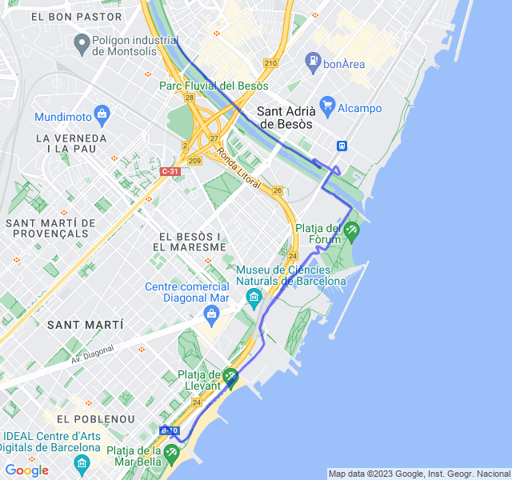
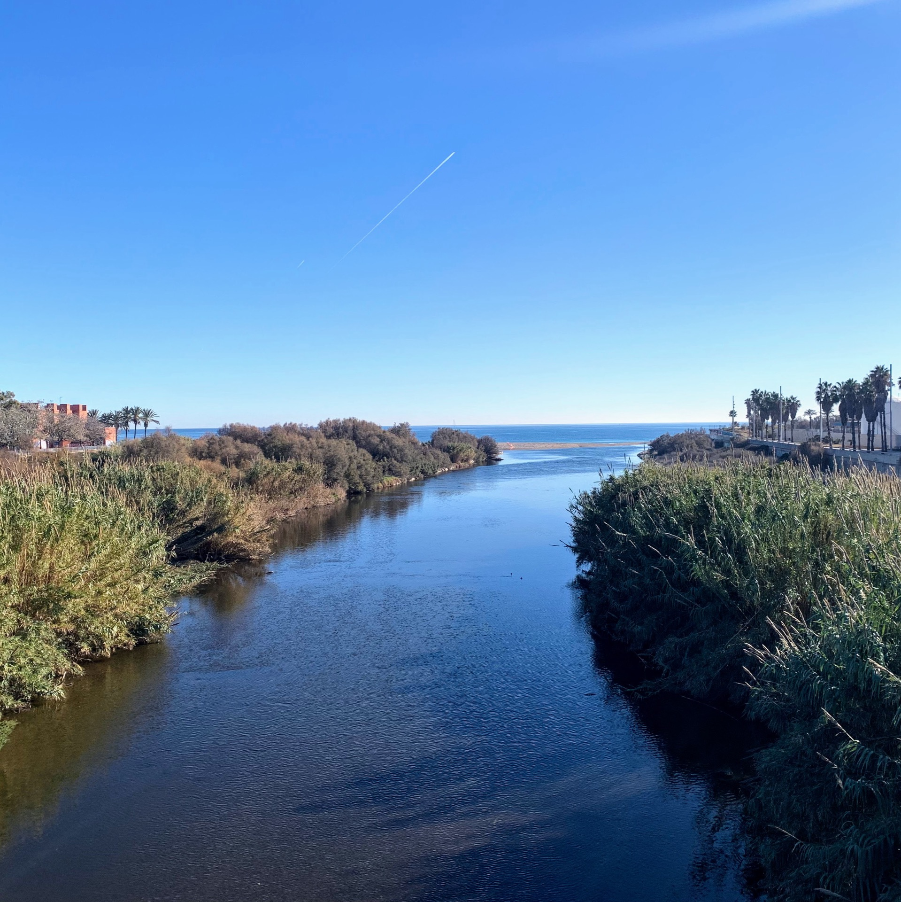
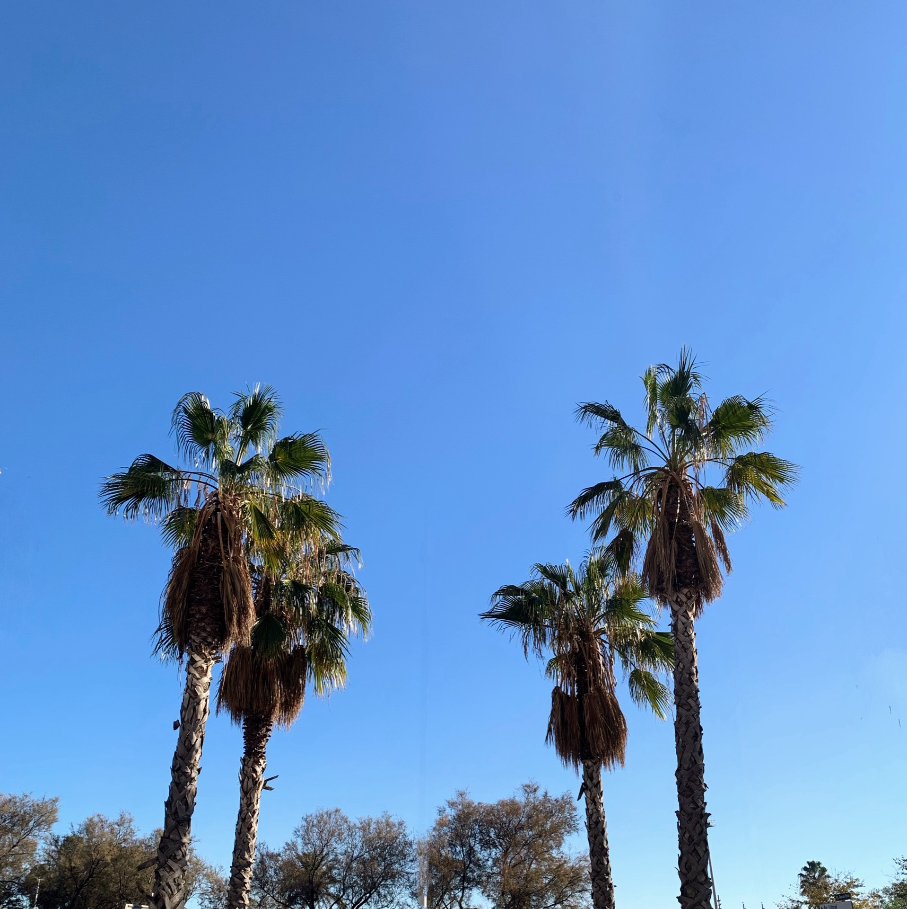
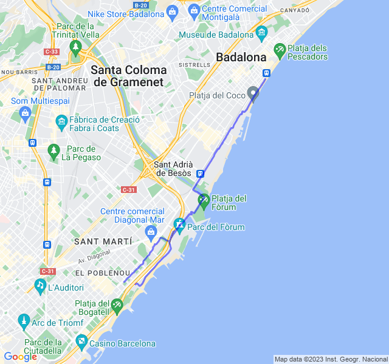
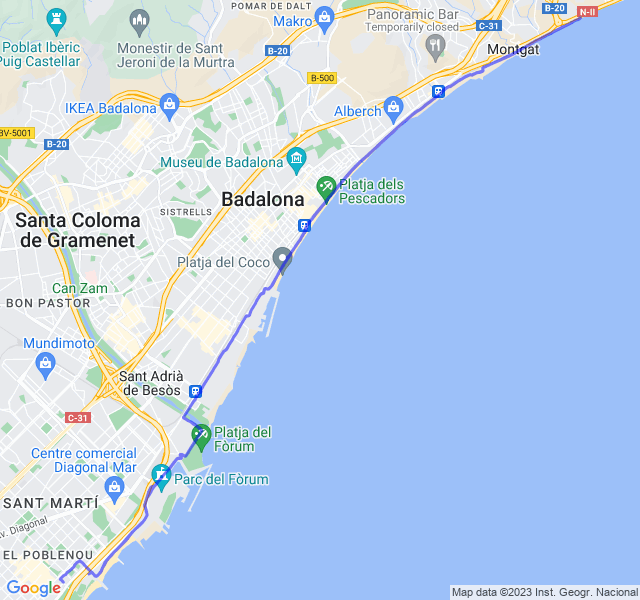
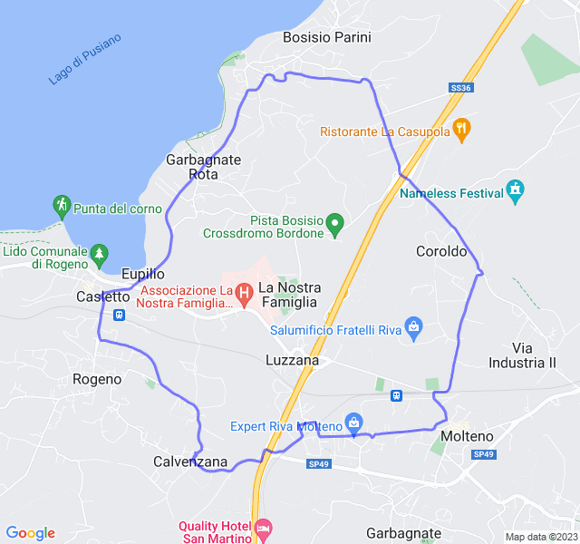

Settimana bella carica divisa tra Spagna e Italia.
<!--more--> 

Un paio di allenamenti davvero tosti hanno caratterizzato la settimana.

## Prima uscita

12km Z1. Il verde del lunedì è sempre bello! Tutto ok, niente di particolare da segnalare!



## Seconda uscita
4x(600+300+200) Z5!

Forse il rosso più pesante fatto fino ad ora. Ma quanto possono essere lunghi 600mt???

Dopo la prima serie ho provato a correre durante il recupero di 3' ma mi son reso conto che non avrei retto fino alla fine quindi dalla serie successivo ho camminato.

Molto impegnativo, ho tenuto i ritmi ma le ultime serie son state dure!



## Terza uscita
5x3000 Z3. 

E così, de botto, un giallo tendente al nero!
Non so a quale libro di torture medioevali si sia ispirato coach quando ha scritto questa settimana di tabella 😅 ma, giusto per dire, ci sono altri modi di liberarsi di un allievo meno dolorosi e che rispettando anche la convenzione di Ginevra! 😆



A parte gli scherzi, è stata una bella faticaccia, forse anche non la giornata perfetta visto che già nel riscaldamento la FC era più alta del solito.

Ho guardato un po' il ritmo e un po' la FC  stando sul limite tra Z3eZ4 ma dopo la terza ripetuta son andato molto più in Z4 e l'ultima è stata proprio tosta (colpa anche di una salitella).
Non so bene come interpretare il tutto! 🙃



## Quarta uscita

Recupero dei 10km Z2 che avrei dovuto fare il giovedì. Tutto bene; un po' troppo forte, ma quando sono in trasferta è sempre così. 


