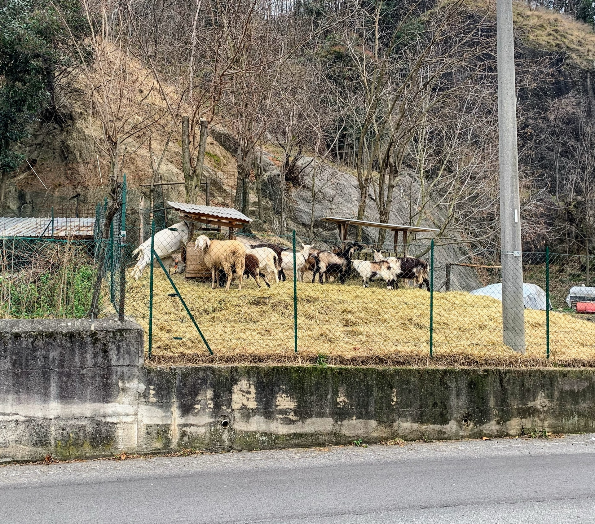
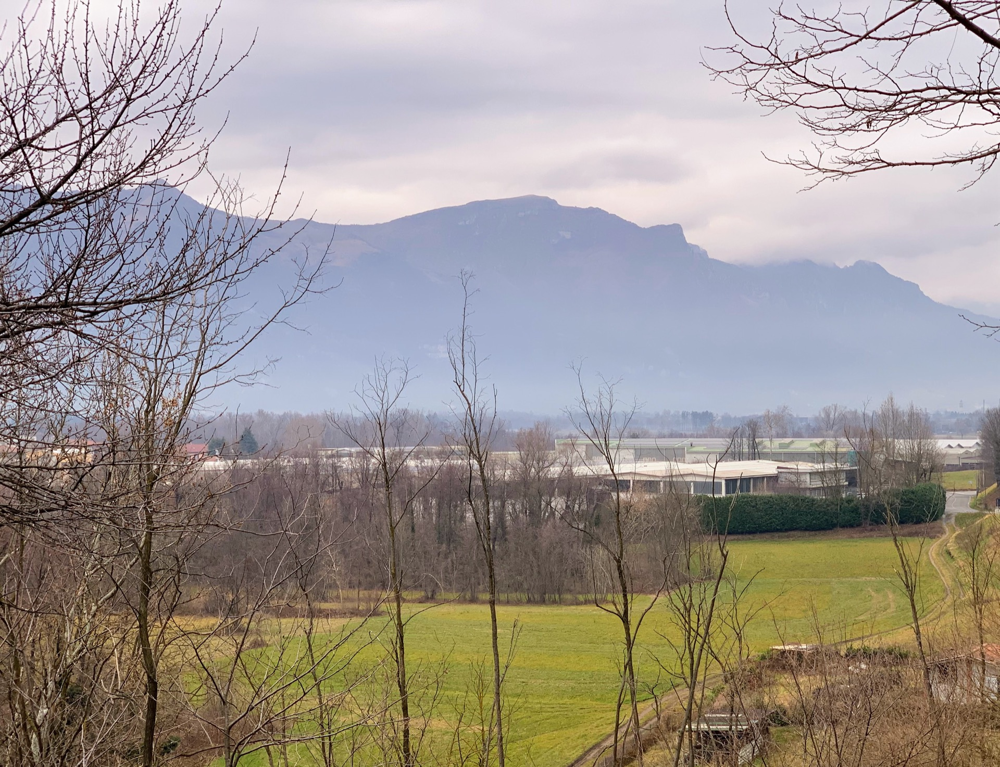
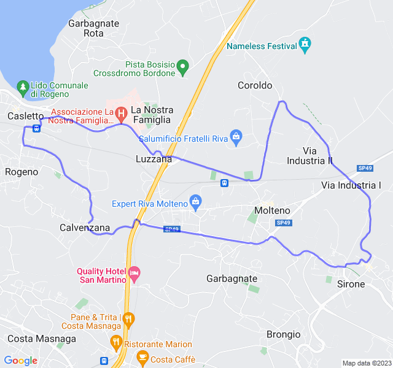
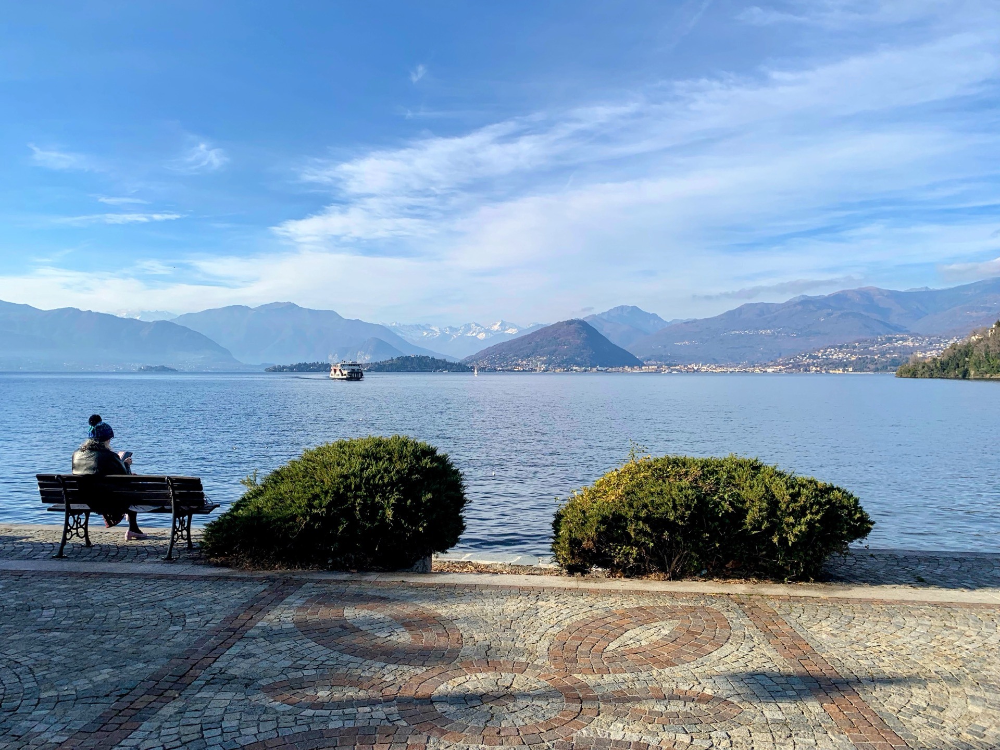
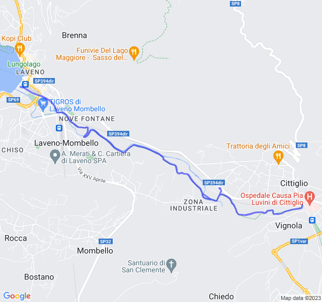
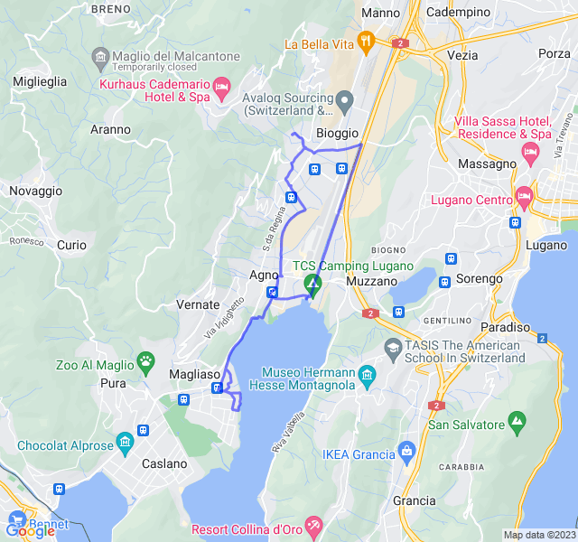
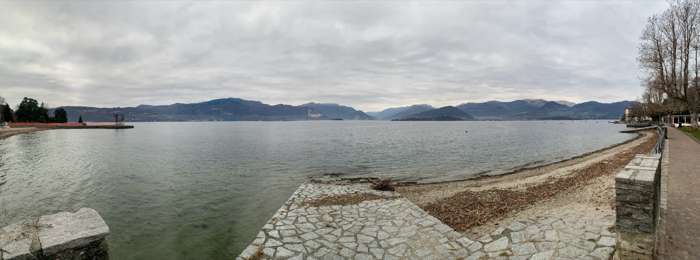
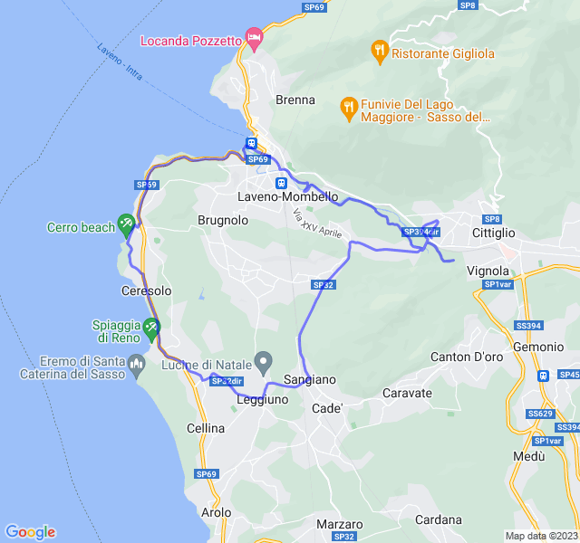

Settimana di _vacanza_ tra brianza, varesotto e svizzera!
<!--more--> 

Ultima settimana di tabella e un po' movimentata per gli spostamenti!

## Prima uscita
10km Z1. Un po' troppo forti ma quando non sono su percorsi conosciuti va sempre così.



## Seconda uscita

10x(1'+1')Z4. Non proprio guarito dal raffreddore e anche un po' dolorante dal ginocchio ma gli intervalli sono andato lo stesso abbastanza bene.



## Terza uscita

12km Z2. Prima uscita in compagnia da un sacco di tempo. Molto divertente chiacchierare anche visto il ritmo easy.



## Quarta uscita

16km Z2. Nonostante ieri abbia fatto qualche km in più del previsto, non ho voluto tagliare il lungo di oggi. Percorso nuovo, un po' pericoloso visto le strade strette e trafficate.

Risultato ottimo con frequenza sotto controllo!


