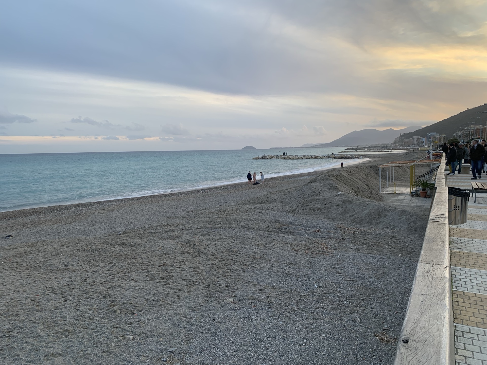
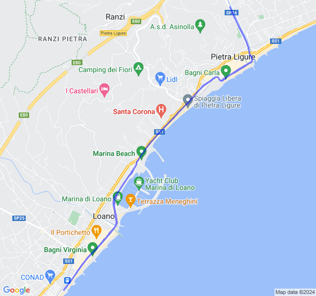
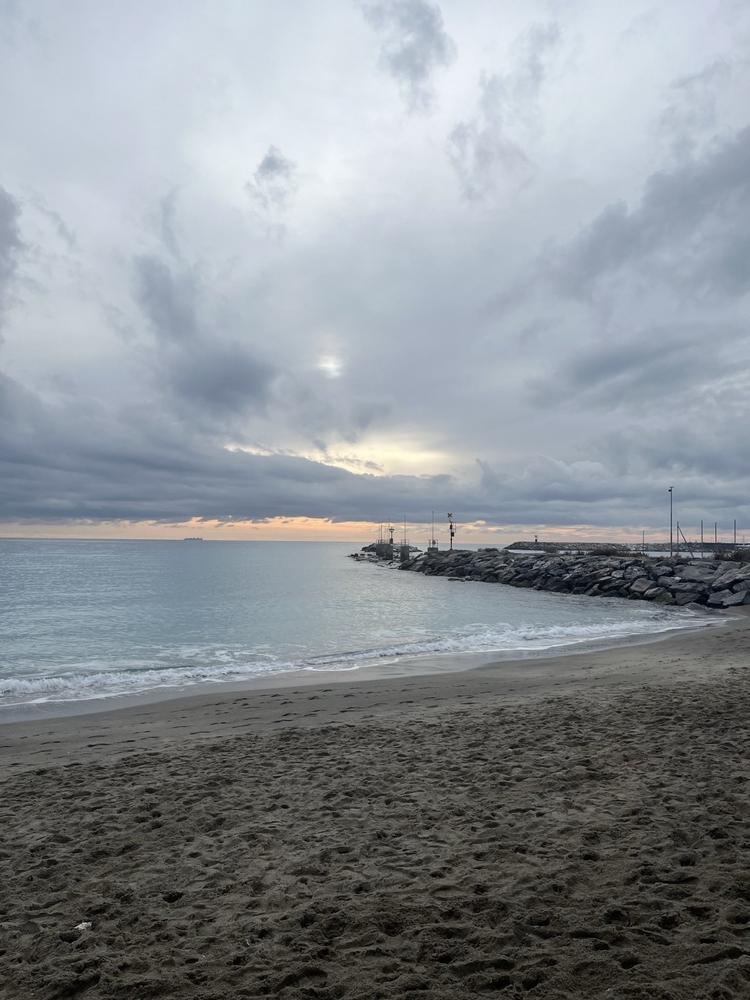
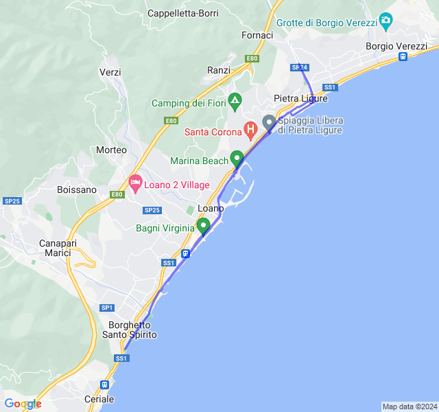
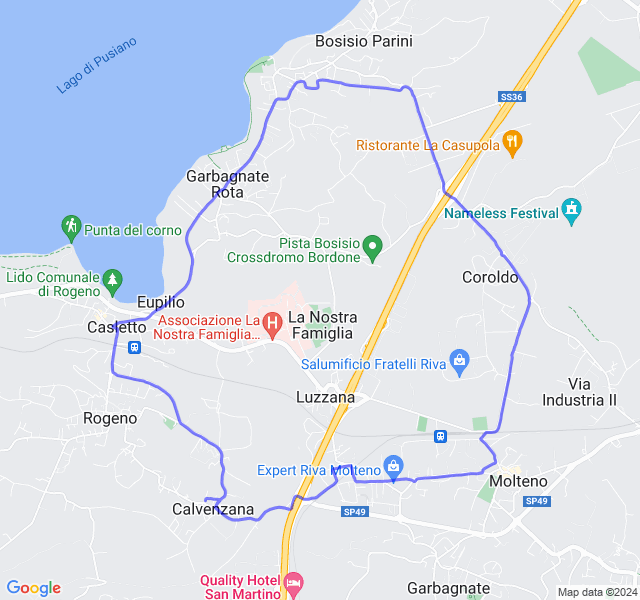
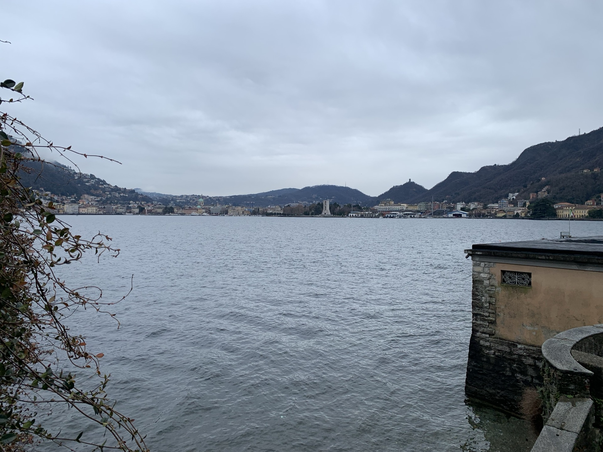
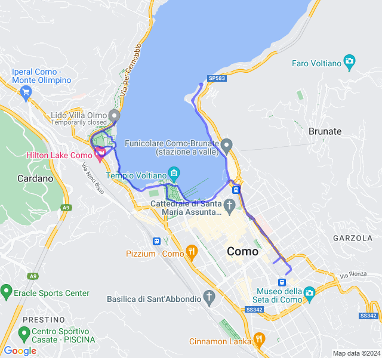

Ultima settimana di vacanza in Italia!
<!--more--> 

## Prima uscita

Prima uscita in liguria. Una corsa tranquilla in Z2 senza troppo da segnalare.



## Seconda uscita

Altra uscita a Pietra Ligure. Questa volta più impegnativa con un delle ripetute in Z4. 

Un pochino di dolore al ginocchio ma generalmente bene. Avrei dovuto provare a fare i recuperi in corsa tra le serie.



## Terza uscita

Ritorno in Brianza con questa corsa in Z2 tranquilla. Le strade però son davvero pericolose per i podisti, spesso senza marciapiede.



## Quarta uscita

Ultima uscita impegnativa: 12km Z3. Su percorso nuovo non son riuscito a correrla benissimo: battiti alti e trappa fatica per il passo tenuto.


