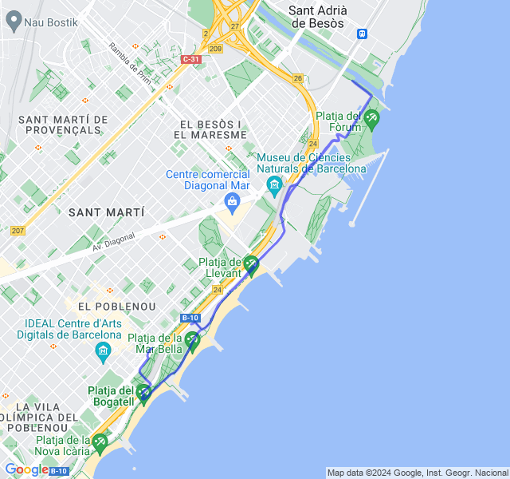
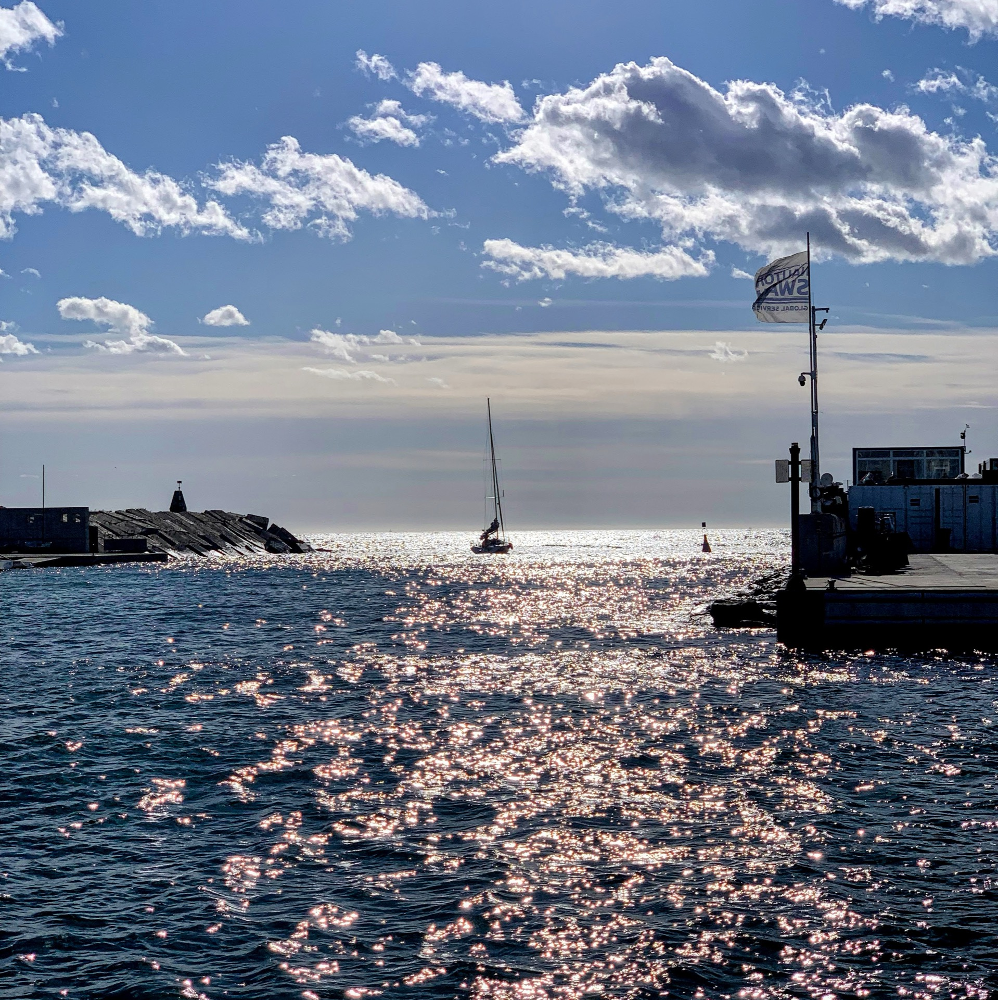
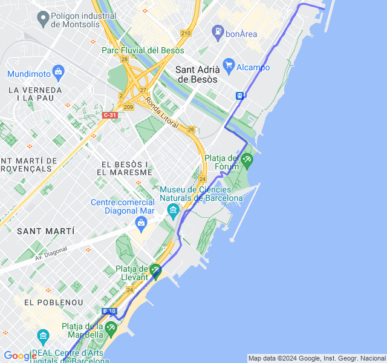
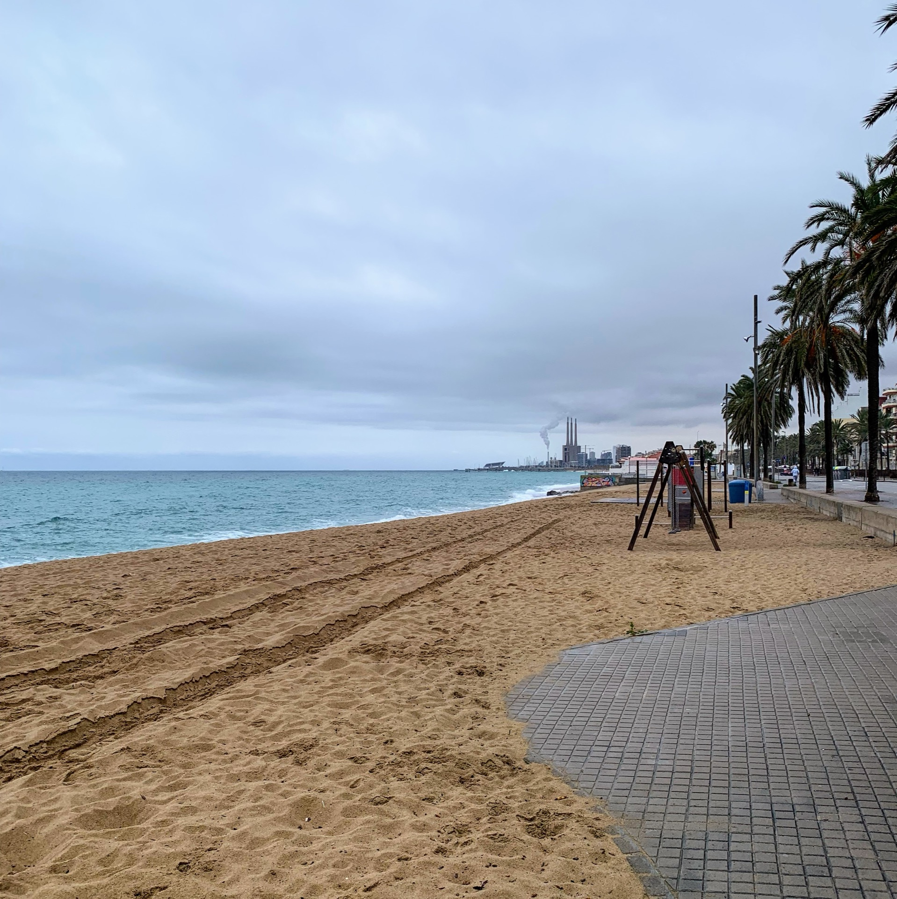
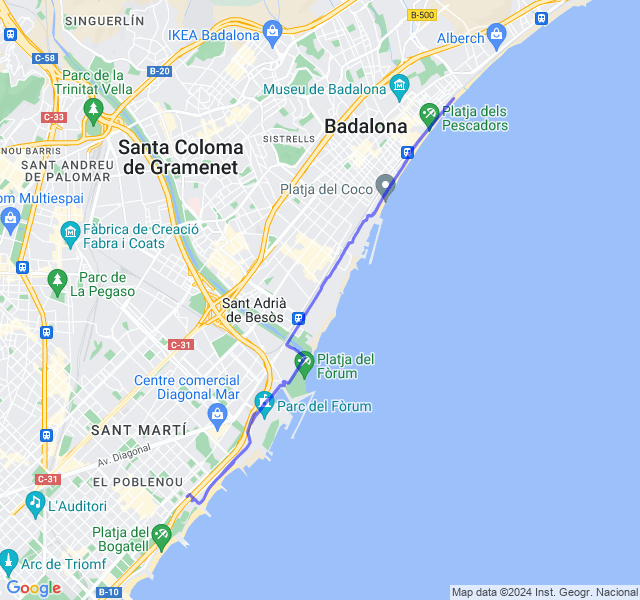

Settimana di recupero post mezza maratona di Sitges.

Corsa lenta per tutti!
<!--more-->

## Prima uscita

8km Z1, super tranquilla dopo la gara. Le gambe rispondono abbastanza bene anche se ovviamente non sono troppo brillanti.



## Seconda uscita

10km Z1, sempre corsa lenta ma oggi sensazioni non proprio buone: fatica forse anche per il ventaccio.



## Terza uscita

16km Z2. Un bel lunghetto. Iniziato con un po' si spossatezza (è qualche giorno che no digerisco bene) ma finito molto tranquillo con un buon ritmo e FC stabile.


