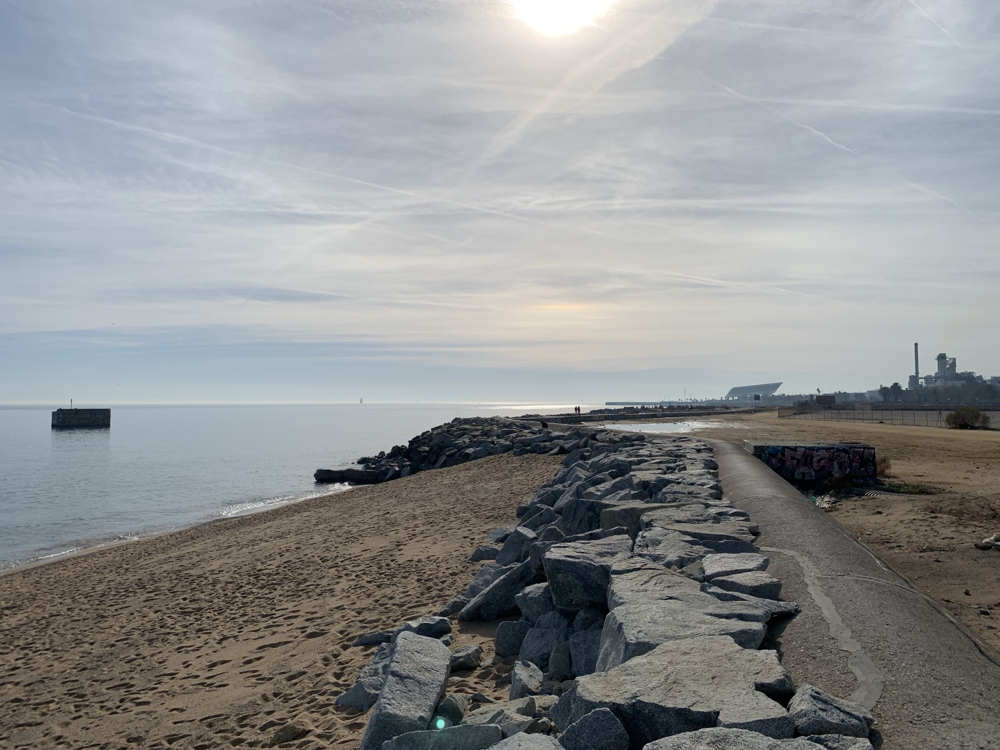
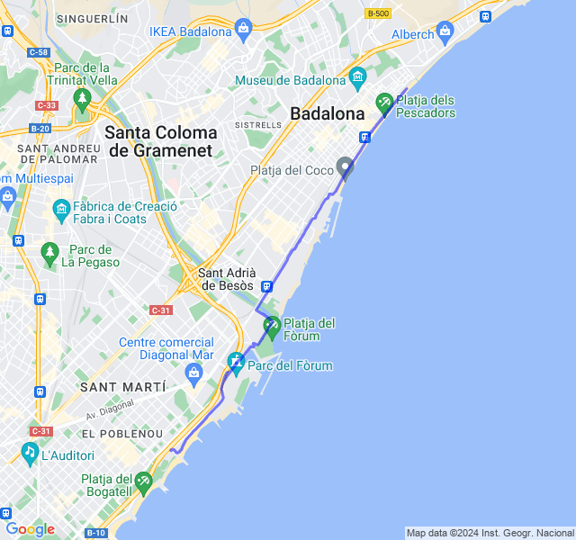
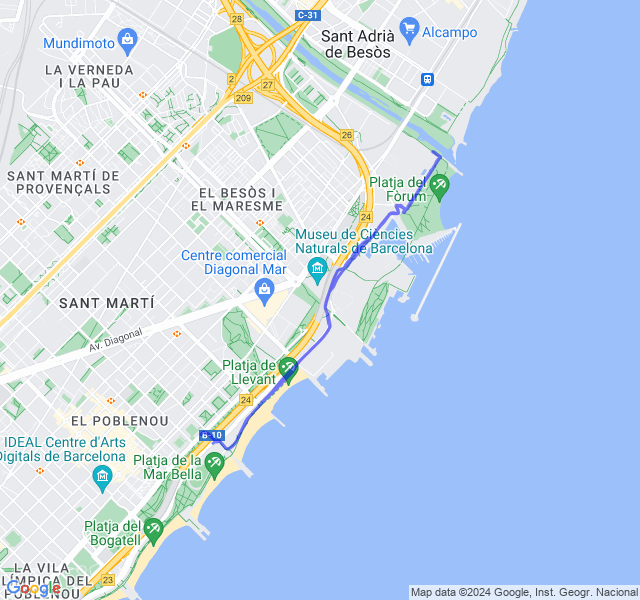
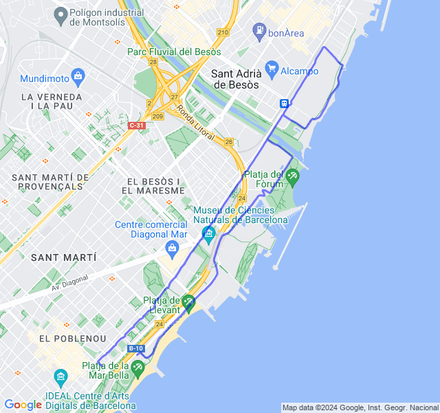
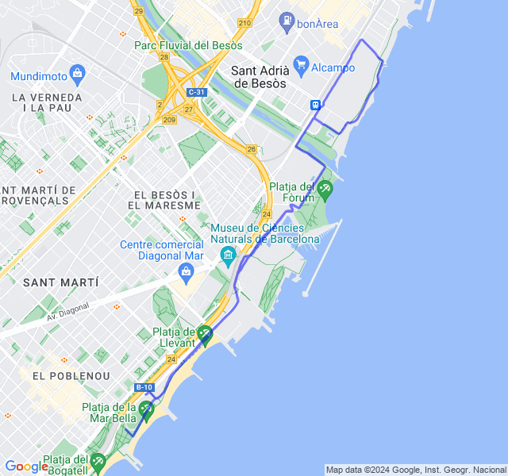
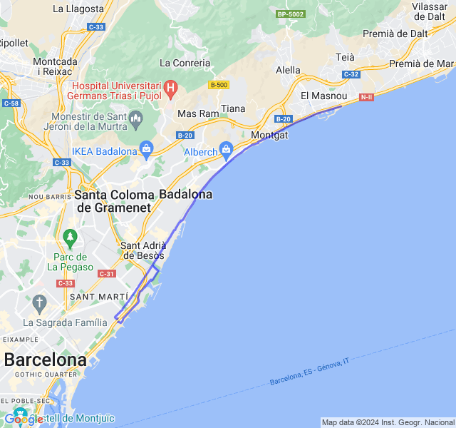

Settimana del primo lunghissimo in preparazione maratona!

<!--more--> 

## Prima uscita
14km Z2 + andature + allunghi.

FC un po' altina ma ieri ho mangiato (e bevuto..) troppo e l'effetto si fa subito sentire 😛.
Tutto sommato un allenamento non terribile e anche la priam volta Z1 di 14km.



## Seconda uscita
5x400 + 10x200 Z5 (VDOT 3:30). Ho un po' sottovalutato questo allenamento invece è stato parecchio duro non so se perchè non ero particolarmente in forma o perchè lo fosse in se.
Nel recupero tra le serie ho camminato un po' per riprendermi.
Nonostante questo, niente FC in Z5.



## Terza uscita
10km corsa lenta. FC un po' ballerina ma tutto ok.



## Quarta uscita
10km Z2. Oggi buone sensazioni, meglio di ieri. Domani un bel lungo, e via!



## Quinta uscita
5x2000 + 5x1000 Z3(VDOT 4:20). Devo dire che ero molto timoroso per questo allenamento sia perché era impegnativo sia perché ho dovuto farlo il pomeriggio (quando di solito non corro mai). Alla fine è andata bene: sia per il passo che per la FC. Nell’ultimo mille ero un po’ cotto ma non del tutto morto. Gli ultimi 3km di defaticamento son stati belli faticosi, con le gambe belle cotte.
In generale direi bene, molto soddisfatto del risultato!


