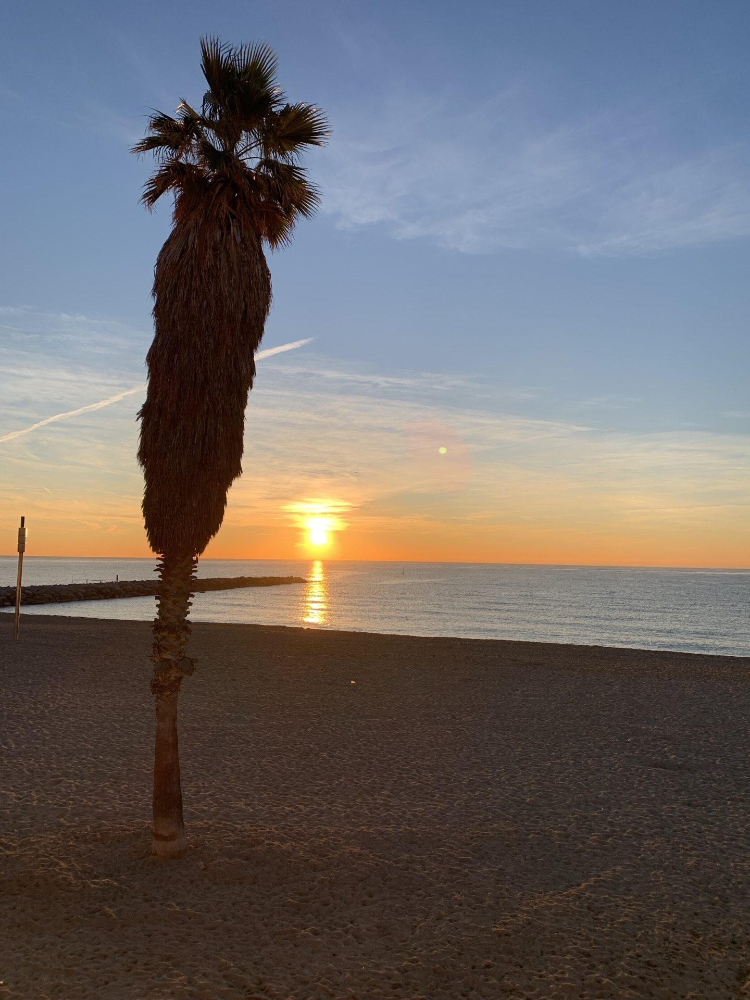
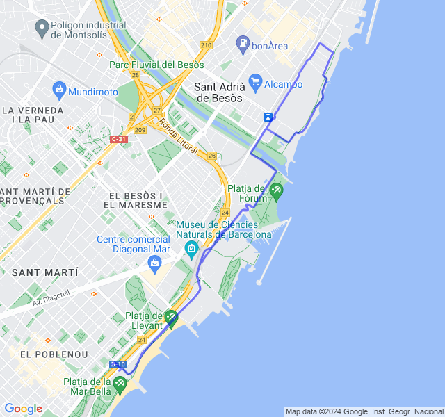
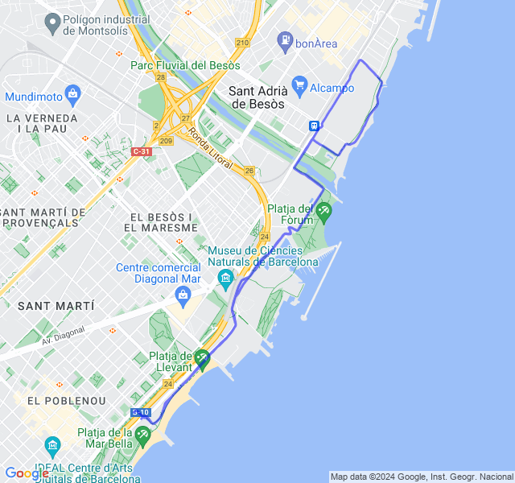
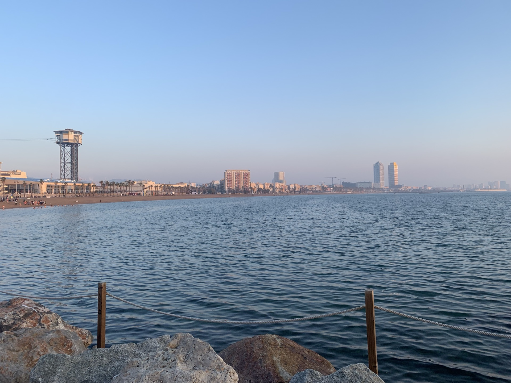
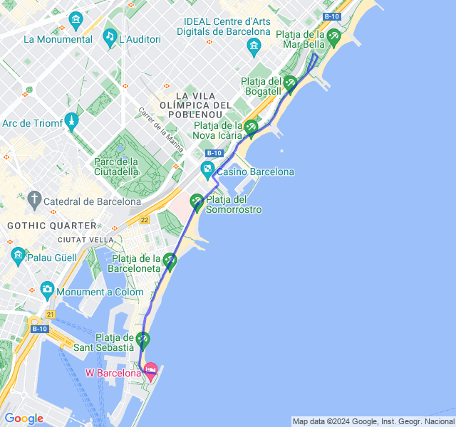
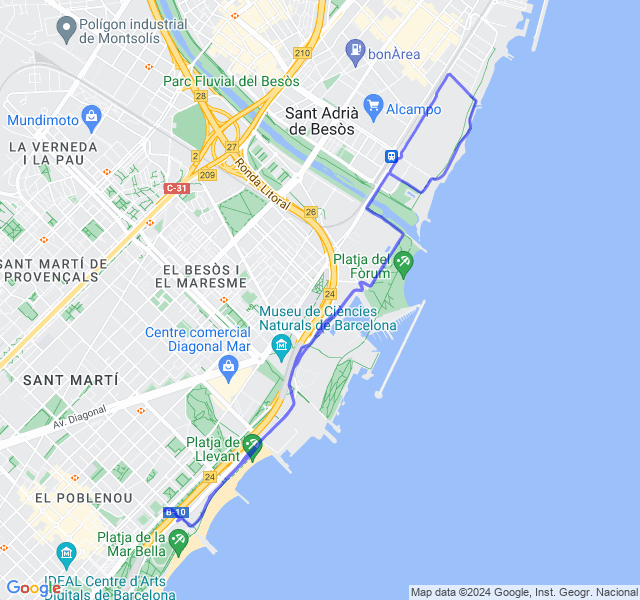
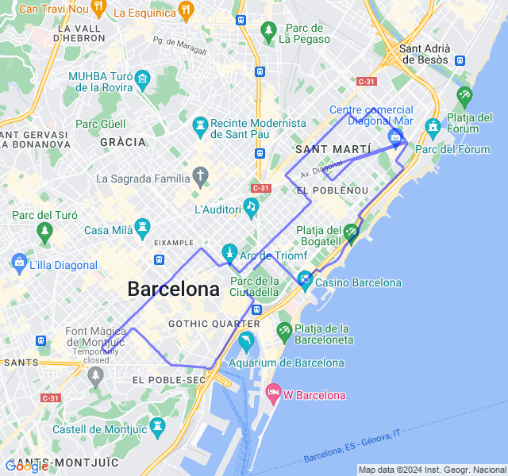

Settimana di _tapering_ pre Mezza di Barcellona!!

<!--more-->

## Prima uscita
10km Z2. Tutto tranquillo, una buona Z2 nonostante la stanchezza un po' latente degli ultimi giorni.



## Seconda uscita
7x(2'Z3+1'Z2) VDOT(4:20). Tutto tranquillo, un po' troppo forti le parti in Z3 ma la fc non ne voleva sapere di salire



## Terza uscita
8km Z2. Tutto tranquillo



## Quarta uscita

8km Z1 + allunghi. Sembra che le sensazioni stiano tornando buone. Speriamo bene per Domenica!



## Quinta uscita
🏁 Mezza maratona di Barcellona!
Anche oggi, contro ogni previsione, un'ottima gara!
Arrivo da giorni di stanchezza e muscoli non brillanti nonostante la settimana di scarico.
Dormo pochissimo per il rumore del vento forte, esco di casa in bici e quasi non riesco ad andare dritto dalle folate. Miracolosamente durante la gara si placa un poco e il percorso è per la maggior parte abbastanza riparato.
Ne esce un bel PB di un minuto su quello di un mese fa! 🥳


