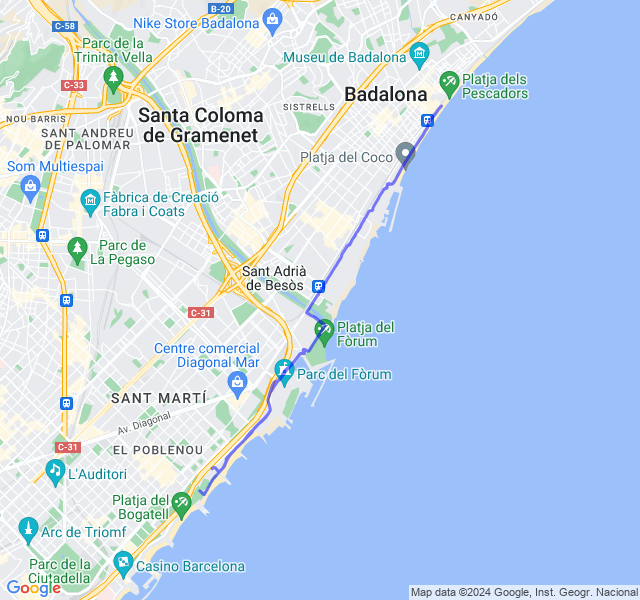
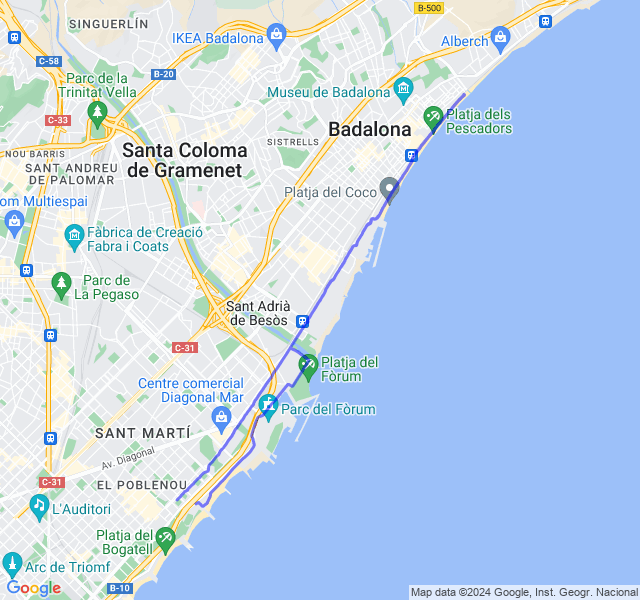
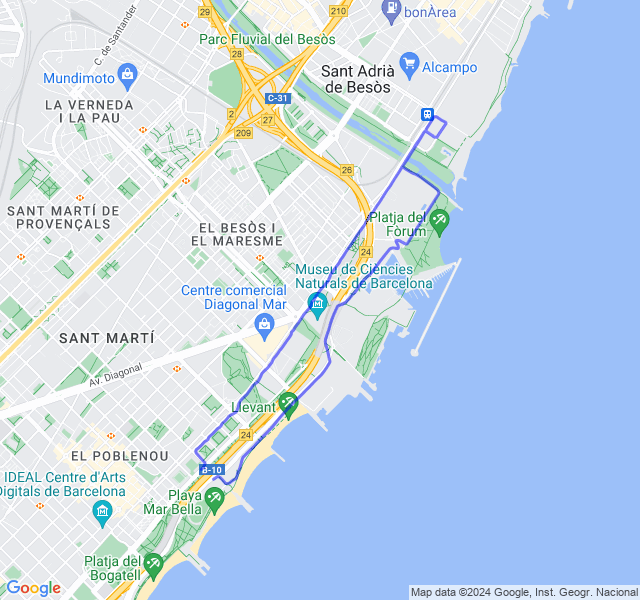
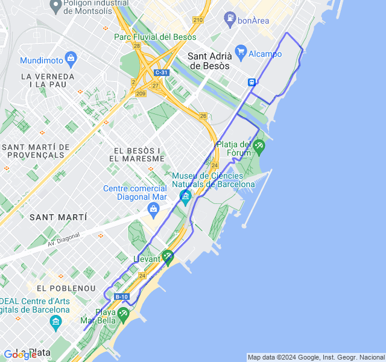
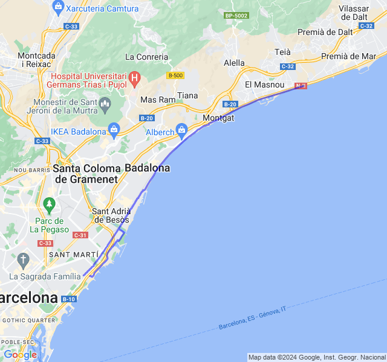

Settimana del primo lunghissimo della preparazione!
<!--more--> 

## Prima uscita

🟢 14km Z1 + andature.
Cuore un po' ballerino, forse aver spostato i 16 di venerdì a ieri non ha aiutato 😛



## Seconda uscita

🔴 2x1,5km + 2x1,2km + 2x1km Z4 (VDOT 4:01). Allenamento bello tosto. Nelle ultime 2 ripetute gambe un po' stanche ma in generale bene nonostante il vento contrario da metà in poi.



## Terza uscita

🟢 Potenziamento + 8km corsa lenta. In po' affaticato ma tutto ok.



## Quarta uscita

🟢 10km Z2.
Tutto tranquillo. Un po' di vento contrario al ritorno che mi ha fatto rallentare un po'.



## Quinta uscita

🟡 5x3000 Z3 (VDOT 4:15).
Ieri un bel lungo da 30km con ripetute in Z3.
Premessa 1: 4:15 è il vdot nuovo dopo l'ultima mezza, prima era 4:20 e secondo me per la Z3 è più realistico, forse ancora un po' veloce.
Premessa 2: ho aggiornato le zone cardio abbassando di 5 battiti la FCMax come concordato. Con le zone vecchie sarei stato sempre in Z3 credo.



Detto questo, non è la prima volta che faccio dei lunghissimi ma è la prima volta che arrivo in fondo in controllo, senza essere completamente morto. Anche le ultime ripetute, nonostante abbia sforato leggermente in Z4, son andate bene, buone sensazioni.
Andata molto facile, fin troppo. Arrivato al punto di ritorno mi son accorto del perchè: una leggera brezza che non si sentiva alle spalle ma si sentiva eccome in faccia.


