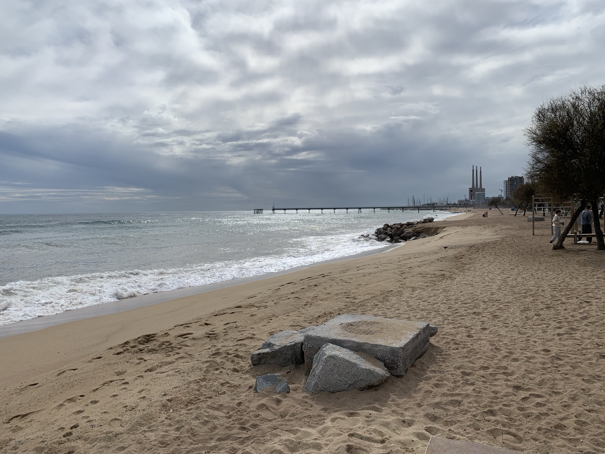
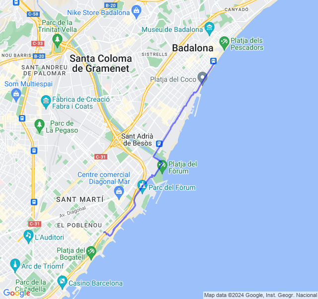
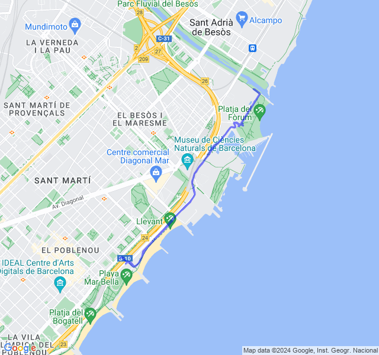
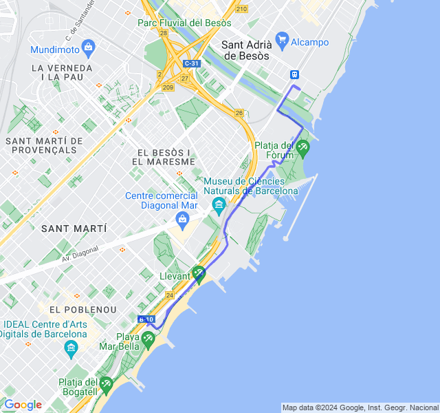
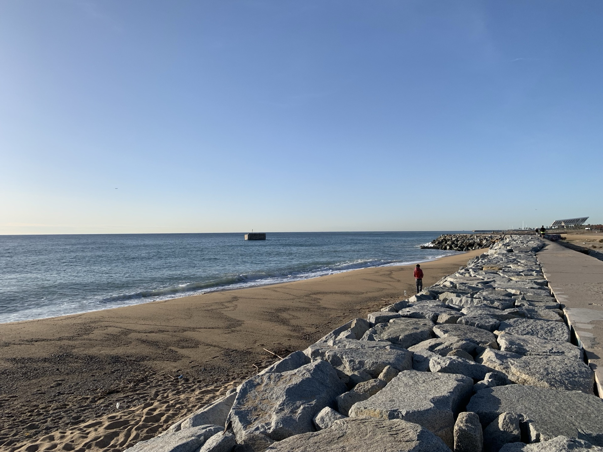
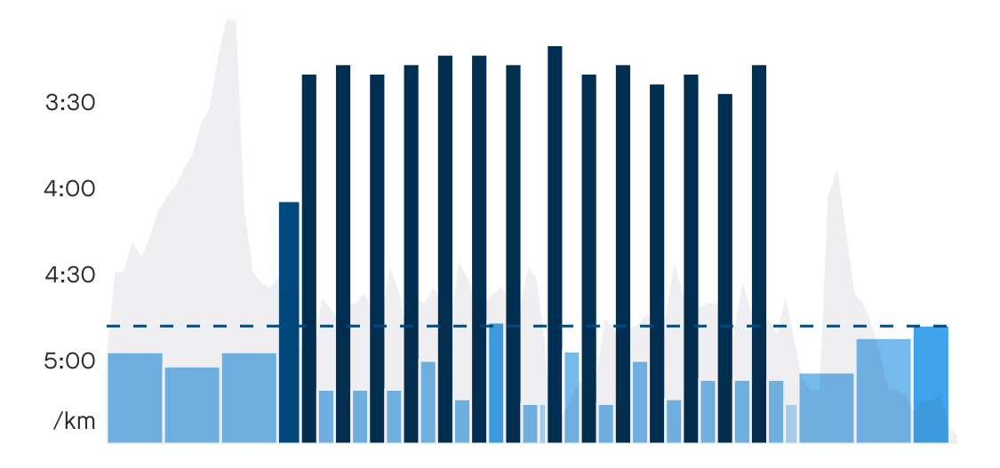
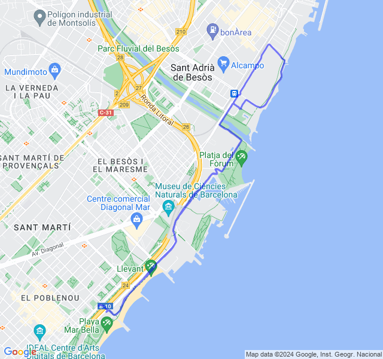
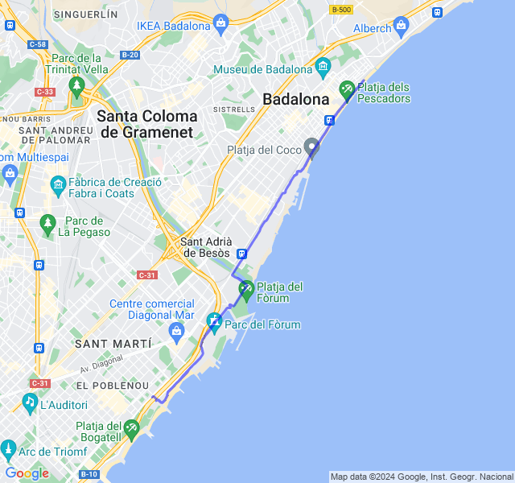

Settimana tranquilla ma un po' affaticata dopo il primo lunghissimo.
<!--more-->

## Prima uscita
14km Z1. Un po' affaticato. Devo un po' abituarmi alla nuova Z1 più bassa di qualche battito: oggi ho sforato parecchio.



## Seconda uscita
2x7x300 Z5. È stato un allenamento abbastanza faticoso. Mi sembra andato abbastanza bene anche se la Z5 non l'ho mai presa purtroppo.



## Terza uscita
8km corsa lenta post potenziamento. Tutto ok, un po' affaticato ma niente di preoccupante.



## Quarta uscita

10km Z2. Tutto tranquillo. Con le nuove zone Z2 il passo è di conseguenza rallentato un po'.



## Quinta uscita
8x1000 Z3. Pensavo fosse un allenamento più tranquillo e invece è stato faticoso. Ho cercato di tenere un buon ritmo anche nella parte di recupero.


