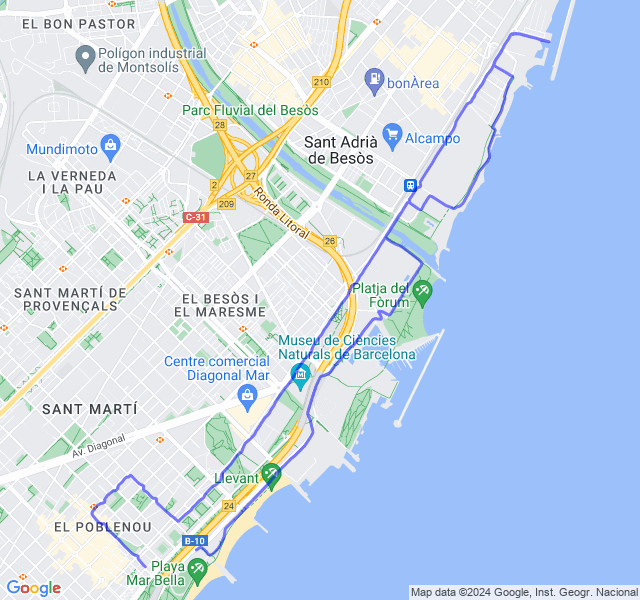
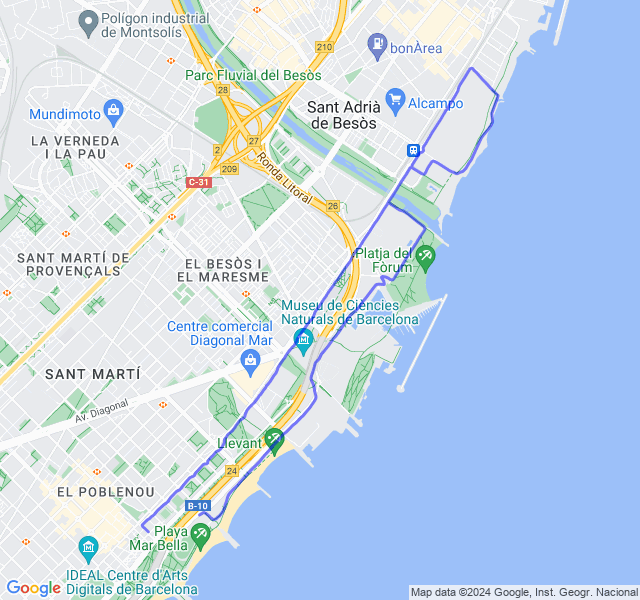
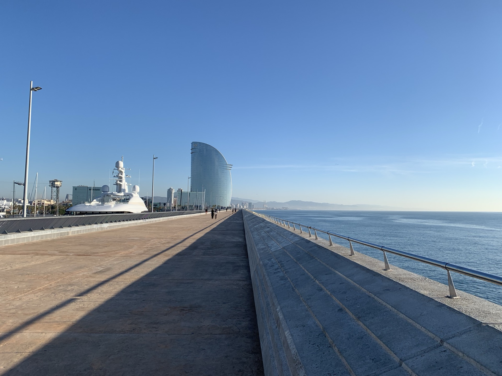
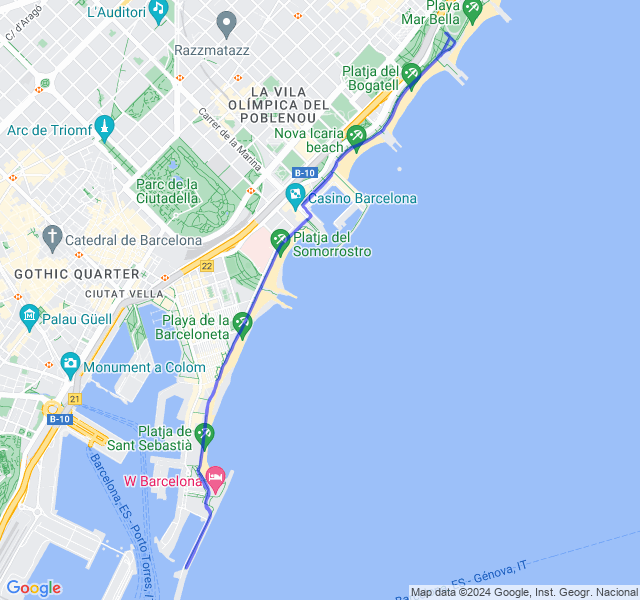
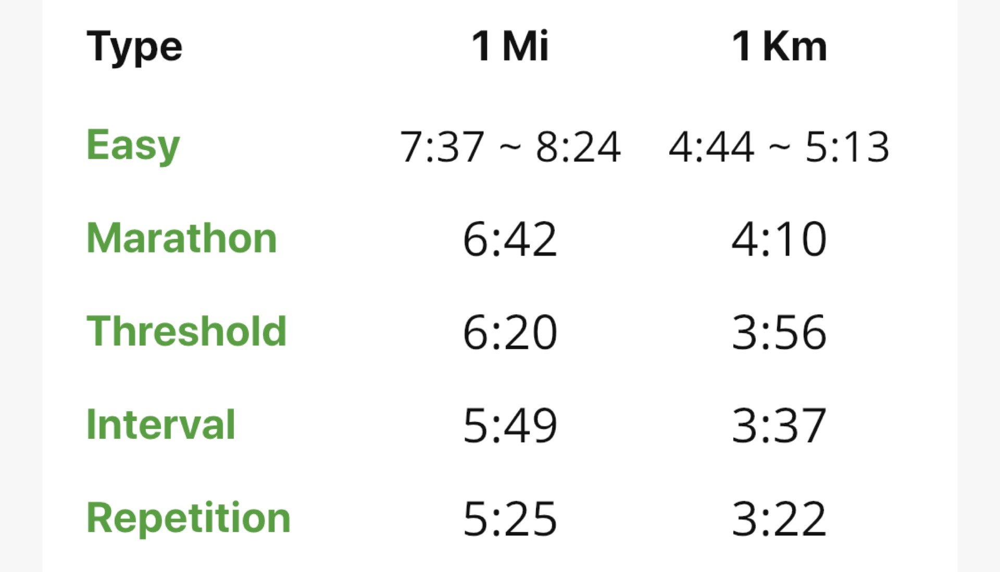
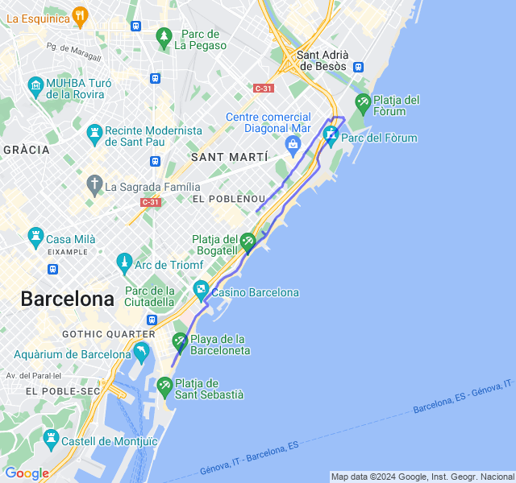
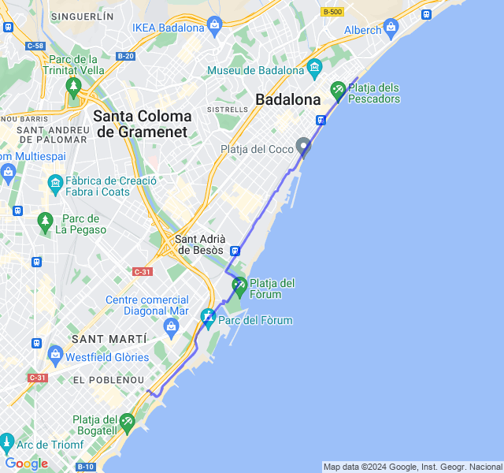

Settimana di recupero dopo il carico della precedente e... VDOT!
<!--more--> 

## Prima uscita
12km Z1. Dopo il lungo di ieri una bella Z1 tranquilla: tutto bene, qualche dolorino alle giunture ma sotto controllo.



## Seconda uscita
8km Z2 un po' allungati.
Gambe non proprio brillanti, ma z2 tranquilla.



## Terza uscita

8/10 km Corsa lenta. Tutto tranquillo, ho corso dopo colazione ed ero leggermente appesantito.



## Quarta uscita
Test VDOT 5km (18:20).
Contro ogni previsione (come al solito) un ottimo risultato nel test VDOT dopo una settimana non brillante. 🥳
Prima volta che faccio il VDOT non in una gara e ho abbassato il mio tempo nei 5km di un minuto tondo.
Alla fine ero veramente cotto e per dirla tutta forse c'era anche un po' di vento a favore.

Aggiorniamo ancora i ritmi di allenamento! Tutti le zone si abbasserebbero di 5sec/km (mi sembrano folli, soprattutto Z3/Z2).



## Quinta uscita
🟢 16km Z2. Ultima uscita della settimana. Dopo il VDOT di ieri un po' di affaticamento alle gambe nella seconda metà ma fiato e FC sotto controllo. Direi bene.


