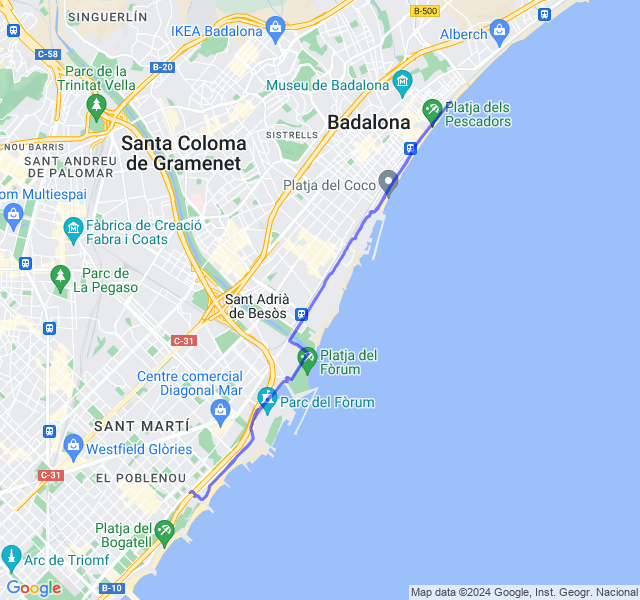
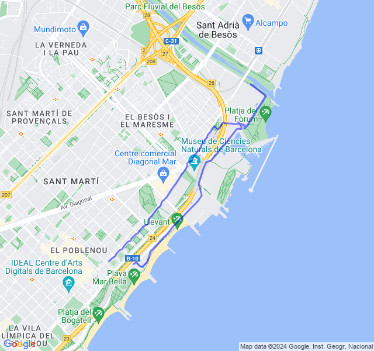
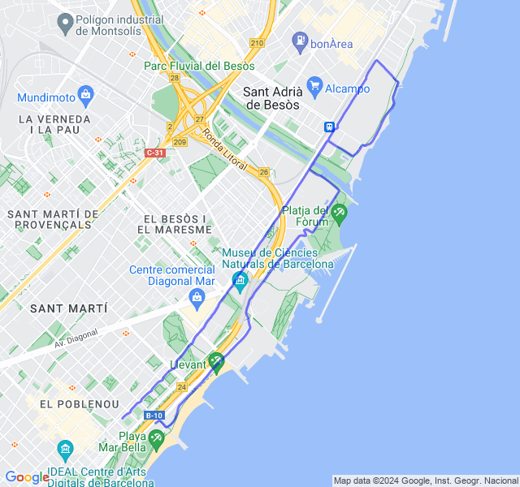
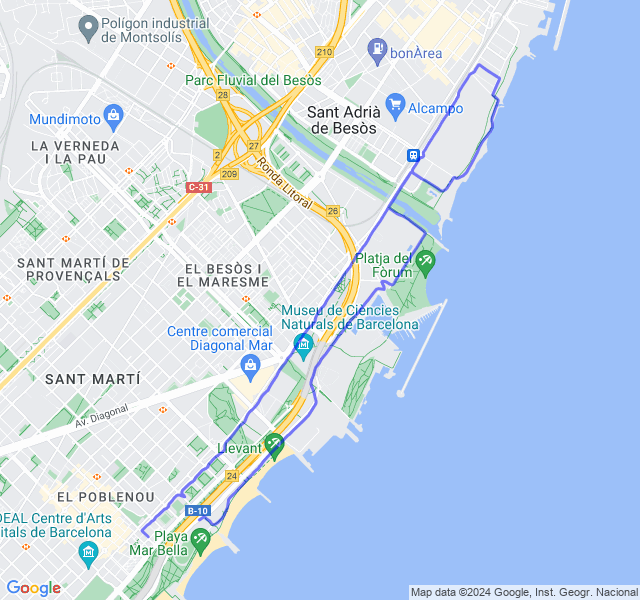
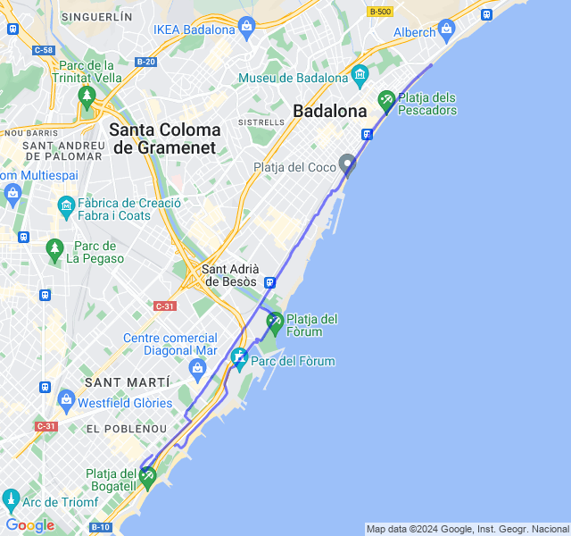

Prima uscita con le scarpe da gara!
<!--more--> 

## Prima uscita
14km Z1 + andature + allunghi.
Qualche battito di troppo ma le sensazioni sono state buone.



## Seconda uscita
3x500 + 5x400 + 5x200 Z5 
Allenamento bello impegnativo. La parte peggiore son stati i 400 poi i 200 tutto in discesa (metaforica) 😆!



## Terza uscita
8/10km corsa lenta.
Tutto ok, corsa tranquilla.



## Quarta uscita
10km Z2. Tutto tranquillo. Un po' più lento di quello che mi aspettavo.



## Quinta uscita
Progressivo 4km Z1 + 9km Z3 + 3km Z4. VDOT Z3 4:10, Z4 3:56 ma mi sembrano fuori portata, soprattutto la Z3 quindi son partito con l'idea di stare sui 4:20/4:25.

Prima uscita con le scarpe da gara (Vaporfly 3) che mi sembrano molto comode. Secondo me sono un po' pesante per giovare di tutti i vantaggi di questo tipo di scarpe ma vedremo in gara.

Ho controllato sia FC che passo e mi pare si essere stato bene nelle zone corrette. Ho forse faticato un pochino troppo nell'ultima parte in Z4.

p.s.: ho anche preso 2 semafori nell'ultima parte che mi hanno un po' tagliato il ritmo.


