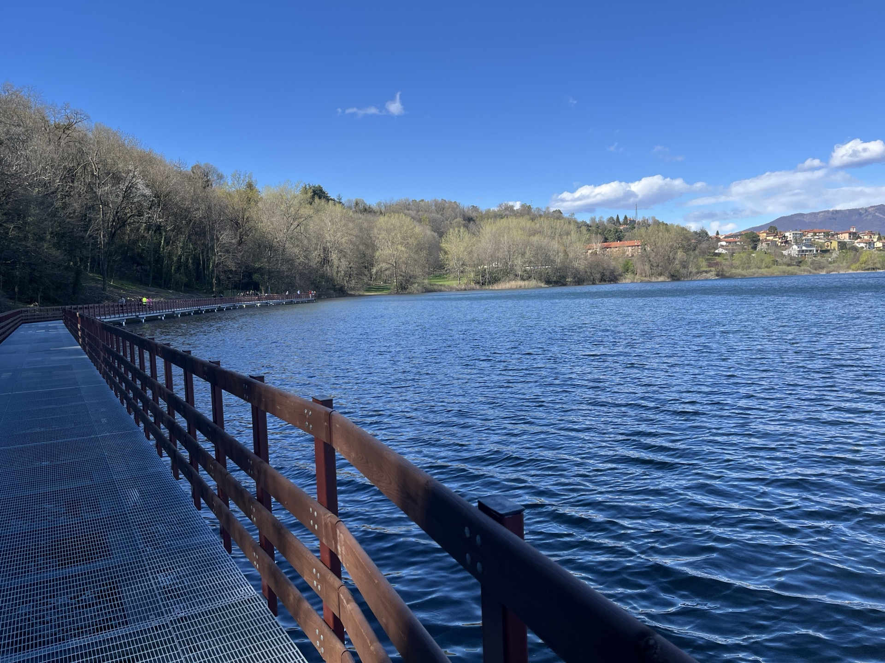
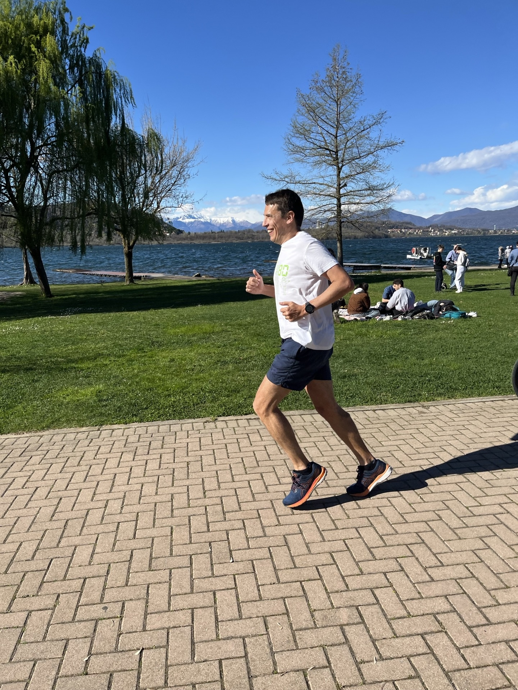
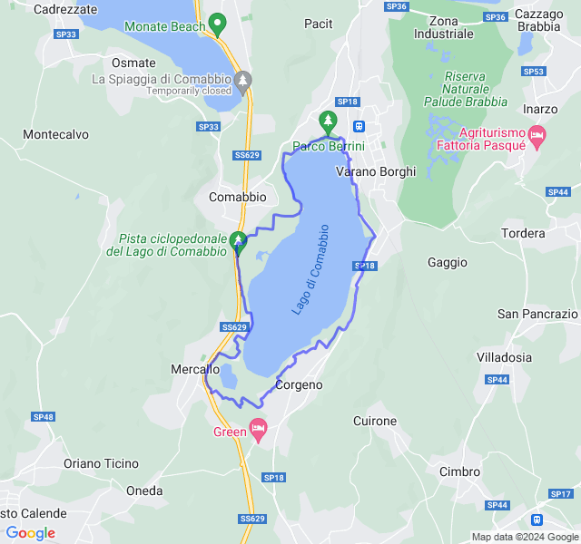
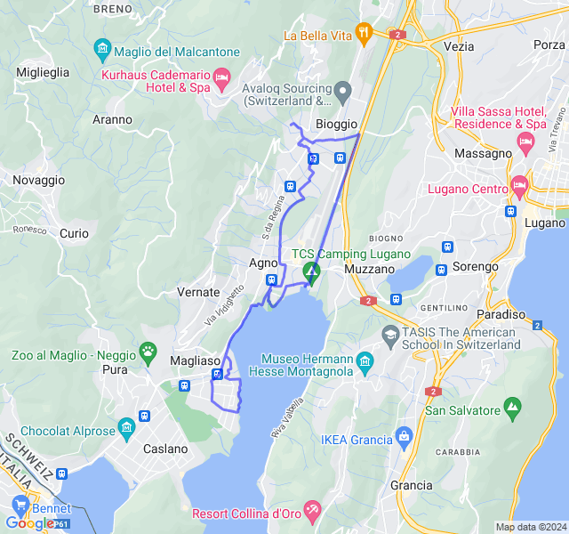
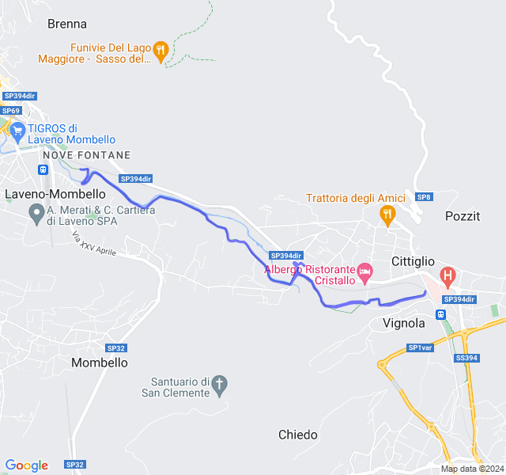
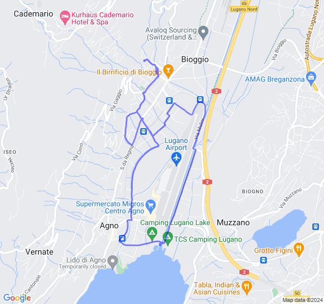
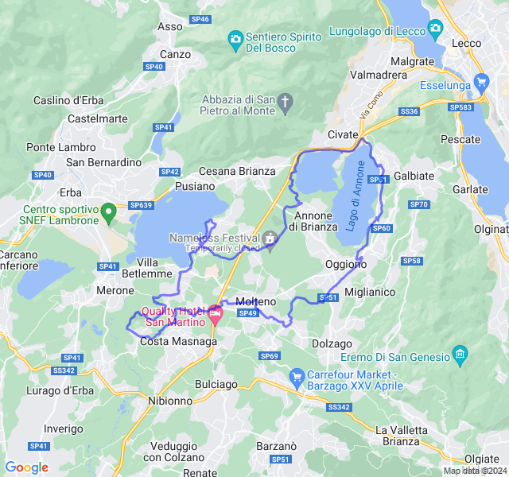

Settimana di ultimo lunghissimo!
<!--more--> 

## Prima uscita
12km Z2. Anticipo un'uscita della prossima settimana che sarà un po' complicata. Dovevano essere i 10km di giovedì, ma son diventati 12 😛.



## Seconda/terza uscita
Settimana di Pasqua un po' caotica.
Ho spostato un po' gli allenamenti lenti per cercare di incastrare tutto. Domenica ho fatto la Z2 del giovedì (12km al posto di 10 😛) e lunedì ho fatto la Z1 (12km al posto di 14).
Tutto sommato abbastanza bene, gambe non proprio brillanti ma ok.
Oggi avrò i 4x2000 e lì sì che sarà dura! 😅





## Quarta uscita



## Quinta uscita
3x5000 + 4x2000 Z3 (VDOT 4:10/4:30).
Non so proprio come interpretare questo allenamento.
Attenzione, post lungo e piangina 😆
🛣️ Il percorso: Alla fine ho corso su un percorso che non avevo mai fatto e ho dovuto tenere quasi sempre la mappa sull'orologio per orientarmi. Un sacco di su e giù che non mi hanno mai fatto prendere il ritmo e una bella salita nella seconda ripetuta da 2000 che mi ha distrutto.
❤️ La frequenza: già da subito, appena partito, ero in Z3. Tutte le ripetute le ho fatte in Z4 con pure dei picchi in Z5 che non raggiungo quasi mai. Solo 11min su quasi 3 ore in Z2. Mi pare completamente sballata anche perchè all'inizio era proprio easy, ho pure canticchiato nelle prime 2 da 5000.
💨 Il passo: alla fine non son andato sicuramente troppo forte ma con tutti i su e giù non riuscivo a capire bene il passo. In più avere la mappa come display non ha aiutato ad avere sotto mano il dato.
💧 Idratazione: ZERO. Una sola fontanella dopo 4 km e una al 31 km (probabilmente nemmeno potabile).
🦿 Crampi: Non so se per la poca idratazione, per il passo o per quella maledetta salita al secondo 2000 ma poco dopo ho avuto iniziato a sentire tirare un polpaccio, poco dopo anche l'altro e da lì ogni salita sul marciapiede era a rischio crampo.
⏱️ Soste: a parte le 2 per bere molto brevi, verso la fine il percorso era pieno di attraversamenti su strade frequentate e ho dovuto spesso fermarmi per trovare il momento giusto.
‼️ Conclusioni: non so bene come interpretare. Molto bene fino alla seconda da 2000 (nonostante la FC completamente fuori), male dopo. In più una volta tornato mi son scolato una bottiglia d'acqua e non so se per quella ma ho avuto la nausea e mal di stomaco per 2 ore (non son riuscito neppure a mangiare).
Se da questo allenamento dovrei capire il passo gara da tenere a Londra forse faccio prima a tirare dei dadi!


